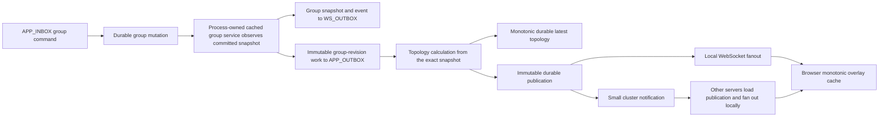
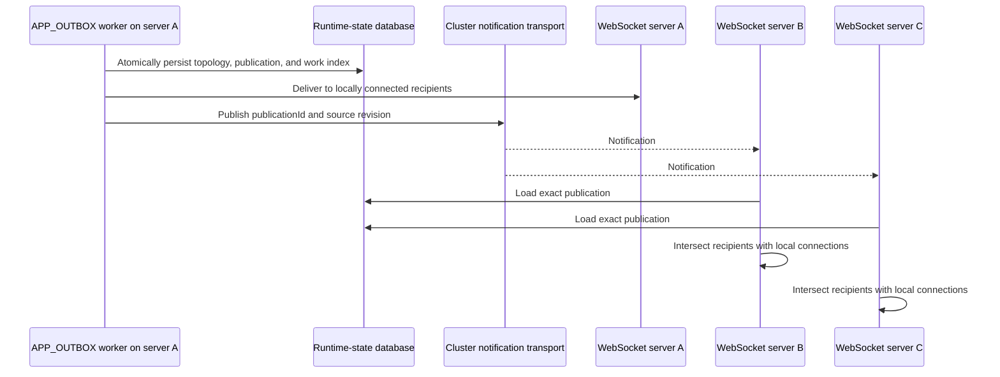

# Convergent State And RTC Topology Architecture

This document describes how Rallar API servers converge group state, client
state, and RTC overlay topology when several server processes share the same
database and complete work out of order.

The architecture does not depend on process ordering. Durable causal
revisions, immutable work, monotonic observation, deterministic identities,
and durable topology publications make retries and reordered delivery safe.

## Goals

- Keep group and client caches consistent with committed durable state.
- Preserve the existing domain meaning of `snapshotVersion`.
- Give every topology calculation an explicit causal group revision.
- Prevent coalescing from changing work that a worker has already reserved.
- Allow any API server to process topology work while delivering the result to
  browser sessions connected to other API servers.
- Keep `APP_OUTBOX` terminal: topology work must not create another queue item.
- Avoid process locks and aggregate-wide transaction locks.

## Architecture Decision Rules

Rallar uses strong data contracts to enable permissive distributed execution.
Authoritative persisted, replicated, queued, event, snapshot, and response
records require their causal and lifecycle fields. Optional fields are
appropriate only when absence has domain meaning and consumers test that
absence; they are not a compatibility mechanism for authoritative state.
Sparse request, query, patch, builder, and migration inputs use separate types.

Once input is well formed, convergence is optimistic:

- read without locking and retry when a revision moves;
- calculate expensive work outside transactions;
- accept newer causal state and ignore older state;
- use a short compare-and-commit transaction at the durable boundary;
- allow duplicate delivery when the receiver can identify it exactly.

Hard rejection remains correct for malformed or wrong-scope data,
authorization failures, equal-revision/different-content conflicts, violated
topology invariants, resource caps, and exhausted bounded retries. In
particular, permissive convergence never means authorizing from stale state.

Compatibility is a product decision rather than an implicit implementation
default. A plan that retains a revisionless shape, legacy work envelope, or
fallback authorization path must obtain explicit human approval and state its
retirement conditions.

Durable scoped key encodings are part of the concurrency contract. A key must
be injective over field name, presence/type, and value; string escaping alone
cannot distinguish an absent scope from a valid sentinel-looking identifier.
Every derived child key and list prefix must use the same canonical encoder.
Ambiguous legacy rows may be migrated only when their stored value proves the
target scope and the destination is claimed conditionally; never guess, fan one
row into multiple scopes, or keep a permanent dual-read fallback.

## Implemented Convergent Database Writes

**AppInbox is mandatory for incoming database mutations.** Every HTTP and
WebSocket database mutation uses it, including client/group/topology,
authentication/session/ticket, CRDT append/admin, and mutating admin operations.
AppInbox owns the transaction and retry boundary; waiting for a result never
falls back to direct mutation.

```text
HTTP/WS mutation
  -> APP_INBOX
  -> read -> compute -> validate
  -> AppInbox transaction
       -> service.write(transaction, computed)
       -> authoritative state/event/receipt
       -> APP_OUTBOX/WS_OUTBOX
       -> result + reservation-fenced completion
  -> commit
  -> wake/poll workers
```

Client, group, topology-config, topology publication/execution, and RTT writes
use the conditional runtime-state operations `insertIfAbsent`,
`upsertIfRevision`, and `deleteIfRevision`. Each service keeps direct named
`read`, `compute`, `validate`, and `write` phases. The `compute` and `validate`
phases are pure; computed persistence data is not called a plan. The service
`write(transaction, computed)` applies it: service write receives the
transaction and never opens, commits, replaces, or retries one. Its conditional
guard is first. An incoming HTTP/WS mutation conflict rolls back and returns to
AppInbox, whose next attempt restarts at `read` and reruns every check.

The storage rule is:

- create with conditional insert;
- update with expected-revision compare-and-set;
- delete or expire with expected-revision conditional delete.

Resource inbox allows 20 total processing attempts. Attempts one through five
wait 1, 2, 4, 8, and 16 ms; later waits rise through seconds, cap at 30 seconds,
and use jitter. A separate best-effort fairness lane claims retries more than 30
seconds overdue independently from timeout recovery. There is no unconditional
or unbounded fallback.

A transaction supplies atomicity for a multi-row commit, but it does not by
itself prevent lost updates. The transaction conditions the authoritative
transition on the revision that the decision observed. Compact
`MutationReceipt` records implement immutable first-writer-wins ledger replay.
Final `APP_OUTBOX` and `WS_OUTBOX` rows are inserted directly through
`ResourceInboxRepository` inside that transaction; a collision fails and rolls
back without loading a winner. There is no intermediate mutation outbox.
Logical WebSocket audience resolution happens only after commit; queue workers
are then woken or poll.

Queue locks are coordination-only for bounded resource-inbox claims. Domain
authentication/session/ticket, AL admission, CRDT, client, group, and topology
writes use conditional insert/update/delete fencing. Advisory and CRDT
document-row locks are not approved queue-claim exceptions.

Authoritative persisted and shared contracts use mandatory fields by default.
Sparse input and migration types remain separate.

Expiry is a causal delete, not cleanup after a trustworthy read. A reader that
saw an expired revision may delete only that revision, so it cannot remove a
replacement that another server refreshed after the read.

## Architecture Overview



The group command does not wait for topology calculation. It waits only for
the durable group mutation and deterministic publication of its WS and
application-outbox work. The independent `APP_OUTBOX` reader owns topology
processing.

## Causal Revisions

### Domain version versus storage revision

`snapshotVersion` remains the public domain version. It advances for semantic
group or client changes according to the existing state-service rules.

`stateRevision` is the causal storage order used by server caches and RTC
topology. For snapshots assembled from runtime-state rows:

```text
stateRevision = RuntimeStateEntry.revision + 1
```

The first committed aggregate row therefore has revision `1`. Group and client
repositories attach the revision from the aggregate group or principal row to
direct reads, lists, and pages.

Group authority is the required `GroupStateCausalRevision` tuple
`{ groupRevision, presenceRevision }`. Metadata and roster changes advance the
group component. Presence connect, heartbeat, disconnect, and expiry use the
session row as their guard, advance presence authority through summary
convergence, and do not contend on the group row. Consumers compare the full
tuple rather than forcing both domains through one scalar write guard.

### Revisioned observation

Group and client caches use the following policy:

| Current cache              | Incoming snapshot                   | Result                                  |
| -------------------------- | ----------------------------------- | --------------------------------------- |
| Missing    | Any                                 | Insert              |
| Revision N | Revision greater than N             | Advance             |
| Revision N | Revision less than N                | Ignore as stale     |
| Revision N | Same revision and same content      | Duplicate/no-op     |
| Revision N | Same revision and different content | Invariant violation |

An equal causal revision with different content throws
`StateSnapshotRevisionConflictError`. Silently choosing one would make a data
integrity defect look like normal eventual consistency.

Authoritative snapshot collections that represent unordered sets use canonical
storage-key order in both the computed mutation result and durable repository
assembly. Never depend on arrival, insertion, or database/provider iteration
order. Preserve equal-revision content checks; ordering drift is a producer bug,
not eventual consistency.

## Process-Owned Cached State Services

API-v1 creates one group read-through cache and one client read-through cache,
then decorates the durable services with:

- `createCachedGroupStateService(...)`
- `createCachedClientStateService(...)`

The decorators implement the existing state-service interfaces. A successful
mutation is observed only after its durable promise resolves, and before the
application inbox service publishes WS or topology work. Every snapshot and
idempotent result must carry `stateRevision`; revisionless compatibility is not
supported.

Reads use asynchronous read-through caching. Authorization, REST, admin,
statistics, and topology paths use these shared services. Synchronous `peek`
is restricted to best-effort local routing where a cache miss can safely
produce no local recipients.

Client cache keys contain the complete principal identity:

```text
(applicationId, workspaceId, principalId)
```

This prevents two workspaces with the same `principalId` from sharing cached
state. Principal-only repository helpers remain compatibility aliases and are
not used by production composition.

WebSocket state callbacks observe the same process-owned services. The
state-sync publisher is publication-only and does not independently mutate a
cache.

Direct snapshot reads use an optimistic aggregate/children/aggregate protocol
with at most three attempts. A moved aggregate revision retries; deletion
returns absent; continuous churn throws `StateSnapshotReadConflictError` with
status 503. Full lists use aggregate set A, two parallel child-prefix reads,
and aggregate set B. The unchanged path is four prefix reads regardless of
snapshot count. Pages validate the scanned aggregate keys with one exact-key
batch read and retain their scanned cursor when a deleted entry is omitted.

### Example: a member changes during a read

Suppose a reader loads aggregate revision 12, then reads members and sessions.
Another server commits a member change and advances the aggregate to revision
13 before the reader's validation read. The reader discards the mixed
candidate and retries from revision 13; it does not lock the group while
assembling children. If the group is deleted, the validation read returns
absent and the result is absent. Three consecutive movements produce a
retryable 503 rather than a torn snapshot.

## Direct Resource Inbox Effects At The Commit Boundary

Client and group mutation transactions write the conditional guard first, then
dependent state, compact receipt, final resource-inbox effects, result, and the
event through the received AppInbox transaction. `APP_OUTBOX`/`WS_OUTBOX` rows
are atomic with accepted authority. Their QueueBox workers drain them after
commit. Retry after process death reuses the same receipt and direct outbox
identity rather than applying the state mutation again.

The old post-commit order—mutate state, publish directly, then try to enqueue
topology work—is historical only. It could expose committed state without a
durable publication intent and must not be copied.

## RTT Refresh Work

RTT refresh is a latest-value workload and may coalesce while pending:

```ts
type RtcTopologyRttRefreshWork = {
  kind: "rtt-refresh";
  groupSnapshot: GroupSnapshot;
  requestedGroupStateRevision: number;
  requestedRttVersion: number;
  overlayId: string;
  requestedAtEpochMs: number;
};
```

RTT scheduling resolves the scoped group once and embeds that exact snapshot.
It does not depend on an ambient full-cache scan at execution time.

A `NEW` RTT envelope may merge versions and reasons. A `RESERVED` envelope is
immutable. When a newer RTT arrives during processing,
`CoalescedAppOutboxWorkService` returns `blockedByReserved`, and the publisher
creates a deterministic successor keyed by group revision, endpoint pair, and
RTT version.

Coalescing retains the newest exact group snapshot, maximum requested RTT
version, and immutable request time selected for the resulting generation.
RTT measurements themselves remain latest-value inputs read during execution.

## Topology Calculation And Latest State

`planRallarRtcTopologySnapshot(...)` contains the side-effect-free planning
policy. `GroupTopologyManagementService` coordinates config and RTT reads,
validation, process observation, and durable observation.

Every work item calculates from its embedded snapshot. It must not replace
revision N with the current cache value N+1. Graph planning occurs outside the
runtime-state transaction. `readTopologyMutation`, `computeTopologyMutation`,
`validateTopologyMutation`, and `writeTopologyMutation` implement the current
commit path. The write transaction CAS-guards the snapshot first, then inserts
the compact work claim and immutable publication. A conflict persists nothing
and returns to its ResourceInbox/QueueBox attempt boundary. AppInbox owns
incoming HTTP/WS mutation retries. Downstream `APP_OUTBOX` work such as
`RtcTopologyOutboxWork` repeats the full read/compute/validate/write sequence on
its own attempt boundary. In both cases, neither service owns the transaction or
retry boundary.

The durable latest-topology repository compares:

```text
(sourceGroupStateRevision, topologyVersion)
```

The greater tuple wins. An unchanged graph keeps its topology version but
still produces a snapshot and publication with the new group revision. This
allows consumers to observe that topology has been reconciled for every
causal group revision without inventing a graph change.

Inactive or deleted groups produce a topology tombstone with
`state: 'removed'`. Its recipients are the union of the prior topology's
sessions and the exact inactive group snapshot's sessions. Its update time is
the immutable group update time. Causally stale work completes without a
publication, so a rejected candidate is never fanned out.

### Example: two planners share one predecessor

Workers A and B both read topology predecessor `(groupRevision=20,
topologyVersion=7)` and plan outside the transaction. A's conditional commit
wins. B's compare-and-set observes a moved predecessor and persists no topology,
publication, or work index. B rereads and replans against A's accepted snapshot.
If B's embedded group snapshot is now causally older, B completes without
publishing. If it is newer, B conditionally commits one exact publication for
its work identity. At no point is a rejected candidate returned as
authoritative or sent to browsers.

## Durable Publications

Topology calculation and network fanout are separated by
`RtcTopologyExecutionRepository`. It atomically commits the accepted topology,
immutable publication, and work-to-publication index in one runtime-state
transaction. A publication contains:

- a deterministic `publicationId`;
- the deterministic queue `workId`;
- the scoped `groupRef`;
- `sourceGroupStateRevision` and overlay version;
- the exact recipient session ids;
- the exact AL topology message;
- its creation time.

Publication and work-index records use the existing runtime-state store and a
24-hour retention window. Exact-key validation uses the existing composite
primary key, so no SQL migration is required. Publication identity contains the
work execution id and the accepted `(sourceGroupStateRevision, overlayVersion)`
tuple. `createdAtEpochMs` comes from the work's immutable request time.

The work index makes retry behavior explicit. Once a work item has persisted a
publication, a retry loads and republishes that record before resolving group
state or recalculating topology. A retry can therefore never publish a
different result for the same work identity.

## Multi-Server Fanout

All API servers share the runtime-state and queue database. PostgreSQL
`NOTIFY` is a wake signal, not the source of truth.



The cluster notification contains only:

```ts
type RtcTopologyPublicationNotification = {
  v: 1;
  publisherId: string;
  publicationId: string;
  sourceGroupStateRevision: number;
};
```

The publishing server performs local delivery directly and ignores its own
remote notification. Other servers load the durable publication and verify its
source revision. Each process encodes the AL message once, deduplicates the
recipient ids, and performs one indexed send per recipient. Closed connections
are skipped without stopping later sends. Fanout never scans unrelated
connections or reads group/client caches.

Duplicate and reordered notifications are harmless because the publication is
immutable and browser caches apply the causal tuple comparison.

API-v1 supports local, disabled, and PostgreSQL cluster transports. PostgreSQL
subscription readiness is awaited before the queue engine and HTTP server
start. A PostgreSQL deployment fails closed if it cannot establish the
subscription. Local and disabled modes resolve readiness immediately; disabled
mode is suitable only for a single server.

### Example: authorization after a remote ban

Server A may have cached group revision 31 when server B bans a member and
commits revision 32. On the member's next room message, A probes the durable
aggregate once. Because the cache is older, A performs a stable snapshot read,
refreshes its cache, and rejects the message. Remote presence disconnects and
group deletion follow the same path. A warm, unchanged authorization performs
only the revision probe.

## Browser Convergence

`RallarOverlayTopologySnapshot` and `OverlayInfo` require
`sourceGroupStateRevision` and `state`. Browser overlay repositories use the
same revision ordering rule as server state caches:

- source revision is compared before overlay version;
- equal tuple with different content is an invariant violation.

Removal tombstones remain in the underlying latest-value repository so an
older active topology cannot resurrect the overlay. Public overlay reads hide
the tombstone, and the RTC group and multicast managers treat it as absent.
The normal overlay-change notification tells the RTC manager to reconcile its
peer lanes.

## Failure And Retry Semantics

- Cache observation is monotonic; late reads cannot regress a process cache.
- Group-revision work is immutable and independently retryable.
- Reserved RTT work is never rewritten; newer input creates a successor.
- Atomic execution rejects stale tuples and persists no partial output.
- Durable publication insertion is idempotent by work and publication id.
- Publication is persisted before the cluster signal is sent.
- Cluster delivery may repeat; browsers reject duplicates and stale tuples.
- `APP_OUTBOX` completes only after persistence and cluster publish succeed.
- The topology handler does not enqueue `APP_INBOX`, `APP_OUTBOX`, or
  `WS_OUTBOX` work.

An APP_OUTBOX storage or cluster-publish failure keeps the queue item retryable.
A delivery failure after local delivery can repeat local delivery on retry;
that is safe because the publication and browser observation are idempotent.

## Guarantees And Remaining Limits

The architecture guarantees that a returned durable group/client snapshot is
revision-consistent, process caches do not regress, outbox-accepted topology
output is atomic with its publication index, a work retry reuses the same
publication, and room authorization observes durable revision movement on the
next message.

It does not yet guarantee lossless cluster publication replay. PostgreSQL
notifications are ephemeral, so a server disconnected after publication commit
can miss the wake-up. The durable record remains correct, but no ordered cursor
drain currently discovers it. The follow-up architecture should maintain a
durable ordered publication log with per-process replay cursors and treat
notifications only as wake-ups.

## Performance Bounds

- Unchanged group/client full lists issue four prefix reads and zero point
  reads, independent of snapshot count.
- A group page of N performs one page scan, two child reads per selected group,
  and one exact-key aggregate validation batch.
- Warm room authorization performs one durable aggregate revision probe; the
  stable snapshot reader runs only after revision movement.
- Topology planning is outside the transaction. Current execution performs a
  fresh read and one conditional write transaction per accepted attempt;
  conflicts re-enter the complete read/compute/validate path.
- Topology fanout performs one encoding and one indexed send per unique
  recipient, with zero connection-wide broadcast scans.

The first three bullets are code/test-proven call-shape bounds, not retained
runtime call counters. The retained Task 5 performance artifact directly
counts SQL statements and production transaction duration but does not count
high-level repository-method calls; no measured repository-call total is
claimed.

The unweakened Postgres medium-scale gate is
`npm run test:api-v1:black-box:postgres:medium-scale`: 100 independently
authenticated clients, five groups, two Postgres-backed API processes, 10
client lanes plus 5 control lanes. Never reduce those constants or the
operation matrix to make a change pass. The Task 8 retained run completed all
2,721 assertions and proved cross-process state/topology convergence.

A mutation-path or concurrency-domain change must also run
`npm run perf:api-v1:state-write` and pass
`node scripts/perf/compare-api-v1-state-write-results.mjs <baseline> <candidate>`.
The comparative result gate validates the artifact and durable receipt/outbox
linkage before evaluating latency, throughput, SQL/resource counts, transaction
duration, and retry exhaustion.

## Deployment And Compatibility

The public meaning of `snapshotVersion` and existing imports remain unchanged,
but snapshot and topology response shapes now require `stateRevision`,
`sourceGroupStateRevision`, and topology `state`. Revisionless snapshots,
missing topology causal fields, legacy outbox work, and nondurable topology
handling are not supported.

The cluster-notification cutover requires a coordinated deployment of API
nodes. Older nodes do not subscribe to topology publication notifications and
cannot fan out publications to their locally connected sessions.

REST route and request shapes, database schema, generated manifests, and
browser runtime import paths are unchanged. The required response fields and
the two-work-type topology queue contract are intentional breaking contract
changes and require a coordinated deployment.

## Source Map

- `packages/shared/api/group-types.ts` and `client-types.ts`: mandatory state
  revision contracts.
- `packages/shared/api/overlay-topology.ts`: topology causal tuple and browser
  conversion.
- `packages/shared/repository/state-snapshot-revision.ts`: shared monotonic
  state observation policy.
- `packages/shared/repository/group-state-snapshots-repository.ts` and
  `client-state-snapshots-repository.ts`: process latest-value caches.
- `packages/shared-server/runtime-state/RuntimeStateJsonStore.ts`: entry-aware
  runtime-state reads and exact-key batches.
- `packages/shared-server/rallar-system/repositories/GroupStateRepository.ts`
  and `ClientStateRepository.ts`: durable snapshot revision attachment.
- `packages/shared-server/rallar-system/services/cached-group-state-service.ts`
  and `cached-client-state-service.ts`: process-owned service decorators.
- `packages/shared-server/rallar-system/services/RtcTopologyOutboxWork.ts`:
  immutable group work, RTT successors, and terminal handling.
- `packages/shared-server/rallar-system/services/rallar-rtc-topology-service.ts`:
  pure topology planning and process observation.
- `packages/shared-server/rallar-system/services/group-topology-management-service.ts`:
  topology config, validation, durable latest observation, and removal plans.
- `packages/shared-server/rallar-system/repositories/RtcTopologySnapshotRepository.ts`:
  monotonic durable latest topology.
- `packages/shared-server/rallar-system/repositories/RtcTopologyPublicationRepository.ts`:
  immutable publications and work index.
- `packages/shared-server/rallar-system/repositories/RtcTopologyExecutionRepository.ts`:
  atomic topology/publication/work-index acceptance.
- `packages/shared-server/rallar-system/pubsub/RtcTopologyClusterTransport.ts`:
  cluster notification contract and local-session fanout.
- `apps/api-v1/src/db/api-v1-rtc-topology-cluster-transport.ts`: local,
  disabled, and PostgreSQL transport composition.
- `apps/api-v1/src/middleware.ts` and `create-rallar-server.ts`: single-owner
  API composition and consumer wiring.

## Verification

Focused concurrency coverage lives in:

- `packages/tests/shared-server/read-compute-write-contract.test.ts`
- `packages/tests/shared-server/cached-state-services.test.ts`
- `packages/tests/shared-server/rtc-topology-outbox-work.test.ts`
- `packages/tests/shared-server/rtc-topology-cluster-transport.test.ts`
- `packages/tests/shared-server/rtc-topology-runtime-state-repositories.test.ts`
- `packages/tests/shared-server/group-topology-management-service.test.ts`
- `packages/tests/api-v1/rtc-topology-cluster-transport.test.ts`
- `packages/tests/shared-web/data-caches.test.ts`
- `apps/api-v1/test/services/ws-topic-room-authorizer.test.ts`
- `packages/shared-test/black-box-runner/tests/api-v1/api-v1-rtc-topology-convergence.json`
- `packages/shared-test/black-box-runner/tests/api-v1/api-v1-state-topology-churn.json`

The full-stack acceptance commands are:

```sh
npm run test:rallar:full-stack:memory:live-rtc-3
npm run test:rallar:full-stack:postgres:live-rtc-3
```

They verify group/member setup, three browser connections, topology
convergence, multicast delivery, and cleanup against both runtime-state
backends.

For api-v1 client, group, topology, runtime-state, or database-concurrency
changes, run the focused files first and then the fixed medium-scale gate. A
mutation-path or concurrency-domain change also runs the performance gate
described above.
