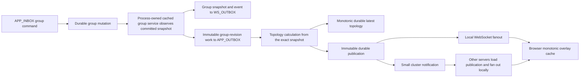
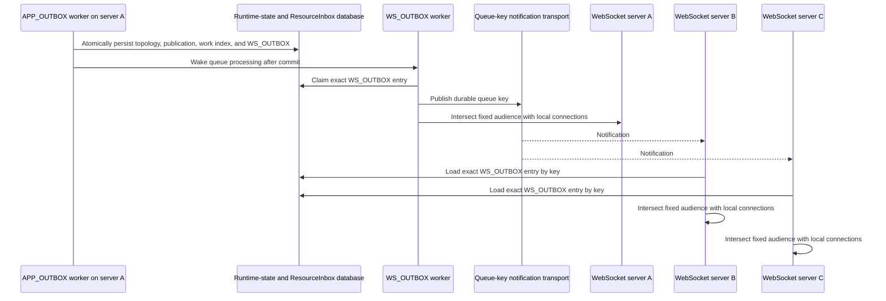

# Convergent State And RTC Topology Architecture

This document describes how Rallar API servers converge group state, client
state, and RTC overlay topology when several server processes share the same
database and complete work out of order.

The architecture does not depend on process ordering. Durable causal
revisions, immutable work, monotonic observation, deterministic identities,
and durable topology publications make retries and reordered delivery safe.

## Goals

- Keep group and client caches consistent with committed durable state.
- Preserve the existing domain meaning of `snapshotVersion`.
- Give every topology calculation an explicit causal group revision.
- Prevent coalescing from changing work that a worker has already reserved.
- Allow any API server to process topology work while delivering the result to
  browser sessions connected to other API servers.
- Keep `APP_OUTBOX` terminal: topology work must not create another queue item.
- Avoid process locks and aggregate-wide transaction locks.

## Architecture Decision Rules

Rallar uses strong data contracts to enable permissive distributed execution.
Authoritative persisted, replicated, queued, event, snapshot, and response
records require their causal and lifecycle fields. Optional fields are
appropriate only when absence has domain meaning and consumers test that
absence; they are not a compatibility mechanism for authoritative state.
Sparse request, query, patch, builder, and migration inputs use separate types.

Once input is well formed, convergence is optimistic:

- read without locking and retry when a revision moves;
- calculate expensive work outside transactions;
- accept newer causal state and ignore older state;
- use a short compare-and-commit transaction at the durable boundary;
- allow duplicate delivery when the receiver can identify it exactly.

Hard rejection remains correct for malformed or wrong-scope data,
authorization failures, equal-revision/different-content conflicts, violated
topology invariants, resource caps, and exhausted bounded retries. In
particular, permissive convergence never means authorizing from stale state.

Compatibility is a product decision rather than an implicit implementation
default. A plan that retains a revisionless shape, legacy work envelope, or
fallback authorization path must obtain explicit human approval and state its
retirement conditions.

Durable scoped key encodings are part of the concurrency contract. A key must
be injective over field name, presence/type, and value; string escaping alone
cannot distinguish an absent scope from a valid sentinel-looking identifier.
Every derived child key and list prefix must use the same canonical encoder.
Ambiguous legacy rows may be migrated only when their stored value proves the
target scope and the destination is claimed conditionally; never guess, fan one
row into multiple scopes, or keep a permanent dual-read fallback.

## Implemented Convergent Database Writes

**AppInbox is mandatory for incoming database mutations.** Every HTTP and
WebSocket database mutation uses it, including client/group/topology,
authentication/session/ticket, CRDT append/admin, and mutating admin operations.
AppInbox owns the transaction and retry boundary; waiting for a result never
falls back to direct mutation.

```text
HTTP/WS mutation
  -> APP_INBOX
  -> read -> compute -> validate
  -> AppInbox transaction
       -> service.write(transaction, computed)
       -> authoritative state/event/receipt
       -> APP_OUTBOX/WS_OUTBOX
       -> result + reservation-fenced completion
  -> commit
  -> wake/poll workers
```

Client, group, topology-config, topology publication/execution, and RTT writes
use the conditional runtime-state operations `insertIfAbsent`,
`upsertIfRevision`, and `deleteIfRevision`. Each service keeps direct named
`read`, `compute`, `validate`, and `write` phases. The `compute` and `validate`
phases are pure; computed persistence data is not called a plan. The service
`write(transaction, computed)` applies it: service write receives the
transaction and never opens, commits, replaces, or retries one. Its conditional
guard is first. An incoming HTTP/WS mutation conflict rolls back and returns to
AppInbox, whose next attempt restarts at `read` and reruns every check.

The storage rule is:

- create with conditional insert;
- update with expected-revision compare-and-set;
- delete or expire with expected-revision conditional delete.

Resource inbox allows 20 total processing attempts. Attempts one through five
wait 1, 2, 4, 8, and 16 ms; later waits rise through seconds, cap at 30 seconds,
and use jitter. A separate best-effort fairness lane claims retries more than 30
seconds overdue independently from timeout recovery. There is no unconditional
or unbounded fallback.

A transaction supplies atomicity for a multi-row commit, but it does not by
itself prevent lost updates. The transaction conditions the authoritative
transition on the revision that the decision observed. Compact
`MutationReceipt` records implement immutable first-writer-wins ledger replay.
Final `APP_OUTBOX` and `WS_OUTBOX` rows are inserted directly through
`ResourceInboxRepository` inside that transaction; a collision fails and rolls
back without loading a winner. There is no intermediate mutation outbox.
Dynamic logical WebSocket audience resolution happens only after commit; queue
workers are then woken or poll. If computed authoritative work already contains
an immutable audience, the final queue entry carries that mandatory audience.
Workers intersect it only with locally open connections and never replace it
with a process cache that may lag the message's causal revision.

Queue locks are coordination-only for bounded resource-inbox claims. Domain
authentication/session/ticket, AL admission, CRDT, client, group, and topology
writes use conditional insert/update/delete fencing. Advisory and CRDT
document-row locks are not approved queue-claim exceptions.

Authoritative persisted and shared contracts use mandatory fields by default.
Sparse input and migration types remain separate.

Expiry is a causal delete, not cleanup after a trustworthy read. A reader that
saw an expired revision may delete only that revision, so it cannot remove a
replacement that another server refreshed after the read.

## Architecture Overview



The group command does not wait for topology calculation. It waits only for
the durable group mutation and deterministic publication of its WS and
application-outbox work. The independent `APP_OUTBOX` reader owns topology
processing.

## Causal Revisions

### Domain version versus storage revision

`snapshotVersion` remains the public domain version. It advances for semantic
group or client changes according to the existing state-service rules.

`stateRevision` is the causal storage order used by server caches and RTC
topology. For snapshots assembled from runtime-state rows:

```text
stateRevision = RuntimeStateEntry.revision + 1
```

The first committed aggregate row therefore has revision `1`. Group and client
repositories attach the revision from the aggregate group or principal row to
direct reads, lists, and pages.

Group authority is the required `GroupStateCausalRevision` tuple
`{ groupRevision, presenceRevision }`. Metadata and roster changes advance the
group component. Presence connect, heartbeat, disconnect, and expiry use the
session row as their guard, advance presence authority through summary
convergence, and do not contend on the group row. Consumers compare the full
tuple rather than forcing both domains through one scalar write guard.

### Revisioned observation

Group and client caches use the following policy:

| Current cache | Incoming snapshot                   | Result              |
| ------------- | ----------------------------------- | ------------------- |
| Missing       | Any                                 | Insert              |
| Revision N    | Revision greater than N             | Advance             |
| Revision N    | Revision less than N                | Ignore as stale     |
| Revision N    | Same revision and same content      | Duplicate/no-op     |
| Revision N    | Same revision and different content | Invariant violation |

An equal causal revision with different content throws
`StateSnapshotRevisionConflictError`. Silently choosing one would make a data
integrity defect look like normal eventual consistency.

Authoritative snapshot collections that represent unordered sets use canonical
storage-key order in both the computed mutation result and durable repository
assembly. Never depend on arrival, insertion, or database/provider iteration
order. Preserve equal-revision content checks; ordering drift is a producer bug,
not eventual consistency.

## Process-Owned Cached State Services

API-v1 creates one group read-through cache and one client read-through cache,
then decorates the durable services with:

- `createCachedGroupStateService(...)`
- `createCachedClientStateService(...)`

The decorators implement the existing state-service interfaces. A successful
mutation is observed only after its durable promise resolves, and before the
application inbox service publishes WS or topology work. Every snapshot and
idempotent result must carry `stateRevision`; revisionless compatibility is not
supported.

General reads use asynchronous read-through caching. Point-read convergence has
a narrower rule: reads without a revision floor use the durable current
snapshot, while an eligible floor-bearing read may return a causally sufficient
cache entry. Strict authorization and graph/topology authority reads use the
same durable current snapshot used for the request decision; stale cached state
is never authorization authority. Synchronous `peek` is restricted to
best-effort local routing where a cache miss can safely produce no local
recipients.

Client cache keys contain the complete principal identity:

```text
(applicationId, workspaceId, principalId)
```

This prevents two workspaces with the same `principalId` from sharing cached
state. Principal-only repository helpers remain compatibility aliases and are
not used by production composition.

WebSocket state callbacks observe the same process-owned services. The
state-sync publisher is publication-only and does not independently mutate a
cache.

Direct snapshot reads use an optimistic aggregate/children/aggregate protocol
with at most three attempts. A moved aggregate revision retries; deletion
returns absent; continuous churn throws `StateSnapshotReadConflictError` with
status 503. Full lists use aggregate set A, two parallel child-prefix reads,
and aggregate set B. The unchanged path is four prefix reads regardless of
snapshot count. Pages validate the scanned aggregate keys with one exact-key
batch read and retain their scanned cursor when a deleted entry is omitted.

### Example: a member changes during a read

Suppose a reader loads aggregate revision 12, then reads members and sessions.
Another server commits a member change and advances the aggregate to revision
13 before the reader's validation read. The reader discards the mixed
candidate and retries from revision 13; it does not lock the group while
assembling children. If the group is deleted, the validation read returns
absent and the result is absent. Three consecutive movements produce a
retryable 503 rather than a torn snapshot.

## Direct Resource Inbox Effects At The Commit Boundary

Client and group mutation transactions write the conditional guard first, then
dependent state, compact receipt, final resource-inbox effects, result, and the
event through the received AppInbox transaction. `APP_OUTBOX`/`WS_OUTBOX` rows
are atomic with accepted authority. Their QueueBox workers drain them after
commit. Retry after process death reuses the same receipt and direct outbox
identity rather than applying the state mutation again.

The old post-commit order—mutate state, publish directly, then try to enqueue
topology work—is historical only. It could expose committed state without a
durable publication intent and must not be copied.

## RTT Refresh Work

RTT refresh is a latest-value workload and may coalesce while pending:

```ts
type RtcTopologyRttRefreshWork = {
  kind: 'rtt-refresh';
  groupSnapshot: GroupSnapshot;
  requestedGroupStateRevision: number;
  requestedRttVersion: number;
  overlayId: string;
  requestedAtEpochMs: number;
};
```

RTT scheduling resolves the scoped group once and embeds that exact snapshot.
It does not depend on an ambient full-cache scan at execution time.

A `NEW` RTT envelope may merge versions and reasons. A `RESERVED` envelope is
immutable. When a newer RTT arrives during processing,
`CoalescedAppOutboxWorkService` returns `blockedByReserved`, and the publisher
creates a deterministic successor keyed by group revision, endpoint pair, and
RTT version.

Coalescing retains the newest exact group snapshot, maximum requested RTT
version, and immutable request time selected for the resulting generation.
RTT measurements themselves remain latest-value inputs read during execution.

## Topology Calculation And Latest State

`RallarRtcTopologyService` is the supported package facade and process-lifecycle boundary.
`RtcTopologyPlanner` owns kind, option, incremental/full, no-RTT, and weighted-path selection;
`createRtcRoomGraph` owns weighted sparse/complete graph decisions; and
`planRallarRtcTopologySnapshot(...)` owns the caller-visible changed/version/timestamp planning
result. `RtcTopologySnapshotRegistry`, `RtcTopologyRttRebuildScheduler`, and `RtcTopologyMetrics`
own accepted process observations, pending RTT work, and mutable counters respectively.
`GroupTopologyManagementService` continues to coordinate config and RTT authority reads,
validation, and durable observation through the supported facade.

Every work item calculates from its embedded snapshot. It must not replace
revision N with the current cache value N+1. Graph planning occurs outside the
runtime-state transaction. `readTopologyMutation`, `computeTopologyMutation`,
`validateTopologyMutation`, and `writeTopologyMutation` implement the current
commit path. The write transaction CAS-guards the snapshot first, then inserts
the compact work claim and immutable publication. A conflict persists nothing
and returns to its ResourceInbox/QueueBox attempt boundary. AppInbox owns
incoming HTTP/WS mutation retries. Downstream `APP_OUTBOX` work such as
`RtcTopologyOutboxWork` repeats the full read/compute/validate/write sequence on
its own attempt boundary. In both cases, neither service owns the transaction or
retry boundary.

The durable latest-topology repository compares:

```text
(sourceGroupStateRevision, topologyVersion)
```

The greater tuple wins. An unchanged graph keeps its topology version but
still produces a snapshot and publication with the new group revision. This
allows consumers to observe that topology has been reconciled for every
causal group revision without inventing a graph change.

Inactive or deleted groups produce a topology tombstone with
`state: 'removed'`. Its recipients are the union of the prior topology's
sessions and the exact inactive group snapshot's sessions. Its update time is
the immutable group update time. Causally stale work completes without a
publication, so a rejected candidate is never fanned out.

### Example: two planners share one predecessor

Workers A and B both read topology predecessor `(groupRevision=20,
topologyVersion=7)` and plan outside the transaction. A's conditional commit
wins. B's compare-and-set observes a moved predecessor and persists no topology,
publication, or work index. B rereads and replans against A's accepted snapshot.
If B's embedded group snapshot is now causally older, B completes without
publishing. If it is newer, B conditionally commits one exact publication for
its work identity. At no point is a rejected candidate returned as
authoritative or sent to browsers.

## Durable Publications

Topology calculation and network fanout are separated by
`RtcTopologyExecutionRepository`. It atomically commits the accepted topology,
immutable publication, and work-to-publication index in one runtime-state
transaction. A publication contains:

- a deterministic `publicationId`;
- the deterministic queue `workId`;
- the scoped `groupRef`;
- `sourceGroupStateRevision` and overlay version;
- the exact recipient session ids;
- the exact AL topology message;
- its creation time.

Publication and work-index records use the existing runtime-state store and a
24-hour retention window. Exact-key validation uses the existing composite
primary key, so no SQL migration is required. Publication identity contains the
work execution id and the accepted `(sourceGroupStateRevision, overlayVersion)`
tuple. `createdAtEpochMs` comes from the work's immutable request time.

The work index makes retry behavior explicit. Once a work item has persisted a
publication, a retry loads that record and writes the same final `WS_OUTBOX`
entry before resolving group state or recalculating topology. A retry can
therefore never publish a different result for the same work identity.

## Multi-Server Fanout

All API servers share the runtime-state and queue database. PostgreSQL
`NOTIFY` is a wake signal, not the source of truth.



The final topology `WS_OUTBOX` message copies the publication's mandatory
`recipientSessionIds` into its fixed logical audience. The cluster notification
contains only the canonical durable queue key:

```ts
type QueueBoxPubSubMessage = {
  delivery: 'key';
  publisherId: string;
  channel: string;
  typeId: 'WS_OUTBOX';
  key: { topicId: string; resourceId: string; contextId: string };
};
```

The claiming server publishes the key and performs local delivery. Other
servers load and validate the exact durable row before local delivery. Each
process performs indexed lookup only for the fixed recipient ids. Closed
connections are skipped without stopping later sends. Fanout never scans
unrelated connections or reads group/client caches. This prevents a valid
publication from disappearing merely because one process observes its
group-state cache a few milliseconds behind the publication revision.

Duplicate and reordered notifications are harmless because the publication is
immutable and browser caches apply the causal tuple comparison.

`createRallarMiddleware(...)` owns queue-key bridge installation because it
constructs the `WsQueueBoxServerService` that the bridge observes. QueueBox is
still the low-latency path: a committed topology key can deliver locally and
wake remote listeners immediately. PostgreSQL `NOTIFY` is intentionally only a
wake-up and remains safe to lose.

### Durable topology replay and reconnect hydration

Each API process owns one ephemeral UUID used as its publisher stream and
consumer identity. There is no singleton allocator. A topology transaction
updates only that process's `rtc_topology_delivery_stream` HEAD and appends one
immutable `rtc_topology_delivery_log` row. The canonical publication identity
is unique across streams, so an A/B race produces one winner and rolls the
losing HEAD update back without a sequence hole.

Every consumer keeps one durable cursor per publisher. Notification,
local-commit, startup, and the one-second anti-entropy poll request the same
single-flight drain. A turn rotates publishers, reads at most 100 entries per
page and 10 pages/1,000 entries total, and advances a cursor only through the
contiguous successfully handled prefix. Bare sequence numbers from different
publishers are never comparable; identify entries as A/11 or B/21 and use the
topology causal tuple to decide current state.

Replay validates the exact publication and `WS_OUTBOX` key, then compares the
historical publication with the current durable topology. It sends current
state when history is stale and stalls on corruption or an incomparable value.
Delivery and log rows share the fixed 24-hour retention window. A cursor behind
the retained prefix triggers current-state hydration of every open local
session before it advances to a captured HEAD; dead consumers do not pin
retention.

Before HTTP starts, a process registers its stream with a database-time lease,
captures existing HEADs, and seeds its new consumer cursors to those HEADs. A
publisher discovered after readiness starts at its retained floor minus one.
The process renews its 30-second lease every 10 seconds. Lease loss stops replay,
closes local sockets, and initiates controlled shutdown instead of silently
reusing the identity.

Reconnect hydration batches connections for 25 milliseconds and scans durable
topology in pages of 100. For every candidate session/group pair it reloads the
durable group twice around the current topology read, requires active
membership, the exact session generation and principal, live presence, and an
unexpired group, then performs an identity-fenced send to that socket
generation. Failed reads retry with bounded delays while the same generation
remains open. This is current-state convergence, not historical per-session
acknowledgement.

### Example: authorization after a remote ban

Server A may have cached group revision 31 when server B bans a member and
commits revision 32. On the member's next room message, A probes the durable
aggregate once. Because the cache is older, A performs a stable snapshot read,
refreshes its cache, and rejects the message. Remote presence disconnects and
group deletion follow the same path. A warm, unchanged authorization performs
only the revision probe.

## Browser Convergence

Browser point readers expose the response source and authoritative revision
metadata. They reject malformed authoritative bodies, missing or invalid
metadata headers, and header/body revision disagreement. A room session refresh
uses one exact group point read without a floor; top-level room and people
refreshes continue to use complete durable collections.

Before targeted, heartbeat, or complete collection reads, browser repair
captures the observed snapshot identity. An authoritative `404`, heartbeat
absence, or successful complete collection omission removes that value only if
the repository still contains the identical observation. Failed, aborted,
malformed, or partial collection reads do not reconcile absence. This is a
race fence for physical cleanup, not a deletion tombstone: a delayed stale
publication can reinsert a removed client or group snapshot until causal
tombstones exist.

`RallarOverlayTopologySnapshot` and `OverlayInfo` require
`sourceGroupStateRevision` and `state`. Browser overlay repositories use the
same revision ordering rule as server state caches:

- source revision is compared before overlay version;
- equal tuple with different content is an invariant violation.

Removal tombstones remain in the underlying latest-value repository so an
older active topology cannot resurrect the overlay. Public overlay reads hide
the tombstone, and the RTC group and multicast managers treat it as absent.
The normal overlay-change notification tells the RTC manager to reconcile its
peer lanes.

## Failure And Retry Semantics

- Cache observation is monotonic; late reads cannot regress a process cache.
- Group-revision work is immutable and independently retryable.
- Reserved RTT work is never rewritten; newer input creates a successor.
- Atomic execution rejects stale tuples and persists no partial output.
- Durable publication insertion is idempotent by work and publication id.
- Publication is persisted before the cluster signal is sent.
- Cluster delivery may repeat; browsers reject duplicates and stale tuples.
- A lost notification is repaired by the periodic durable cursor drain.
- A reconnect receives current topology only after a fresh durable
  authorization check; a replacement socket generation cannot receive the
  prior generation's send.
- Cursor advancement never crosses a failed send or corrupt reference.
- `APP_OUTBOX` completes only after persistence and cluster publish succeed.
- The topology handler does not enqueue `APP_INBOX`, `APP_OUTBOX`, or
  `WS_OUTBOX` work.

An APP_OUTBOX storage or cluster-publish failure keeps the queue item retryable.
A delivery failure after local delivery can repeat local delivery on retry;
that is safe because the publication and browser observation are idempotent.

## Guarantees And Remaining Limits

The architecture guarantees that a returned durable group/client snapshot is
revision-consistent, process caches do not regress, outbox-accepted topology
output is atomic with its publication index, a work retry reuses the same
publication, strict read authorization does not trust cached snapshots, and an
eligible floor-bearing point read never returns below its requested scalar or
causal floor.

Topology publication discovery survives a live PostgreSQL listener outage
through durable per-process streams and per consumer/publisher cursors. A
process offline past the 24-hour retention window receives current-state gap or
reconnect hydration, not exact historical delivery. Exact history across a
browser disconnect and durable per-session acknowledgements remain outside
this contract.

Browser client/group absence repair also does not guarantee resurrection
safety. Conditional physical deletion protects a newer observation already in
the repository, but it cannot prevent a delayed stale publication from
recreating an absent entry. Causal tombstones remain separate work. The overlay
tombstones described above are a different feature and do not provide state
snapshot deletion authority.

## Performance Bounds

- Unchanged group/client full lists issue four prefix reads and zero point
  reads, independent of snapshot count.
- A group page of N performs one page scan, two child reads per selected group,
  and one exact-key aggregate validation batch.
- Warm room authorization performs one durable aggregate revision probe; the
  stable snapshot reader runs only after revision movement.
- An eligible point-read cache hit performs zero durable snapshot reads.
  Tokenless reads, misses, floor fallback, and strict group point reads perform
  one full durable snapshot read for the selected feature.
- Topology planning is outside the transaction. Current execution performs a
  fresh read and one conditional write transaction per accepted attempt;
  conflicts re-enter the complete read/compute/validate path.
- Topology fanout performs one encoding and one indexed send per unique
  recipient, with zero connection-wide broadcast scans.
- A new accepted topology publication adds one process-local HEAD CAS and one
  immutable delivery-log insert in the existing transaction. Independent A/B
  streams share no mutable HEAD row.
- Replay is bounded to 100 entries per page and 1,000 entries/10 pages per turn;
  reconnect and gap hydration scan durable topology in 100-row pages.

The first three bullets are code/test-proven call-shape bounds, not retained
runtime call counters. The retained Task 5 performance artifact directly
counts SQL statements and production transaction duration but does not count
high-level repository-method calls; no measured repository-call total is
claimed.

The unweakened Postgres medium-scale gate is
`npm run test:api-v1:black-box:postgres:medium-scale`: 100 independently
authenticated clients, five groups, three Postgres-backed API processes, 10
client lanes plus 5 control lanes. Never reduce those constants or the
operation matrix to make a change pass. The Task 8 retained run completed all
fixed assertions and proved cross-process state/topology convergence.

The API-v1 black-box runner keeps memory as a one-process mode. Its built-in
Postgres cluster profiles instead manage three Deno API processes sharing one
Postgres database on ports 18080, 18081, and 18082. Inspect the isolated
`api-v1-server.log`, `api-v1-server-secondary.log`, and
`api-v1-server-tertiary.log` artifacts together; recipes-only mode is
externally managed. Standard/default, CRDT, and medium-scale cluster recipes
all give node C meaningful work. The runner automatically clears prior
`fairness-proof.json` before each invocation, so a failed run cannot leave
stale proof presented as current.

`npm run test:api-v1:black-box:postgres:topology-replay` is the dedicated
durable proof. A/B retain QueueBox workers; passive C disables both database
notifications and QueueBox workers. N1/N3/N5 are distinct Alice sessions and
N2/N4/N6 are distinct Bob sessions. The proof requires C to converge only from
poll-driven replay, stops C, advances both publisher HEADs, starts C' with a new
stream, and reconnects N5/N6 to current state without a post-start mutation.
It writes `rtc-topology-replay-proof.json` plus isolated A, B, C, and C' logs.

A mutation-path or concurrency-domain change must also run
`npm run perf:api-v1:state-write` and pass
`node scripts/perf/compare-api-v1-state-write-results.mjs <baseline> <candidate>`.
The comparative result gate validates the artifact and durable receipt/outbox
linkage before evaluating latency, throughput, SQL/resource counts, transaction
duration, and retry exhaustion.

## Deployment And Compatibility

The public meaning of `snapshotVersion` and existing imports remain unchanged,
but snapshot and topology response shapes now require `stateRevision`,
`sourceGroupStateRevision`, and topology `state`. Revisionless snapshots,
missing topology causal fields, legacy outbox work, and nondurable topology
handling are not supported.

Deploy the schema first, then deploy all writers with replay disabled so every
accepted publication appends a process-stream entry. Enable replay only after
all writers are log-capable. Replay now defaults to enabled; QueueBox workers
remain enabled by default. `RALLAR_API_QUEUE_WORKERS=disabled` is a
PostgreSQL-only proof/operations mode for a passive process.

Rollback sets `RALLAR_RTC_TOPOLOGY_REPLAY=disabled`. That stops replay and
reconnect/gap hydration but deliberately leaves stream registration, logging,
lease renewal, fixed-retention compaction, and schema in place so a later
cutover does not create a new unlogged interval. Do not drop the delivery tables
or disable standard QueueBox workers as part of this rollback.

Existing REST paths, database schema, generated manifests, and browser runtime
import paths remain compatible. Point-read floor queries, authoritative
response headers, and metadata-bearing browser readers are additive;
`findStateGroup(...)` preserves its body-only return shape. The required
response fields and the two-work-type topology queue contract remain the
intentional coordinated-deployment boundary described by this architecture.

## Source Map

- `packages/shared/api/group-types.ts` and `client-types.ts`: mandatory state
  revision contracts.
- `packages/shared/api/overlay-topology.ts`: topology causal tuple and browser
  conversion.
- `packages/shared/repository/state-snapshot-revision.ts`: shared monotonic
  state observation policy.
- `packages/shared/repository/group-state-snapshots-repository.ts` and
  `client-state-snapshots-repository.ts`: process latest-value caches.
- `packages/shared-server/runtime-state/RuntimeStateJsonStore.ts`: entry-aware
  runtime-state reads and exact-key batches.
- `packages/shared-server/rallar-system/repositories/GroupStateRepository.ts`
  and `ClientStateRepository.ts`: durable snapshot revision attachment.
- `packages/shared-server/rallar-system/services/cached-group-state-service.ts`
  and `cached-client-state-service.ts`: process-owned service decorators.
- `packages/shared-server/rallar-system/services/RtcTopologyOutboxWork.ts`:
  immutable group work, RTT successors, and terminal handling.
- `packages/shared-server/rallar-system/services/rallar-rtc-topology-service.ts`:
  supported topology facade and process-lifecycle coordination.
- `packages/shared-server/rallar-system/topology/planning/rtc-topology-planner.ts`:
  topology kind, option, incremental/full, no-RTT, and weighted-path selection.
- `packages/shared-server/rallar-system/topology/planning/create-rtc-room-graph.ts`:
  weighted sparse/complete room graph decisions.
- `packages/shared-server/rallar-system/topology/planning/compute-no-rtt-topology-next-hops.ts`:
  deterministic star, tree, and mesh no-RTT next hops.
- `packages/shared-server/rallar-system/topology/planning/plan-rallar-rtc-topology-snapshot.ts`:
  caller-visible snapshot change, version, timestamp, and canonical next-hop result.
- `packages/shared-server/rallar-system/topology/runtime/rtc-topology-snapshot-registry.ts`:
  accepted process observations and causal conflict decisions.
- `packages/shared-server/rallar-system/topology/runtime/rtc-topology-rtt-rebuild-scheduler.ts`:
  pending RTT deadlines, coalescing, claims, delays, and cleanup.
- `packages/shared-server/rallar-system/topology/runtime/rtc-topology-metrics.ts`:
  topology counters, duration observations, and reset behavior.
- `packages/shared-server/rallar-system/topology/group-topology-management-service.ts`:
  topology config, validation, durable latest observation, and removal plans.
- `packages/shared-server/rallar-system/repositories/RtcTopologySnapshotRepository.ts`:
  monotonic durable latest topology.
- `packages/shared-server/rallar-system/repositories/RtcTopologyPublicationRepository.ts`:
  immutable publications and work index.
- `packages/shared-server/rallar-system/repositories/RtcTopologyExecutionRepository.ts`:
  atomic topology/publication/work-index acceptance.
- `packages/shared-server/rallar-system/topology/replay/**`: stream/log
  validation, bounded replay, current repair, diagnostics, and reconnect/gap
  hydration.
- `packages/shared-server/postgres/rtc-topology/**`: PostgreSQL stream, append,
  cursor, compaction, and retirement adapters.
- `packages/shared-server/rallar-system/pubsub/RtcTopologyClusterTransport.ts`:
  deprecated compatibility-only public transport data; production composition
  no longer owns or requires it.
- `packages/shared-server/rallar-system/pubsub/QueueBoxPubSubBridge.ts`:
  durable queue-key publication, actual listener readiness, and bounded
  cluster-receive diagnostics.
- `packages/shared-server/rallar-system/middleware/RallarMiddleware.ts`:
  queue bridge installation and combined runtime readiness ownership.
- `apps/api-v1/src/runtime/rtc-topology/**`: process stream registration,
  readiness, replay configuration, health shutdown, and metrics composition.
- `apps/api-v1/src/middleware.ts` and `create-rallar-server.ts`: single-owner
  API composition and consumer wiring.

## Verification

Focused concurrency coverage lives in:

- `packages/tests/shared-server/authoritative-mutation-read-compute-validate-write.test.ts`
- `packages/tests/shared-server/cached-state-services.test.ts`
- `packages/tests/shared-server/rtc-topology-outbox-work.test.ts`
- `packages/tests/shared-server/rtc-topology-delivery-log.test.ts`
- `packages/tests/shared-server/rtc-topology-replay-service.test.ts`
- `packages/tests/shared-server/rtc-topology-reconnect-hydrator.test.ts`
- `packages/tests/shared-server/rtc-topology-cluster-transport.test.ts`
- `packages/tests/shared-server/rallar-system/rtc-topology/persistence/rtc-rtt-repository-read-write.test.ts`
- `packages/tests/shared-server/rallar-system/rtc-topology/persistence/rtc-rtt-repository-convergence.test.ts`
- `packages/tests/shared-server/rallar-system/rtc-topology/persistence/rtc-rtt-persistence-corruption.test.ts`
- `packages/tests/shared-server/rallar-system/rtc-topology/rtc-topology-snapshot-repository.test.ts`
- `packages/tests/shared-server/rallar-system/rtc-topology/rtc-topology-publication-repository.test.ts`
- `packages/tests/shared-server/group-topology-management-service.test.ts`
- `packages/tests/shared-server/queuebox-pubsub-bridge.test.ts`
- `packages/tests/shared-server/rallar-middleware.test.ts`
- `packages/tests/shared/ws-outbox-owner-miss-retry.test.ts`
- `packages/tests/api-v1/rtc-topology-cluster-transport.test.ts`
- `packages/tests/shared-web/data-caches.test.ts`
- `apps/api-v1/test/services/ws-topic-room-authorizer.test.ts`
- `packages/shared-test/black-box-runner/tests/api-v1/api-v1-rtc-topology-convergence.json`
- `packages/shared-test/black-box-runner/tests/api-v1/api-v1-state-topology-churn.json`
- `packages/shared-test/black-box-runner/topology-replay/api-v1-rtc-topology-replay-proof.mts`

The full-stack acceptance commands are:

```sh
npm run test:rallar:full-stack:memory:live-rtc-3
npm run test:rallar:full-stack:postgres:live-rtc-3
```

They verify group/member setup, three browser connections, topology
convergence, multicast delivery, and cleanup against both runtime-state
backends.

For api-v1 client, group, topology, runtime-state, or database-concurrency
changes, run the focused files first and then the fixed medium-scale gate. A
mutation-path or concurrency-domain change also runs the performance gate
described above.
