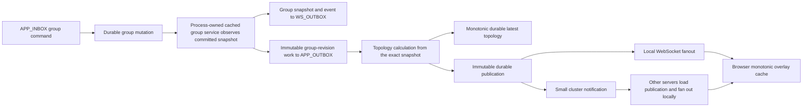
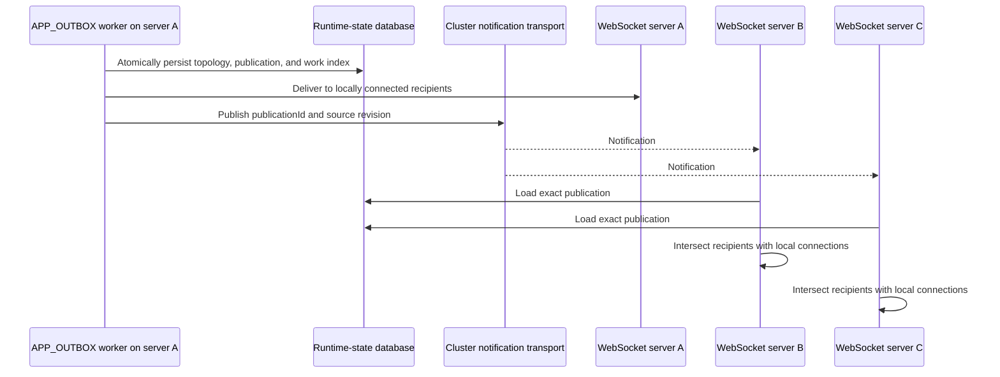

# Convergent State And RTC Topology Architecture

This document describes how Rallar API servers converge group state, client
state, and RTC overlay topology when several server processes share the same
database and complete work out of order.

The architecture does not depend on process ordering. Durable causal
revisions, immutable work, monotonic observation, deterministic identities,
and durable topology publications make retries and reordered delivery safe.

## Goals

- Keep group and client caches consistent with committed durable state.
- Preserve the existing domain meaning of `snapshotVersion`.
- Give every topology calculation an explicit causal group revision.
- Prevent coalescing from changing work that a worker has already reserved.
- Allow any API server to process topology work while delivering the result to
  browser sessions connected to other API servers.
- Keep `APP_OUTBOX` terminal: topology work must not create another queue item.
- Avoid process locks and aggregate-wide transaction locks.

## Architecture Overview



The group command does not wait for topology calculation. It waits only for
the durable group mutation and deterministic publication of its WS and
application-outbox work. The independent `APP_OUTBOX` reader owns topology
processing.

## Causal Revisions

### Domain version versus storage revision

`snapshotVersion` remains the public domain version. It advances for semantic
group or client changes according to the existing state-service rules.

`stateRevision` is the causal storage order used by server caches and RTC
topology. For snapshots assembled from runtime-state rows:

```text
stateRevision = RuntimeStateEntry.revision + 1
```

The first committed aggregate row therefore has revision `1`. Group and client
repositories attach the revision from the aggregate group or principal row to
direct reads, lists, and pages.

Child-row-only mutations, such as a presence heartbeat that updates a session
TTL without changing `snapshotVersion`, also touch the aggregate row. This
ensures that two snapshots with different durable content cannot legitimately
carry the same `stateRevision`.

### Revisioned observation

Group and client caches use the following policy:

| Current cache              | Incoming snapshot                   | Result                                  |
| -------------------------- | ----------------------------------- | --------------------------------------- |
| Missing    | Any                                 | Insert              |
| Revision N | Revision greater than N             | Advance             |
| Revision N | Revision less than N                | Ignore as stale     |
| Revision N | Same revision and same content      | Duplicate/no-op     |
| Revision N | Same revision and different content | Invariant violation |

An equal causal revision with different content throws
`StateSnapshotRevisionConflictError`. Silently choosing one would make a data
integrity defect look like normal eventual consistency.

## Process-Owned Cached State Services

API-v1 creates one group read-through cache and one client read-through cache,
then decorates the durable services with:

- `createCachedGroupStateService(...)`
- `createCachedClientStateService(...)`

The decorators implement the existing state-service interfaces. A successful
mutation is observed only after its durable promise resolves, and before the
application inbox service publishes WS or topology work. Every snapshot and
idempotent result must carry `stateRevision`; revisionless compatibility is not
supported.

Reads use asynchronous read-through caching. Authorization, REST, admin,
statistics, and topology paths use these shared services. Synchronous `peek`
is restricted to best-effort local routing where a cache miss can safely
produce no local recipients.

Client cache keys contain the complete principal identity:

```text
(applicationId, workspaceId, principalId)
```

This prevents two workspaces with the same `principalId` from sharing cached
state. Principal-only repository helpers remain compatibility aliases and are
not used by production composition.

WebSocket state callbacks observe the same process-owned services. The
state-sync publisher is publication-only and does not independently mutate a
cache.

Direct snapshot reads use an optimistic aggregate/children/aggregate protocol
with at most three attempts. A moved aggregate revision retries; deletion
returns absent; continuous churn throws `StateSnapshotReadConflictError` with
status 503. Full lists use aggregate set A, two parallel child-prefix reads,
and aggregate set B. The unchanged path is four prefix reads regardless of
snapshot count. Pages validate the scanned aggregate keys with one exact-key
batch read and retain their scanned cursor when a deleted entry is omitted.

## Topology Work At The Commit Boundary

When an application-inbox group mutation writes an event,
`AppGroupInboxService` performs these post-commit operations in order:

1. Publish the committed group snapshot to `WS_OUTBOX`.
2. Publish the group event to `WS_OUTBOX`.
3. Enqueue the exact committed snapshot as `RTC_TOPOLOGY_RECOMPUTE` in
   `APP_OUTBOX`.
4. Complete the application-inbox command.

The group-revision work contract is immutable:

```ts
type RtcTopologyGroupRevisionWork = {
  kind: "group-revision";
  groupSnapshot: GroupSnapshot;
  sourceGroupStateRevision: number;
  overlayId: string;
  requestedAtEpochMs: number;
};
```

Its deterministic queue identity contains the fully scoped overlay identity
and `stateRevision`. Repeating post-commit publication after a partial failure
therefore converges on the same logical work item.

Production WebSocket group-snapshot callbacks observe and broadcast state but
do not create topology work. Local `WS_OUTBOX` callbacks never schedule
topology work.

## RTT Refresh Work

RTT refresh is a latest-value workload and may coalesce while pending:

```ts
type RtcTopologyRttRefreshWork = {
  kind: "rtt-refresh";
  groupSnapshot: GroupSnapshot;
  requestedGroupStateRevision: number;
  requestedRttVersion: number;
  overlayId: string;
  requestedAtEpochMs: number;
};
```

RTT scheduling resolves the scoped group once and embeds that exact snapshot.
It does not depend on an ambient full-cache scan at execution time.

A `NEW` RTT envelope may merge versions and reasons. A `RESERVED` envelope is
immutable. When a newer RTT arrives during processing,
`CoalescedAppOutboxWorkService` returns `blockedByReserved`, and the publisher
creates a deterministic successor keyed by group revision, endpoint pair, and
RTT version.

Coalescing retains the newest exact group snapshot, maximum requested RTT
version, and immutable request time selected for the resulting generation.
RTT measurements themselves remain latest-value inputs read during execution.

## Topology Calculation And Latest State

`planRallarRtcTopologySnapshot(...)` contains the side-effect-free planning
policy. `GroupTopologyManagementService` coordinates config and RTT reads,
validation, process observation, and durable observation.

Every work item calculates from its embedded snapshot. It must not replace
revision N with the current cache value N+1. Graph planning occurs outside the
runtime-state transaction. The handler then validates the predecessor under
fixed-order topology/work-index locks, retrying calculation at most three times
when the predecessor moves.

The durable latest-topology repository compares:

```text
(sourceGroupStateRevision, topologyVersion)
```

The greater tuple wins. An unchanged graph keeps its topology version but
still produces a snapshot and publication with the new group revision. This
allows consumers to observe that topology has been reconciled for every
causal group revision without inventing a graph change.

Inactive or deleted groups produce a topology tombstone with
`state: 'removed'`. Its recipients are the union of the prior topology's
sessions and the exact inactive group snapshot's sessions. Its update time is
the immutable group update time. Causally stale work completes without a
publication, so a rejected candidate is never fanned out.

## Durable Publications

Topology calculation and network fanout are separated by
`RtcTopologyExecutionRepository`. It atomically commits the accepted topology,
immutable publication, and work-to-publication index in one runtime-state
transaction. A publication contains:

- a deterministic `publicationId`;
- the deterministic queue `workId`;
- the scoped `groupRef`;
- `sourceGroupStateRevision` and overlay version;
- the exact recipient session ids;
- the exact AL topology message;
- its creation time.

Publication and work-index records use the existing runtime-state store and a
24-hour retention window. Exact-key validation uses the existing composite
primary key, so no SQL migration is required. Publication identity contains the
work execution id and the accepted `(sourceGroupStateRevision, overlayVersion)`
tuple. `createdAtEpochMs` comes from the work's immutable request time.

The work index makes retry behavior explicit. Once a work item has persisted a
publication, a retry loads and republishes that record before resolving group
state or recalculating topology. A retry can therefore never publish a
different result for the same work identity.

## Multi-Server Fanout

All API servers share the runtime-state and queue database. PostgreSQL
`NOTIFY` is a wake signal, not the source of truth.



The cluster notification contains only:

```ts
type RtcTopologyPublicationNotification = {
  v: 1;
  publisherId: string;
  publicationId: string;
  sourceGroupStateRevision: number;
};
```

The publishing server performs local delivery directly and ignores its own
remote notification. Other servers load the durable publication and verify its
source revision. Each process encodes the AL message once, deduplicates the
recipient ids, and performs one indexed send per recipient. Closed connections
are skipped without stopping later sends. Fanout never scans unrelated
connections or reads group/client caches.

Duplicate and reordered notifications are harmless because the publication is
immutable and browser caches apply the causal tuple comparison.

API-v1 supports local, disabled, and PostgreSQL cluster transports. PostgreSQL
subscription readiness is awaited before the queue engine and HTTP server
start. A PostgreSQL deployment fails closed if it cannot establish the
subscription. Local and disabled modes resolve readiness immediately; disabled
mode is suitable only for a single server.

## Browser Convergence

`RallarOverlayTopologySnapshot` and `OverlayInfo` require
`sourceGroupStateRevision` and `state`. Browser overlay repositories use the
same revision ordering rule as server state caches:

- source revision is compared before overlay version;
- equal tuple with different content is an invariant violation.

Removal tombstones remain in the underlying latest-value repository so an
older active topology cannot resurrect the overlay. Public overlay reads hide
the tombstone, and the RTC group and multicast managers treat it as absent.
The normal overlay-change notification tells the RTC manager to reconcile its
peer lanes.

## Failure And Retry Semantics

- Cache observation is monotonic; late reads cannot regress a process cache.
- Group-revision work is immutable and independently retryable.
- Reserved RTT work is never rewritten; newer input creates a successor.
- Atomic execution rejects stale tuples and persists no partial output.
- Durable publication insertion is idempotent by work and publication id.
- Publication is persisted before the cluster signal is sent.
- Cluster delivery may repeat; browsers reject duplicates and stale tuples.
- `APP_OUTBOX` completes only after persistence and cluster publish succeed.
- The topology handler does not enqueue `APP_INBOX`, `APP_OUTBOX`, or
  `WS_OUTBOX` work.

An APP_OUTBOX storage or cluster-publish failure keeps the queue item retryable.
A delivery failure after local delivery can repeat local delivery on retry;
that is safe because the publication and browser observation are idempotent.

## Performance Bounds

- Unchanged group/client full lists issue four prefix reads and zero point
  reads, independent of snapshot count.
- A group page of N performs one page scan, two child reads per selected group,
  and one exact-key aggregate validation batch.
- Warm room authorization performs one durable aggregate revision probe; the
  stable snapshot reader runs only after revision movement.
- Topology planning is outside transaction locks. Normal execution performs one
  predecessor read and one locked validation read.
- Topology fanout performs one encoding and one indexed send per unique
  recipient, with zero connection-wide broadcast scans.

Timing benchmarks are directional machine-local evidence. Repository-call
counts and algorithmic bounds are the acceptance gates.

## Deployment And Compatibility

The public `snapshotVersion` contract and existing imports remain unchanged,
but `stateRevision`, topology `sourceGroupStateRevision`, and topology `state`
are mandatory. Revisionless snapshots, missing topology causal fields, legacy
outbox work, and nondurable topology handling are not supported.

The cluster-notification cutover requires a coordinated deployment of API
nodes. Older nodes do not subscribe to topology publication notifications and
cannot fan out publications to their locally connected sessions.

No recipe timeout, REST schema, queue schema, generated manifest, or browser
runtime import path is changed by this architecture.

PostgreSQL notifications remain ephemeral. A durable publication can still be
missed if `NOTIFY` succeeds while another process is disconnected, because
there is no ordered durable cursor drain. Lossless cluster replay is a separate
follow-up: notifications should act only as wake-ups for a durable ordered
publication log with per-process replay cursors.

## Source Map

- `packages/shared/api/group-types.ts` and `client-types.ts`: mandatory state
  revision contracts.
- `packages/shared/api/overlay-topology.ts`: topology causal tuple and browser
  conversion.
- `packages/shared/repository/state-snapshot-revision.ts`: shared monotonic
  state observation policy.
- `packages/shared/repository/group-state-snapshots-repository.ts` and
  `client-state-snapshots-repository.ts`: process latest-value caches.
- `packages/shared-server/runtime-state/RuntimeStateJsonStore.ts`: entry-aware
  runtime-state reads and exact-key batches.
- `packages/shared-server/rallar-system/repositories/GroupStateRepository.ts`
  and `ClientStateRepository.ts`: durable snapshot revision attachment.
- `packages/shared-server/rallar-system/services/cached-group-state-service.ts`
  and `cached-client-state-service.ts`: process-owned service decorators.
- `packages/shared-server/rallar-system/services/RtcTopologyOutboxWork.ts`:
  immutable group work, RTT successors, and terminal handling.
- `packages/shared-server/rallar-system/services/rallar-rtc-topology-service.ts`:
  pure topology planning and process observation.
- `packages/shared-server/rallar-system/services/group-topology-management-service.ts`:
  topology config, validation, durable latest observation, and removal plans.
- `packages/shared-server/rallar-system/repositories/RtcTopologySnapshotRepository.ts`:
  monotonic durable latest topology.
- `packages/shared-server/rallar-system/repositories/RtcTopologyPublicationRepository.ts`:
  immutable publications and work index.
- `packages/shared-server/rallar-system/repositories/RtcTopologyExecutionRepository.ts`:
  atomic topology/publication/work-index acceptance.
- `packages/shared-server/rallar-system/pubsub/RtcTopologyClusterTransport.ts`:
  cluster notification contract and local-session fanout.
- `apps/api-v1/src/db/api-v1-rtc-topology-cluster-transport.ts`: local,
  disabled, and PostgreSQL transport composition.
- `apps/api-v1/src/middleware.ts` and `create-rallar-server.ts`: single-owner
  API composition and consumer wiring.

## Verification

Focused concurrency coverage lives in:

- `packages/tests/shared-server/cached-state-services.test.ts`
- `packages/tests/shared-server/rtc-topology-outbox-work.test.ts`
- `packages/tests/shared-server/rtc-topology-cluster-transport.test.ts`
- `packages/tests/shared-server/rtc-topology-runtime-state-repositories.test.ts`
- `packages/tests/api-v1/rtc-topology-cluster-transport.test.ts`
- `packages/tests/shared-web/data-caches.test.ts`

The full-stack acceptance commands are:

```sh
npm run test:rallar:full-stack:memory:live-rtc-3
npm run test:rallar:full-stack:postgres:live-rtc-3
```

They verify group/member setup, three browser connections, topology
convergence, multicast delivery, and cleanup against both runtime-state
backends.
