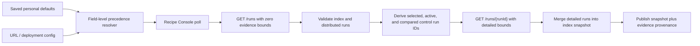

# Rallar Black Box SPA Resilience, Settings, and Swagger Design

## Status

Approved for implementation on 2026-07-18. This document records the recommended design the user approved after reviewing the production and legacy screenshots. The later Swagger failure report is included as a required implementation slice.

## Goals

- Make the new Recipe Console recoverably read the deployed control server without the current four-second false-offline timeout.
- Stop polling detailed high-volume evidence for every retained control run.
- Preserve detailed evidence for the control runs an operator is actively using.
- Show the actual control-read error, including timeout duration, instead of only `Offline · unreachable`.
- Add an obvious account/settings control to the new SPA, including logout.
- Let an operator persist non-secret personal defaults for the control endpoint, API endpoint, application, workspace, group, and control-read timeout.
- Keep URL and deployment configuration authoritative over personal defaults.
- Repair Swagger UI “Execute” behind the production HTTPS reverse proxy.
- Verify the changes through automated behavior tests and rendered desktop/mobile browser QA.

## Evidence and Root Causes

### Recipe Console timeout

The deployed Recipe Console polls:

`GET /runs?limitCommands=120&limitResults=120&limitEvents=160&limitStats=60&limitReports=40&limitHeartbeats=80`

Production evidence gathered before implementation:

- response: HTTP 200
- elapsed time: about 9.1 seconds
- payload: about 33.3 MB
- retained runs: 50
- events across the response: 5,727
- current SPA request timeout: 4 seconds

A zero-evidence index response was about 1.3 MB and 3.2 seconds. A reduced-but-still-detailed response remained about 6.1 MB and 3.7 seconds. The immediate timeout is therefore deterministic, and raising the timeout alone would continue to poll unnecessarily large all-run payloads.

### Missing account, logout, and defaults

`App.tsx` already supplies `authBusy`, `authError`, and `onLogout` to `RecipeConsoleApp`, but the new app currently discards them. The new top command bar has only refresh and copy controls. The legacy shell exposes logout and editable global context, while the new Recipe Console has no settings surface.

### Swagger UI

The production docs page is HTTPS, but `/api/openapi.json` advertises:

`http://control.rallar.intactss.com`

Swagger consequently generates an HTTP `/runs` request. Executing the documented operation displays `Failed to fetch` because the HTTPS page cannot safely call that mixed-content URL. The server derives the OpenAPI server URL from the reverse proxy's internal request scheme.

## Architecture

### 1. Index-first control polling

The polling request will use zero evidence bounds for commands, results, events, stats, reports, and heartbeats. It will still return authoritative run identity, timestamps, agent state/counters, distributed-run state, and fleet reports.

After the index is validated, the client will identify the control runs that require detailed evidence:

- the explicit `controlRunId` in the current Recipe Console URL;
- the bootstrap run when present in the index;
- control runs owning the selected distributed run;
- control runs owning `compareLeft` or `compareRight` distributed runs;
- control runs with non-terminal distributed runs.

Those run IDs are de-duplicated in stable order and read through the existing `GET /runs/{runId}` endpoint using the existing detailed evidence bounds. Detailed run snapshots replace their corresponding index entries in the in-memory snapshot.

The query provenance will state which run IDs contain detailed evidence and which remain index-only. This prevents the zero-bound transport decision from being implicit. No controller persistence contract changes are required.

Detail reads use the same authorization state and abort signal as the root read. They are serialized to avoid concurrent token-broker challenges. A missing or invalid requested detail is a protocol failure for that query rather than silently presenting an index-only run as complete evidence.

The default control-read timeout becomes 20,000 ms, matching the existing black-box client default and leaving headroom for a production root read plus a selected detail read. Polling remains settlement-based and non-overlapping.

### 2. Error diagnostics

The existing structured `lastError` remains the source of truth. The command-bar status label will distinguish a timeout and include the configured duration, for example:

`Timed out after 20 s · unreachable`

HTTP, authorization, protocol, and network behavior retains its existing status classification. The settings surface also shows the latest structured control error when one exists.

### 3. Personal defaults and precedence

A versioned Recipe Console preferences module will own a small local-storage document:

```ts
type RecipeConsolePreferences = Readonly<{
  controlUrl?: string;
  apiBaseUrl?: string;
  applicationId?: string;
  workspaceId?: string;
  groupId?: string;
  controlReadTimeoutMs: number;
}>;
```

Only this allow-listed shape is persisted. Endpoint values must use an allowed HTTP/HTTPS/WS/WSS scheme, contain no username or password, and contain no query or fragment. Empty strings are omitted. The timeout is an integer from 1,000 through 120,000 ms. Invalid or unknown persisted data is ignored; credentials, auth tokens, passwords, client IDs, session IDs, and session tickets are never persisted.

Effective-value precedence is field-specific:

1. an explicit URL parameter;
2. a matching `VITE_RALLAR_*` deployment value;
3. a saved personal default;
4. the existing bootstrap default.

Fields controlled by URL or deployment are shown as managed and cannot be overwritten from the personal-default form. Saving updates the active Recipe Console immediately by recreating its control connection with the effective values. Reset removes the personal preference document and returns unlocked fields to bootstrap defaults.

Client and session identity remain auth-owned and read-only. The account section identifies the signed-in username and session state without exposing a token or persisting identity data.

### 4. Account/settings UI

The accepted visual direction is the existing Recipe Console design system:

- existing white command bar, blue focus treatment, 44 px icon controls, six-pixel radii, and current typography;
- a `sliders` icon button at the far right labeled `Open account and settings`;
- a right-aligned modal panel on desktop and bottom sheet on mobile;
- two sections: `Account` and `Personal defaults`;
- explicit `Save defaults`, `Reset defaults`, and `Logout` controls;
- inline validation and save status using existing semantic status colors.

The panel traps focus, closes with Escape or its close control, restores focus to the trigger, and keeps logout disabled while authentication work is busy. Logout calls the existing root `logout()` flow; successful session clearing returns the browser-rallar operator to the existing login screen.

No new decorative system, images, gradients, badges, or marketing copy will be introduced.

### 5. Swagger proxy safety

The OpenAPI document will advertise the relative server URL `/` with description `Current control server`. OpenAPI resolves that URL against the document/page origin, so local HTTP continues to work and production HTTPS remains HTTPS without trusting proxy headers or hard-coding a deployment host.

The Swagger HTML continues to load `/api/openapi.json`. A regression test will prove that a request whose internal URL is HTTP still returns a relative server URL, which reproduces the reverse-proxy failure mode.

Controller JSON responses used by high-frequency runtime endpoints will be compact rather than pretty-printed. The Swagger/OpenAPI JSON can remain readable only if it is separated from the runtime response helper; otherwise it will also use compact JSON. Response semantics and content type do not change.

## Data Flow



## Error Handling

- Timeouts abort the entire index/detail query and retain the prior snapshot as stale when one exists.
- A user-triggered refresh remains de-duplicated with an active poll.
- Detail-read 404, HTTP, authorization, network, and protocol errors keep their structured error information.
- Preference storage exceptions do not crash the app; the settings surface reports that the defaults could not be saved or reset.
- Invalid form input is rejected before storage or connection replacement.
- Logout errors remain visible in the account panel through `authError`.
- Swagger uses same-origin resolution and requires no forwarded-header trust policy.

## Compatibility and Security

- Existing controller routes and snapshot response contracts are preserved.
- Existing consumers that call `/runs` without zero bounds retain current behavior.
- Existing auth and credential-provenance rules remain authoritative.
- Personal defaults never weaken the rule that URL-selected endpoints cannot receive ambient stored credentials.
- No secret value is placed in local storage, URLs, screenshots, test fixtures, or logs.
- The Swagger change is backwards compatible for local and deployed browsers because `/` resolves to the current origin.

## Testing and Acceptance

### Automated

- Red/green tests for index bounds, selected/active/compared detail derivation, merge order, detail validation, authorization reuse, and query cancellation.
- Red/green test proving the provider default timeout is 20,000 ms and configurable.
- Red/green tests for timeout status copy.
- Red/green tests for preference validation, security allow-list, field-level precedence, save, read, and reset.
- Component/structure tests proving the account/settings props are carried from `App.tsx` to the command bar.
- A Playwright workflow that opens settings, edits an unlocked field, saves, verifies local storage and live UI state, resets it, and exercises logout from the visible control.
- Deno regression test for the relative OpenAPI server URL.
- Focused Vitest, control-server Deno tests/check, Recipe Console build, and broader related suites.

### Rendered QA

- Production failure screenshots remain the before evidence.
- Local fixed SPA is checked at desktop and mobile widths.
- Page identity, meaningful DOM, framework overlay, console warnings/errors, and at least one settings interaction are checked.
- Settings open/close, Escape/focus restoration, save/reset, validation, managed-field treatment, timeout diagnostics, and logout are exercised.
- Swagger `Try it out` is exercised against the fixed local server and the generated request URL is verified as same-origin.
- After screenshots show the desktop settings panel, mobile settings sheet, visible timeout diagnostic, and successful Swagger request.

## Non-Goals

- Changing controller retention policy.
- Persisting operator tokens, passwords, auth sessions, client IDs, or session IDs.
- Replacing the existing Recipe Console visual design.
- Adding arbitrary per-route timeout tuning.
- Redesigning the legacy shell.
- Trusting arbitrary `X-Forwarded-*` headers for Swagger URL construction.
