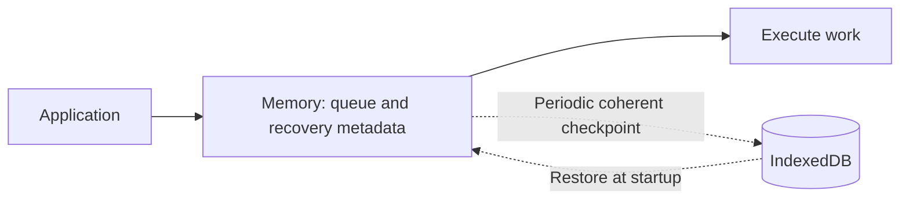

# QueueBox Persistence QoS Product Plan

Date: 2026-09-28

Status: Proposed product direction. This document defines application needs,
observable behavior and delivery outcomes. It does not map the proposal to
existing code, prescribe a public API or select a persisted format.

## Product goal

Let applications choose how much recovery they need without making every queue
operation wait for local storage. The central capability is an in-memory
QueueBox whose recoverable state is checkpointed to IndexedDB periodically.

During normal operation, memory owns the live queue. Persistence speed determines
recovery freshness; admission, execution, retries and completion proceed from
memory. Applications explicitly accept the possibility of losing recent work or
repeating previously completed work after a restart.

The product promise is:

> Accept and process work from memory. Attempt to checkpoint changes at the
> configured interval while the runtime can execute. Continue operating when
> persistence falls behind or fails, and expose the actual recovery freshness.
> On restart, recover from the last usable committed checkpoint.

This is a permissive QoS with a recovery target. It does not promise that a
configured interval is an absolute maximum loss window, that storage never
fails, or that effects execute exactly once.

## Application needs

Policy belongs to a workload, rather than to an entire application by default.
A single application may have live interactions, local drafts and an offline
outbox with different requirements.

| Application need                                       | Suitable policy                                                              | Accepted recovery behavior                                                             |
| ------------------------------------------------------ | ---------------------------------------------------------------------------- | -------------------------------------------------------------------------------------- |
| Presence, cursors and replaceable presentation updates | Memory without checkpoints                                                   | Fresh updates replace lost state; stale session traffic need not replay.               |
| Rebuildable or idempotent background work              | Memory with checkpoints, for example every 1–10 seconds                      | Recent admissions may be lost and completed work may repeat.                           |
| Best-effort telemetry and aggregates                   | Memory with batching or checkpoints, for example every 10–60 seconds         | Missing and repeated observations are handled according to the telemetry contract.     |
| Recomputable processing progress                       | Checkpoints every minute or ten minutes                                      | More computation may repeat after restart.                                             |
| Drafts and preferences                                 | Periodically persist the latest application state                            | Recent edits may be lost; checkpointing a work queue alone does not save the document. |
| Offline commands presented as safely stored            | Acceptance after local commit, optionally preceded by optimistic UI feedback | The application distinguishes immediate feedback from confirmed local persistence.     |

These intervals illustrate product choices, not measured defaults or latency
recommendations. Applications choose them according to the cost of lost work,
replay and persistence overhead. State whose authority lives on a server still
uses that authority; a browser checkpoint does not become authoritative merely
because it survives a restart.

## Persistence profiles

The profiles describe when acceptance and execution may happen. They are product
contracts, not claims that these modes already exist or names for committed APIs.

| Profile                          | Acceptance milestone        | Execution eligibility            | Primary use                                                                            |
| -------------------------------- | --------------------------- | -------------------------------- | -------------------------------------------------------------------------------------- |
| Memory                           | Accepted into RAM           | After memory admission           | Session work with no restart recovery requirement.                                     |
| Memory with periodic checkpoints | Accepted into RAM           | After memory admission           | Responsive work with best-effort recovery and explicit loss/replay tolerance.          |
| Staged                           | Accepted into RAM           | After the relevant state commits | Immediate acceptance feedback when external effects should wait for local persistence. |
| Committed                        | Accepted after local commit | After the relevant state commits | Applications that attach a local persistence promise to acceptance.                    |

Worker placement is independent of these profiles. A worker can own queue
processing and checkpoint preparation without changing the acceptance contract.
It does not itself strengthen recovery or keep a runtime alive indefinitely.

IndexedDB's native relaxed durability option is also independent. It changes
the transaction commit criterion, not whether application execution waits for
periodic persistence. A later technical design chooses the transaction durability
policy separately and documents its meaning.

## Checkpointed memory contract

### Policy selection

The first product increment is opt-in and selects a policy for one coherent
runtime or queue scope. Selecting the profile must not silently weaken another
scope's delivery or persistence contract.

The policy has four required decisions:

1. A positive target checkpoint interval, supporting choices such as one second,
   ten seconds, one minute and ten minutes without requiring separate modes.
2. Continue execution in memory when persistence is delayed or unavailable.
3. A finite live queue capacity and an explicit overflow behavior: reject new
   work, drop eligible work or replace work that the application declares
   semantically superseded.
4. A recovery policy that declares whether lost admissions and repeated effects
   are acceptable and how replay is handled.

No universal interval is selected here. Product presets and capacity values are
chosen from representative application measurements. An interval is measured
from checkpoint scheduling, not repeatedly postponed by every new mutation;
continuous traffic must not prevent checkpoint attempts indefinitely.

### Normal operation

Reads, admission, reservation, retries, completion and cleanup use memory. The
runtime captures a coherent recoverable state, then writes it in the background.
Execution does not hold a memory mutation boundary while waiting for IndexedDB.

Checkpointing records recoverable state rather than an event history. Several
transitions of the same entry may collapse into one persisted state. A job that
enters and completes between checkpoints may require only a final receipt, or no
queue row if its contract requires no retained receipt. Required deduplication
and ownership facts still survive with the state that depends on them.

Coalescing transitions of one entry must not discard distinct application
commands. Replacing successive latest-value updates requires explicit application
semantics; it is not a generic optimization for arbitrary commands.

### Recovery freshness

The configured interval is a target while the runtime can execute. Timer delays,
slow writes, suspension and persistence failures can make the actual recovery
point older. A lifecycle-triggered checkpoint may improve recovery, but shutdown
or background transitions are not guaranteed opportunities to finish a write.

Expose enough information to make the uncertainty useful:

- The configured profile and target interval.
- Whether changes remain uncheckpointed and the age of the oldest such change.
- Pending persistence volume and live queue capacity usage as separate values.
- The state version and capture time represented by the last successful checkpoint.
- Persistence health: healthy, delayed or failing, with the latest failure reason.

Checkpoint completion time is not the same as the time of the state it contains.
An old checkpoint with no newer changes is current; elapsed time alone must not
make an idle queue appear stale.

The application may present a manual save or persistence barrier where useful.
That operation waits for a specified accepted state version to commit and reports
failure honestly. It is an explicit stronger operation; ordinary checkpointed
execution continues independently. It does not require all later traffic to stop.

## Loss and replay semantics

Consider a ten-second checkpoint interval:

| Time      | Event                                                      |
| --------- | ---------------------------------------------------------- |
| 0 seconds | A checkpoint contains job A as pending.                    |
| 2 seconds | A executes successfully and completes in memory.           |
| 5 seconds | Job B enters memory.                                       |
| 7 seconds | The runtime terminates before the next checkpoint commits. |

Recovery restores A as pending and does not contain B. B can be lost; A can run
again. A may be an old job: the recent change that disappeared was its completion.
An external side effect is not rolled back when the queue restores an older state.

Applications therefore need stable operation identities and idempotent effects,
reconciliation against another authority, or explicit acceptance of duplicates.
The queue cannot infer that an arbitrary repeated effect is harmless.

Local milestones remain distinct: accepted into memory, represented in a
committed checkpoint, sent to a peer and accepted or applied by a remote
application. These milestones do not form one mandatory timeline; work may
complete before its next checkpoint. Local acceptance must not be described as
remote delivery or application completion.

A protocol acknowledgment that transfers durable responsibility cannot silently
inherit this weaker local policy. Such traffic needs a compatible negotiated
contract or a persistence milestone before that acknowledgment is issued.

## Failure and lifecycle behavior

| Situation                                              | Required product behavior                                                                                                                      |
| ------------------------------------------------------ | ---------------------------------------------------------------------------------------------------------------------------------------------- |
| IndexedDB is slow or a checkpoint is still in flight   | Continue memory operations; expose growing recovery lag and bound persistence backlog.                                                         |
| A checkpoint fails                                     | Retain the previously committed checkpoint, retain newer live state, report the failure and retry with bounded scheduling.                     |
| Storage remains unavailable                            | Continue within the declared memory capacity; never report uncommitted state as saved.                                                         |
| The live queue reaches capacity                        | Apply the selected overflow policy and report the outcome; acceptance is not unlimited.                                                        |
| A page is suspended or terminated                      | Recovery may be older than the configured interval; do not claim an unfinished checkpoint succeeded.                                           |
| The runtime restarts                                   | Restore a coherent checkpoint before processing work dependent on it, preserve expiry rules and recover interrupted reservations deliberately. |
| A stored checkpoint is unreadable or incompatible      | Report a recovery failure; require an explicit reset/rebuild policy rather than silently presenting an empty queue as successful recovery.     |
| Another tab or runtime uses the same persistence scope | Maintain one live owner, or enforce a separately designed coordination policy; independent snapshots must not overwrite one another.           |

Storage latency has no direct execution dependency after recovery, but storage
work still consumes CPU, allocations and memory. Serialization, copying and
garbage collection require bounded work. A worker is an option when those costs
affect application responsiveness.

Recovery can affect startup latency. The application may render while recovery
runs, but work depending on restored queue state waits for that readiness boundary.
Starting with an empty queue after a read failure is a separate, explicit product
choice, not an automatic consequence of permissive checkpoint writes.

## Coherence and resource requirements

A checkpoint covers one recovery unit: queue entries and the ownership, ordering,
deduplication, retry and completion facts needed to interpret them. Restoring
these independently can create a state that never existed during execution.

The previous committed recovery point remains usable until the next complete
checkpoint is published. A successful old write must not clear newer dirty state
or overwrite a newer recovery point. Interrupted writes must not expose a partial
checkpoint as complete.

The initial design should bound persistence to one checkpoint in flight plus
coalesced newer changes, rather than accumulating every historical snapshot.
Full coherent snapshots are a candidate for bounded queues; incremental batches
are a later option when measurements justify the complexity. Both must preserve
the same visible recovery semantics and capacity limits.

Runtime policy changes and mixed persistence levels within a shared ordering
scope are outside the first increment. Stronger operations cannot claim to be
recoverable while omitting the weaker state they depend on. A later design must
cover those dependencies before allowing such combinations.

## Delivery outcomes

### First capability: explicit memory and checkpointed memory profiles

Deliver an opt-in policy for a bounded scope with one live owner. It provides
memory execution, configurable periodic checkpoints, coherent restoration,
visible persistence health and a declared capacity policy. Keep profile names and
configuration independent of backend-specific tuning.

Acceptance requires the recovery and failure scenarios below. Mapping these
requirements to code, APIs, storage formats and compatibility boundaries is a
separate implementation-design step.

### Next capability: evidence for application adoption

Validate the profile with a representative replay-tolerant application workload
in native browsers. Establish its interval and capacity presets, quantify
responsiveness and recovery freshness, and demonstrate degraded storage behavior.

Adoption depends on the workload meeting its responsiveness budget and declared
loss/replay tolerance. No speedup or supported queue size is claimed before these
measurements exist.

### Later outcomes

Use evidence to decide whether applications need worker ownership, incremental
checkpoints, earlier volume-based flushes, manual persistence barriers, staged
execution or batching improvements for committed execution. Multi-tab ownership
and mixed per-message policies require their own explicit contracts. A different
storage engine is not a prerequisite for the checkpointed-memory product.

## Acceptance scenarios

These are requirements for the eventual capability, not results already obtained.

| Scenario                           | Observable acceptance condition                                                                                                        |
| ---------------------------------- | -------------------------------------------------------------------------------------------------------------------------------------- |
| Memory profile                     | Queue work completes without opening or accessing persistence.                                                                         |
| Checkpoint target                  | Dirty state triggers attempts at the selected interval during active execution; continuous mutations do not postpone attempts forever. |
| Delayed database                   | Within available memory capacity, admission and execution continue while a checkpoint remains unresolved.                              |
| Coherent restart                   | Recovery contains queue state and its dependent metadata from one committed recovery point.                                            |
| Interrupted checkpoint             | Recovery uses the prior committed point or the complete new point, never a partially published mixture.                                |
| Mutation during a write            | A later successful checkpoint includes newer changes; an older completion cannot mark them persisted.                                  |
| Crash after an external effect     | The documented replay is visible and the application demonstrates idempotency, reconciliation or accepted duplicate behavior.          |
| Persistent write failure           | Work continues in memory, failure and lag are visible, and persistence bookkeeping stays bounded.                                      |
| Capacity exhaustion                | The selected reject, drop or supersede behavior is observable and cannot be mistaken for unconditional acceptance.                     |
| Expiry and interrupted reservation | Recovery respects original expiry and does not leave work indefinitely owned by the previous runtime.                                  |
| Unavailable recovery data          | The runtime reports recovery failure and follows the declared reset/rebuild policy.                                                    |
| Competing owners                   | A second owner cannot silently overwrite the first owner's recovery state.                                                             |

## Measurement and adoption criteria

Compare memory, checkpointed memory and committed execution with equivalent
application semantics, payloads and useful work. Include bursts, idle periods,
large queues, slow storage, failed writes and interrupted runtimes. Report worker
placement separately from persistence policy so their effects remain attributable.

Measure acceptance and execution latency, sustained throughput, UI responsiveness,
CPU time, peak and retained memory, checkpoint size and duration, recovery
freshness and startup recovery time. Include both lost admissions and repeated
effects when reporting recovery outcomes.

Checkpointed memory is successful when ordinary queue progress has no dependency
on database completion, total resource use remains within the selected workload's
budget, and the application can observe and tolerate its actual recovery behavior.
Numeric performance targets and production defaults are set from the adoption
workload rather than invented in this product plan.

## Scope and decisions reserved for implementation design

This plan does not introduce code changes, public API names, persisted schemas,
migrations, default-profile changes or production rollout. It does not relax
authoritative server mutation requirements or promise an audit log, exactly-once
effects, a fixed maximum loss window or persistence independent of browser storage
availability.

The implementation design must select the first adoption workload, ownership
scope, supported recovery and overflow policies, checkpoint format, browser
support targets and measured capacity presets. Those decisions must preserve the
product contract above; they do not require linking this proposal to current
implementation files.

## Platform references

- [IndexedDB access in workers](https://developer.mozilla.org/en-US/docs/Web/API/WorkerGlobalScope/indexedDB)
- [IndexedDB transaction durability](https://developer.mozilla.org/en-US/docs/Web/API/IDBTransaction/durability)
- [Browser page lifecycle and suspended execution](https://developer.chrome.com/docs/web-platform/page-lifecycle-api)
