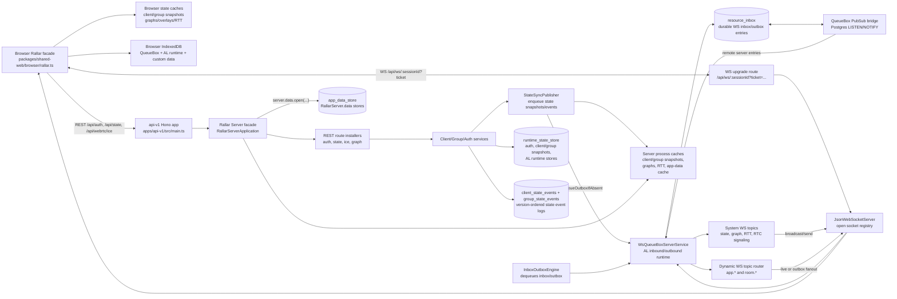

# Rallar Server Repositories And Data Flow

This document maps the current Rallar Server data model, persistence repositories, runtime caches, and transport flows. It covers the reusable server package in `packages/shared-server`, the current API application wiring in `apps/api-v1`, and the browser facade path in `packages/shared-web`.

## Executive Summary

Rallar Server is both REST HTTP and WebSocket based.

This file inventories current behavior. Authoritative shared state uses
`insertIfAbsent`, `upsertIfRevision`, and `deleteIfRevision` with bounded
retries from fresh reads. Database row, table, and advisory locks are
exceptional and require explicit human approval. Historical lock-based client,
group, topology, publication, and RTT implementations are not precedent; the
current targeted paths do not call `lockKey`.

- REST HTTP owns auth, initial state reads, client state mutations, group/room mutations, ICE config, graph reads, and Swagger docs.
- WebSocket owns live AL messages, RTC signaling, system state snapshot broadcasts, state event broadcasts, dynamic application topics, and server-to-client message fanout.
- Persistent server state currently uses Postgres through nine physical tables: `runtime_state_store`, `client_state_events`, `group_state_events`, `resource_inbox`, `resource_inbox_results`, `app_data_store`, `crdt_documents`, `crdt_updates`, and `crdt_snapshots`.
- Process-local caches exist for client snapshots, group snapshots, graphs,
  observed topology/RTT values, Rallar app-data store instances, WebSocket
  connections, rate limiters, and repository-manager registrations. Durable
  topology/RTT authority remains in runtime state.
- Browser Rallar gets initial client/group state over REST, then receives live state snapshot messages over WS. The high-level `rallar.rooms.onChange(...)` and `rallar.people.onChange(...)` APIs are driven by the browser state caches. Live state events can be observed through `rallar.rooms.onEvent(...)` and `rallar.people.onEvent(...)`; lower-level WS messages can still be observed with `rallar.messages.ws.onMessage(...)`.

## Architecture Diagram



## Main Runtime Entry Points

The current API runtime is composed in `apps/api-v1/src/main.ts`.

- `createRallarServer()` builds the shared server facade and injects API-v1 dependencies.
- `rallar.system.useDefaultMiddlewareTopics()` installs built-in WS topics, then installs the dynamic WS router.
- `rallar.system.useWebSocketLifecycle()` installs close handling for client/group presence cleanup.
- `rallar.ws.mount(app)` mounts the WS route and installs the server WS facade.
- `rallar.rest.mount(app)` mounts auth, state, ICE, graph, and docs routes.
- `rallar.start()` starts the `InboxOutboxEngine`.

The reusable facade is `packages/shared-server/rallar-facade/RallarServer.ts`.

- `RallarServer.ws` wraps topic definition, handlers, proxies, publish, and WS status.
- `RallarServer.system` wraps default middleware topics and WS lifecycle installation.
- `RallarServer.data` wraps generic repository registration and persistent server app-data stores.

## Current Authoritative Mutation Model

**AppInbox is mandatory for incoming database mutations.** All incoming HTTP
and WebSocket database writes use it, including client/group/topology,
authentication/session/ticket, CRDT append/admin, and mutating admin operations.
AppInbox owns the transaction and retry boundary; result waiting never falls
back to a direct mutation.

```text
HTTP/WS mutation
  -> APP_INBOX
  -> read -> compute -> validate
  -> AppInbox transaction
       -> service.write(transaction, computed)
       -> authoritative state/event/receipt
       -> APP_OUTBOX/WS_OUTBOX
       -> result + reservation-fenced completion
  -> commit
  -> wake/poll workers
```

Logical WebSocket audience resolution happens only after commit; queue workers
are then woken or poll.

The five guarded operation families keep one visible `read`, `compute`,
`validate`, `write` sequence:

- client: `readClientMutation`, `computeClientMutation`,
  `validateClientMutation`, `writeClientMutation`;
- group: `readGroupMutation`, `computeGroupMutation`,
  `validateGroupMutation`, `writeGroupMutation`;
- topology config: `readTopologyConfigMutation`,
  `computeTopologyConfigMutation`, `validateTopologyConfigMutation`,
  `writeTopologyConfigMutation`;
- RTC topology: `readTopologyMutation`, `computeTopologyMutation`,
  `validateTopologyMutation`, `writeTopologyMutation`; and
- RTT: `readRtcRttMutation`, `computeRtcRttMutation`, `validateRtcRttMutation`,
  `writeRtcRttMutation`.

The `compute` and `validate` phases are pure; computed persistence data is not
called a plan. The service `write(transaction, computed)` is transaction-bound:
service write receives the transaction and never opens, commits, replaces, or
retries one. Its conditional guard is first. An incoming HTTP/WS mutation
conflict returns to AppInbox, which rereads and revalidates the complete
decision surface.

Client/group/topology-config effects use direct transaction-bound `APP_OUTBOX`/
`WS_OUTBOX` entries through `ResourceInboxRepository`. Guarded state, compact
`MutationReceipt` authority, result, outbox rows, and any event commit
atomically. There is no intermediate mutation outbox. RTC topology similarly
commits its snapshot guard, work claim, and immutable publication atomically;
RTT commits endpoint guards, measurement, receipt, and final topology AppOutbox
work. RTC RTT persistence contains only the canonical measurement,
endpoint-admission, receipt, and final topology AppOutbox families; no offline
RTT migration remains.

Resource inbox allows 20 total processing attempts. Attempts one through five
wait 1, 2, 4, 8, and 16 ms; later waits rise through seconds, cap at 30 seconds,
and use jitter. A distinct best-effort fairness lane claims retries more than 30
seconds overdue independently from timeout recovery.

AppInbox owns incoming HTTP/WS mutation retries. Downstream `APP_OUTBOX` work
such as `RtcTopologyOutboxWork` uses its own ResourceInbox/QueueBox attempt
boundary and repeats the full read/compute/validate/write sequence. In both
cases, neither service owns the transaction or retry boundary.

Concurrency domains are explicit. Client state guards the principal; group
metadata and roster guard the group; presence guards one session and does not
contend on the group row. The materialized presence summary converges
asynchronously and carries `GroupStateCausalRevision` with the group revision.

`GroupStateService` aggregate-backed commands and
`GroupTopologyManagementService` config/override commands use one scoped-key
FIFO lane per service instance to suppress avoidable local CAS collisions.
Presence-session commands do not enter the aggregate lane. The lane is not a
correctness or authorization authority: separately constructed services and
processes remain independent, and every effect retains its fresh-read,
revalidation, and conditional database write. It is not a database-lock
substitute or precedent, and it must never be used to justify removing the CAS
guard or adding a row, table, or advisory lock.

Authoritative persisted and shared contracts use mandatory fields by default.
Optional fields require meaningful domain absence and consumer tests. Sparse
request/query/patch/build/migration types remain separate.

## Intentional Residual Database Lock Inventory

Queue locks are coordination-only. The only current production lock mechanism
is bounded `FOR UPDATE SKIP LOCKED` selection for resource-inbox reservation,
timeout recovery, and the fairness lane. Authentication/session/ticket, AL
admission, CRDT, client, group, and topology writes use conditional
insert/update/delete fencing. Advisory locks and CRDT document-row locks are not
approved queue-claim exceptions.

The non-queue subsections below preserve historical evidence of mechanisms
removed by the AppInbox design. Their present-tense descriptions refer to the
superseded implementation and must not be used as current architecture.

### `PSqlRuntimeStateRepository.lockKey`

**Purpose and protected invariant.** `PSqlRuntimeStateRepository.lockKey`
implements the shared transaction-scoped `lockKey` primitive with
`pg_advisory_xact_lock`. For only the callers inventoried below, it prevents two
transactions for the same encoded namespace/key from crossing a protected
read-modify-write boundary concurrently.

**Bounded critical section.** The adapter acquires one advisory lock derived
from one namespace/key after its caller opens `begin`; PostgreSQL releases it
at that transaction's commit or rollback. The lock has no process-lifetime or
cross-key scope.

**Review/removal condition.** Do not add callers. Remove `lockKey` from the
transactional repository interface and Postgres adapter after ticket
consumption, username registration, and both AL admission stores use proven
conditional delete/insert/CAS or lease-claim operations. Any retention review
must measure contention and transaction duration for those remaining callers.

### `PSqlQueueBox.reserveEntries`

**Purpose and protected invariant.** `PSqlQueueBox.reserveEntries` and
`PSqlQueueBox.reserveTimeoutEntries` use
`ResourceInboxRepository.findEntriesSkipLocked` and
`ResourceInboxRepository.findTimedOutReservedEntriesSkipLocked` with
`FOR UPDATE SKIP LOCKED`. This lets concurrent QueueBox workers claim disjoint
`resource_inbox` rows without waiting for or double-reserving a row selected by
another worker.

**Bounded critical section.** Each method opens one transaction, selects at
most `maxToReserve` ordered rows, changes only those rows to the reserved state,
and commits before dispatching the returned work. Row locks last only for that
selection-and-reservation transaction.

**Review/removal condition.** Keep this queue-specific exception only while
row locking is required for exclusive claims. Replace it after a conditional
lease-claim design proves equivalent no-duplicate, timeout-recovery, fairness,
and multi-worker behavior; review sooner if measured lock wait or reservation
transaction duration breaches the queue budget. Do not copy it into
authoritative state mutation code.

### `AuthSessionRepository.consumeWebSocketTicket`

**Purpose and protected invariant.**
`AuthSessionRepository.consumeWebSocketTicket` locks the ticket key in
`auth-sessions:ws-tickets` so a short-lived WebSocket ticket has at most one
successful consumer and cannot authorize two socket upgrades.

**Bounded critical section.** One repository transaction locks one ticket key,
reads and deletes that ticket, validates its referenced auth session, and then
commits or rolls back. The advisory lock ends with that transaction.

**Review/removal condition.** Replace the lock when a conditional delete or
atomic delete-and-return operation proves one-winner ticket consumption and
session validation under concurrent redemption. Reassess retention whenever
the auth-session storage contract changes or contention is observed.

### `AuthSessionRepository.consumeAgentSessionTicket`

**Purpose and protected invariant.**
`AuthSessionRepository.consumeAgentSessionTicket` locks the ticket key in
`auth-sessions:agent-session-tickets` so a short-lived agent-session ticket has
at most one successful consumer and cannot attach two agents through one
credential.

**Bounded critical section.** One repository transaction locks one ticket key,
reads and deletes that ticket, validates its referenced auth session, and then
commits or rolls back. The advisory lock ends with that transaction.

**Review/removal condition.** Replace the lock when a conditional delete or
atomic delete-and-return operation proves one-winner ticket consumption and
session validation under concurrent redemption. Reassess retention whenever
the agent-session bootstrap contract changes or contention is observed.

### `registerAuthUser`

**Purpose and protected invariant.** `registerAuthUser` uses
`AuthUserRepository.usernameLockKey` to serialize registration for one
normalized username. The protected check and writes preserve case-insensitive
username uniqueness across the username record, client-id record, and configured
static clients.

**Bounded critical section.** The registration transaction locks one normalized
username, checks registered and static users, derives the password hash, writes
the two user indexes, and then commits or rolls back. Its scope is one
registration, although password derivation currently lengthens the transaction
and is part of the removal pressure.

**Review/removal condition.** Replace this exception with a conditional
normalized-username insert or database uniqueness claim that keeps the
client-id index atomic, with password derivation outside the transaction.
Review it before increasing password work factors and whenever registration
latency or lock contention is measured.

### `PSqlInboundAdmissionBackend`

**Purpose and protected invariant.** `PSqlInboundAdmissionBackend` exposes
`lockKey` to `ALInboundAdmissionStore`. The store serializes a sender-version
check with its inbound deduplication, ordering, supersedence, durable-effect,
and version-bump bundle, and serializes ready-effect lease claims so concurrent
workers cannot both accept the same expected version or claim the same effect.

**Bounded critical section.** Each lock is held inside one backend `write`
transaction for one sender-version or effect-claim key, from the guarded read
through the associated runtime-state writes and version bump or lease claim.
It ends at that transaction's commit or rollback.

**Review/removal condition.** Remove this backend lock callback after inbound
sender versions and effect claims use conditional CAS/lease operations that
pass the existing conflict, ordering, supersedence, deduplication, and
multi-worker effect-delivery tests. Measure contention and transaction duration
before approving continued retention.

### `PSqlOutboundAdmissionBackend`

**Purpose and protected invariant.** `PSqlOutboundAdmissionBackend` exposes
`lockKey` to `ALOutboundAdmissionStore`. The store serializes a sender-version
check with its outbound sent/ack/nack/repair/supersedence and durable-effect
bundle, and serializes ready-effect lease claims so concurrent workers cannot
both accept the same expected version or claim the same effect.

**Bounded critical section.** Each lock is held inside one backend `write`
transaction for one sender-version or effect-claim key, from the guarded read
through the associated runtime-state writes and version bump or lease claim.
It ends at that transaction's commit or rollback.

**Review/removal condition.** Remove this backend lock callback after outbound
sender versions and effect claims use conditional CAS/lease operations that
pass the existing conflict, supersedence, control-message, repair, and
multi-worker effect-delivery tests. Measure contention and transaction duration
before approving continued retention.

### `PSqlCrdtLogRepository`

**Purpose and protected invariant.** `PSqlCrdtLogRepository` calls
`readDocumentMetadataByKey` with its update mode and issues `FOR UPDATE` on one
`crdt_documents` row. This serializes per-document append-sequence allocation,
quota accounting, snapshot accounting, and overwrite restore against concurrent
document writes.

**Bounded critical section.** Append and snapshot transactions lock one
document row while they validate document-local policy/quota state and write
the corresponding update or snapshot plus counters. Overwrite restore locks
that row through delete and reconstruction of the one supplied document
bundle. All row locks end at the surrounding transaction's commit or rollback;
restore duration therefore scales with that bounded bundle.

**Review/removal condition.** Replace the row lock after document revisions,
conditional counter updates, unique append-sequence ownership, and restore
fencing prove the same sequencing and quota invariants under concurrent writes.
Review before raising restore-size limits or when per-document lock wait or
transaction duration is measurable.

## Data Types, Repositories, Persistence, And Cache

| Data                                     | Repository/API                                                                        | Physical persistence                                                                     | Cache                                                | Notes                                                                                                                                                                                                                                                           |
| ---------------------------------------- | ------------------------------------------------------------------------------------- | ---------------------------------------------------------------------------------------- | ---------------------------------------------------- | --------------------------------------------------------------------------------------------------------------------------------------------------------------------------------------------------------------------------------------------------------------- |
| Auth users                               | `AuthUserRepository`                                                                  | `runtime_state_store` namespaces `auth-users:by-username` and `auth-users:by-client-id`  | No dedicated repository cache                        | Stores password hash/salt/algorithm, roles, status, display name, client id, username. Rows normally do not expire.                                                                                                                                             |
| Auth sessions                            | `AuthSessionRepository`                                                               | `runtime_state_store` namespaces `auth-sessions:by-token` and `auth-sessions:by-session` | No dedicated repository cache                        | Session rows expire at `expiresAtEpochMs`. Logout deletes token and session index rows.                                                                                                                                                                         |
| WebSocket tickets                        | `AuthSessionRepository`                                                               | `runtime_state_store` namespace `auth-sessions:ws-tickets`                               | No dedicated repository cache                        | Short-lived ticket rows. Consumption currently uses advisory locking when transactional runtime state is available; this is descriptive migration debt, not the default for new code.                                                                           |
| Client principals                        | `ClientStateRepository`                                                               | `runtime_state_store` namespace `client-state:principals`                                | Client snapshot cache after publish/receive          | Durable profile/presence identity for a principal inside app/workspace scope.                                                                                                                                                                                   |
| Client instances                         | `ClientStateRepository`                                                               | `runtime_state_store` namespace `client-state:instances`                                 | Client snapshot cache after publish/receive          | Durable instance records under a principal.                                                                                                                                                                                                                     |
| Client sessions                          | `ClientStateRepository`                                                               | `runtime_state_store` namespace `client-state:sessions`                                  | Client snapshot cache after publish/receive          | Active sessions expire by `expiresAtEpochMs`; lazy deletion also happens on reads.                                                                                                                                                                              |
| Client events                            | `ClientStateRepository` through `ClientStateEventStore`                               | `client_state_events`                                                                    | Live event callbacks, no durable browser event cache | Appended on mutations. Paged by `(snapshot_version, occurred_at_epoch_ms, event_id)`. Broadcast over WS as `client-state.event`; `rallar.people.onEvent(...)` can observe live events, while `data-caches.ts` does not apply event payloads to snapshot caches. |
| Groups/rooms                             | `GroupStateRepository`                                                                | `runtime_state_store` namespace `group-state:groups`                                     | Group snapshot cache after publish/receive           | Group rows can use `purgeAfterEpochMs`; active/deleted/archived status is in the JSON value.                                                                                                                                                                    |
| Group members                            | `GroupStateRepository`                                                                | `runtime_state_store` namespace `group-state:members`                                    | Group snapshot cache after publish/receive           | Member status and role are durable.                                                                                                                                                                                                                             |
| Group presence sessions                  | `GroupStateRepository`                                                                | `runtime_state_store` namespace `group-state:sessions`                                   | Group snapshot cache after publish/receive           | Generation-fenced session CAS is the write guard. Presence does not contend on the group row.                                                                                                                                                                   |
| Group presence summaries                 | `GroupStateRepository` / `GroupPresenceSummaryWork`                                   | `runtime_state_store` namespace `group-state:presence-summary`                           | Group snapshot cache after convergence               | Optimistic materialized view with required `GroupStateCausalRevision`; recomputation emits topology work asynchronously.                                                                                                                                        |
| Group events                             | `GroupStateRepository` through `GroupStateEventStore`                                 | `group_state_events`                                                                     | Live event callbacks, no durable browser event cache | Appended on mutations. Paged by `(snapshot_version, occurred_at_epoch_ms, event_id)`. Broadcast over WS as `group-state.event`; `rallar.rooms.onEvent(...)` can observe live events, while `data-caches.ts` does not apply event payloads to snapshot caches.   |
| Client/group/topology mutation receipts  | Domain repositories                                                                   | `runtime_state_store` idempotency namespaces                                             | No logical cache                                     | Compact `MutationReceipt` authority; exact replay returns the winner without storing a full snapshot graph.                                                                                                                                                     |
| Direct mutation effects                  | `ResourceInboxRepository`                                                             | `resource_inbox` APP_OUTBOX/WS_OUTBOX entries                                            | No logical cache                                     | Immutable transaction-local entries for client/group state sync, presence-summary convergence, and topology recompute. QueueBox workers drain them after commit.                                                                                                |
| RTC topology snapshots                   | `RtcTopologySnapshotRepository`                                                       | `runtime_state_store` scoped topology namespace                                          | Process-local observed topology                      | Expected-revision snapshot CAS; equal authority with different content is corruption.                                                                                                                                                                           |
| RTC topology work claims/publications    | `RtcTopologyPublicationRepository` / `RtcTopologyExecutionRepository`                 | `runtime_state_store` scoped receipt/publication namespaces                              | Loaded on delivery                                   | Snapshot guard, compact work claim, and immutable publication commit atomically.                                                                                                                                                                                |
| RTC RTT measurements/admissions/receipts | `rtc-topology/persistence` (`RtcRttRepository` plus the cleanup and migration owners) | `runtime_state_store` scoped RTT namespaces                                              | Process-local observed RTT/graph values              | Endpoint-admission guards precede measurement and the compact receipt. Final per-group recompute work is written directly to AppOutbox; expired receipt cleanup guards only the receipt revision.                                                               |
| WS inbox/outbox entries                  | `PSqlQueueBox` over `ResourceInboxRepository`                                         | `resource_inbox`                                                                         | No logical cache; queue engine locks rows            | Same table is used for both inbound and outbound queue entries. `ri_type_id` separates `WS_INBOX` and `WS_OUTBOX`.                                                                                                                                              |
| App inbox results                        | `ResourceInboxResultsRepository`                                                      | `resource_inbox_results`                                                                 | No logical cache                                     | Stores completed or failed app-inbox results keyed like the originating queue entry so REST callers can wait for durable mutation results.                                                                                                                      |
| AL runtime bookkeeping                   | `createPSqlALRuntimeStores`                                                           | `runtime_state_store` under server WS runtime namespaces                                 | Runtime-store objects in process                     | Used for admission, dedup, ordering, supersedence, sent tracking, pending acks, repair attempts.                                                                                                                                                                |
| Server app data                          | `RallarServer.data.open(...)` / `RallarServerAppDataStore`                            | `app_data_store`                                                                         | Per-process `Map` inside each opened store           | Supports namespace, store name, key prefix, schema version, migration callback, TTL, `expireAtFor`, fresh/cache-first reads, and conditional mutation retries when the repository supports them.                                                                |
| CRDT documents                           | CRDT log repositories                                                                 | `crdt_documents`                                                                         | Repository/runtime dependent                         | Stores CRDT document metadata, lifecycle, scope, retention/quota metadata, and append/snapshot counters.                                                                                                                                                        |
| CRDT updates                             | CRDT log repositories                                                                 | `crdt_updates`                                                                           | Repository/runtime dependent                         | Stores accepted update envelopes per document and append sequence, with idempotency by update id.                                                                                                                                                               |
| CRDT snapshots                           | CRDT log repositories                                                                 | `crdt_snapshots`                                                                         | Repository/runtime dependent                         | Stores compacted snapshot envelopes per document and append sequence.                                                                                                                                                                                           |
| Generic facade repositories              | `RallarServerDataFacade.register/set/lookup/...`                                      | In-memory only unless the registered object persists itself                              | `RepositoryManager`                                  | This is process-local registry state, not durable data by itself.                                                                                                                                                                                               |
| Graph snapshots                          | shared graph repositories and graph services                                          | Process-local cache                                                                      | Graph cache                                          | Graph HTTP routes read computed graph data; RTT updates can recompute and cache graphs.                                                                                                                                                                         |
| ICE config                               | `readMeteredIceConfig` via route service                                              | External Metered response, not persisted                                                 | `LoanedValue` cache                                  | API-v1 caches ICE config for a short period in memory.                                                                                                                                                                                                          |
| Browser custom data                      | `rallar.data.open(...)` in shared-web                                                 | Browser IndexedDB                                                                        | Observable latest repository cache                   | Separate from Rallar Server data. BroadcastChannel can sync same-origin tabs when configured.                                                                                                                                                                   |
| Browser QueueBox and AL runtime          | browser queuebox and AL runtime stores                                                | Browser IndexedDB when supported, else memory                                            | Runtime object caches                                | Used for WS/RTC client queues and AL dedup/ordering/supersedence state. Expiry eviction exists in browser middleware.                                                                                                                                           |

## Physical Storage Model

### `runtime_state_store`

This is the shared server infrastructure key-value table. The Postgres adapter is `PSqlRuntimeStateRepository`.

Columns used by the adapter:

- `store_namespace`
- `store_key`
- `store_value`
- `expire_at_ts`
- `updated_ts`
- `revision`

It is used by auth, client state, group state, and AL runtime stores. `RuntimeStateJsonStore` stores JSON strings and applies lazy expiry on reads. The API app also starts `initRuntimeStateExpiryEviction(...)`, which periodically deletes expired rows across namespaces.

`RuntimeStateConditionalRepositoryLike` supplies `insertIfAbsent`,
`upsertIfRevision`, and `deleteIfRevision`; the transactional optimistic
capability combines those guards with `begin`. Topology config keeps target and
invariant lifecycle generations. Group presence keeps session generation
identity plus separate summary presence authority, so stale cleanup cannot
delete a reconnect and metadata writers do not serialize heartbeats.

The key space is namespace plus encoded keys such as:

- `app=<applicationId>:ws=<workspaceId>:principal=<principalId>`
- `app=<applicationId>:ws=<workspaceId>:group=<groupId>:session=<sessionId>`
- `token=<accessToken>`
- `ticket=<ticket>`

Scoped keys are canonical injective projections, not merely delimiter-escaped
strings. The group-state key family preserves historical `ws=_` for an absent
workspace. Because `_` is also a valid explicit workspace identifier and
`encodeURIComponent('_')` remains `_`, a present `_` is encoded canonically as
`ws=%5F`; a literal `%5F` identifier becomes `ws=%255F`. Other established
workspace keys remain unchanged. Group, member, session, admission, presence
summary, idempotency, and scope-list prefixes all delegate to the same helper.

Every group-state direct, prefix-list, snapshot-list, and page read decodes the
canonical key before trusting JSON. It compares decoded application, workspace,
group, and child principal/session/request identity first with the trusted
request and then with the stored value. Compact idempotency records carry a
mandatory `aggregateRef`, including no-event receipts. A missing or mismatched
identity raises typed invariant corruption for the whole read; the repository
does not return a miss, filter a corrupt list row, rewrite on read, or infer a
scope from the value.

The old `ws=_` namespace is intrinsically ambiguous for data written before
this distinction: it may mean absent workspace or explicit `_`, and an earlier
collision may already have overwritten one value. Runtime code does not dual
read or guess. An operator migration may move a row to `ws=%5F` only when the
stored domain value proves `workspaceId: "_"`, using a conditional destination
insert/CAS and an expected-revision source delete. Rows without enough scope
identity, including some no-event idempotency receipts, must be expired or
resolved manually. Never copy one ambiguous row into both namespaces; lost
predecessors cannot be reconstructed automatically.

### `client_state_events` and `group_state_events`

These tables store durable state-event logs separately from the JSON runtime
state table. The Postgres adapters are `PSqlClientStateEventRepository` and
`PSqlGroupStateEventRepository`.

Important mapped fields:

- `application_id`, `workspace_key`, and `principal_id` or `group_id` scope the
  event stream. Client-event mapping is unchanged. Group events preserve `_`
  for absent workspace, encode an explicit `_` as `%5F`, and URI-encode other
  present workspace identifiers through the group-event-only canonical helper.
  Append, full-list, recent-list, page, and admin group-event counts all use the
  same helper.
- `event_id`, `event_type`, `snapshot_version`, and `occurred_at_epoch_ms`
  mirror the public event payload.
- `event_json` stores the full event response body returned by REST and replay
  APIs. Group-event reads also select the physical `event_id` and validate JSON
  application/workspace/group/event identity against the trusted requested row
  slot. Any mismatch raises typed invariant corruption for the whole read.
- Page indexes order by `snapshot_version`, `occurred_at_epoch_ms`, and
  `event_id`, matching `StateEventCursor` and avoiding full-history scans for
  `/events/page`.

Historical group-event `workspace_key='_'` rows may represent absent workspace
or explicit `_`, and a prior primary-key collision may already have dropped one
accepted event. The runtime never dual reads or guesses. An offline migration
must stop old writers, validate `event_json` against every physical identity
column, derive exactly one canonical destination, claim it conditionally, and
delete only the verified source row. Destination mismatch/collision aborts and
is reported; an event previously lost to `ON CONFLICT DO NOTHING` cannot be
recovered without an independent authoritative source.

### `resource_inbox`

Despite the table name, API-v1 uses this as the durable QueueBox table for both WS inbox and WS outbox. The Postgres adapter is `ResourceInboxRepository`, wrapped by `PSqlQueueBox`.

Important mapped fields:

- `ri_topic_id` maps to `ResourceEntry.key.topicId`.
- `ri_resource_id` maps to `ResourceEntry.key.resourceId`.
- `fk_ext_bank_id` maps to `ResourceEntry.key.contextId`.
- `ri_type_id` maps to the queue type, for example `WS_INBOX` or `WS_OUTBOX`.
- `ri_resource` stores the serialized AL message or payload.
- `ri_status`, `start_ts`, `end_ts`, `next_ts`, and `ri_attempts` drive QueueBox processing and retries.
- `expire_ts` drives queue row expiry.

The engine reserves work with `SELECT ... FOR UPDATE SKIP LOCKED`, marks rows reserved, dispatches them through AL runtime, and releases them to done/failed/retry states.

### `resource_inbox_results`

This table stores durable app-inbox completion results. The Postgres adapter is
`ResourceInboxResultsRepository`.

Important mapped fields:

- `ris_topic_id` maps to `ResourceEntry.key.topicId`.
- `ris_resource_id` maps to `ResourceEntry.key.resourceId`.
- `fk_ext_bank_id` maps to `ResourceEntry.key.contextId`.
- `ris_type_id` maps to the queue type.
- `ris_resource` stores the serialized mutation result or failure payload.
- `ris_status` records completed or failed result state.
- `expire_ts` drives result row expiry.

### `app_data_store`

This table is for application data explicitly stored through the server app-data facade, not Rallar middleware state. The Postgres adapter is `PSqlAppDataRepository`.

Columns used by the adapter:

- `app_namespace`
- `store_name`
- `data_key`
- `data_value`
- `schema_version`
- `expire_at_ts`
- `updated_ts`
- `revision`

`RallarServerAppDataStore` keeps a per-process memory cache. `read(...)` and `keys()` are memory-only. `get(...)`
defaults to fresh repository read-through, with `readConsistency: 'cache-first'` available for callers that explicitly
prefer the local cache. Writes persist first, then update the cache. `PSqlAppDataRepository` uses the `revision` column
for conditional insert/update/delete operations, so read-modify-write helpers can retry conflicts without overwriting a
newer row. There is no automatic WS synchronization or app-data pubsub invalidation.

### CRDT tables

`crdt_documents`, `crdt_updates`, and `crdt_snapshots` are the durable CRDT log
tables used by the server CRDT repositories. The API-v1 migration and in-memory
schema both define these tables, and the Prisma schema mirrors them as the
physical storage source of truth.

- `crdt_documents` stores document identity, application/workspace scope,
  lifecycle, retention/quota metadata, projection ids, and append/snapshot
  counters, including the rolling stored update-byte total used by document-byte
  quota checks.
- `crdt_updates` stores accepted update envelopes by document and append
  sequence, with a unique update-id index per document.
- `crdt_snapshots` stores compacted snapshot envelopes by document and snapshot
  id, ordered by append sequence for lookup.

## REST HTTP Data Flow

### Auth

The auth route installer is `apps/api-v1/src/routes/config-route.ts`.

- `GET /api/config` returns API base URL, WS base URL, and the WS endpoint template.
- `POST /api/auth/register` creates an auth user in `AuthUserRepository`.
- `POST /api/auth/login` validates credentials and creates an auth session in `AuthSessionRepository`.
- `POST /api/auth/logout` deletes the current auth session.
- `POST /api/auth/ws-ticket` issues a short-lived WS ticket for the current auth session.

The state routes under `/api/state/*` are protected by `requireApiAuthSession` in `main.ts`.

### Client State

Client state routes live in `apps/api-v1/src/routes/client-state-routes.ts`.

- List/read snapshots and presence.
- List events.
- Upsert principal.
- Upsert instance.
- Connect session.
- Heartbeat session.
- Disconnect session.

HTTP and lifecycle mutations enter through `AppClientInboxService`, which calls
`ClientStateService`. `readClientMutation`, `computeClientMutation`, and
`validateClientMutation` run before `writeClientMutation` opens the short
transaction. The principal guard is first, followed by child rows, compact
receipt, state-mutation outbox, and event. `AppClientInboxService` completes the
command; the outbox drainer owns publication.

### Group/Room State

Group state routes live in `apps/api-v1/src/routes/group-state-routes.ts`.

- List/read group snapshots.
- List group events.
- Create/update group.
- Upsert member.
- Connect group presence session.
- Heartbeat group presence session.
- Disconnect group presence session.

HTTP and lifecycle mutations enter through `AppGroupInboxService`, which calls
`GroupStateService`. `readGroupMutation`, `computeGroupMutation`, and
`validateGroupMutation` run before `writeGroupMutation` opens the short
transaction. Metadata/roster mutations guard the group; presence mutations
guard the session. Receipt, outbox, and event are atomic with accepted state.
`AppGroupInboxService` completes the command; APP_OUTBOX/WS_OUTBOX workers own
state sync and presence-summary convergence after commit.

### ICE And Graph

- `GET /api/webrtc/ice` reads Metered ICE config and caches it in memory.
- Scoped graph diagnostics live under
  `/api/state/apps/:applicationId/workspaces/:workspaceId/graphs/global` and
  `/api/state/apps/:applicationId/workspaces/:workspaceId/groups/:groupId/graphs/latest`.

## WebSocket Data Flow

### Connection Setup

1. Browser Rallar logs in or restores an auth session.
2. `initialiseMiddleware(...)` reads `/api/config`.
3. It calls `/api/auth/ws-ticket`.
4. It opens `/api/ws/:sessionId?ticket=<ticket>`.
5. `ws-routes.ts` consumes the WS ticket, upgrades the socket, adds a `ConnectionContext` to `JsonWebSocketServer`, and registers an authorised client session through `ClientStateService`.
6. The server close lifecycle later disconnects client and group presence for the socket session id.

### Incoming Browser WS Message

1. Browser `rallar.messages.ws.send(...)` builds an AL broadcast message and enqueues it in `WsQueueBoxClientService`.
2. The browser QueueBox engine sends it over the WebSocket.
3. `JsonWebSocketServer` parses the JSON message and hands it to `WsQueueBoxServerService`.
4. `ALInboundMessageRuntime` applies QoS policy: admission, dedup, ordering, supersedence, forwarding, and control message handling.
5. The server QueueBox stores or dispatches the message through inbox callbacks.
6. System topics are handled by `ws-system-topics.ts`; user topics are handled by the dynamic WS topic router.

### Outgoing Server WS Message

There are two common paths.

State sync path:

1. A client/group mutation commits guarded state, compact receipt, event, and
   immutable `ResourceInbox` effects in one transaction.
2. APP_OUTBOX/WS_OUTBOX workers publish state-sync effects idempotently; group
   work also schedules summary convergence.
3. `StateSyncPublisher` updates the process snapshot cache and enqueues the AL
   snapshot/event message into durable WS QueueBox.
4. `InboxOutboxEngine` dequeues the WS outbox entry.
5. `ws-system-topics.ts` delivers the scoped message.
6. Browser `WsQueueBoxClientService` receives the AL message.
7. `packages/shared-web/browser/data-caches.ts` stores snapshot messages in browser state caches.
8. `BrowserRallarFacade` observes cache changes and emits `rooms.onChange(...)` and `people.onChange(...)`.
9. Live state-event subscribers registered through `rooms.onEvent(...)` and `people.onEvent(...)` observe matching
   state event messages without mutating the snapshot caches.

Dynamic user-topic path:

1. Server code defines topics with `rallar.ws.defineTopic(...)`, adds handlers with `rallar.ws.on(...)`, adds proxies with `rallar.ws.proxy(...)`, or publishes with `rallar.ws.publish(...)`.
2. The dynamic router accepts only user topics starting with `app.` or `room.` unless implicit topics are disabled.
3. Reserved built-in topics and `rallar.*` topics are rejected from the dynamic path.
4. Room-scoped messages call `authorizeRoomMessage`, which API-v1 implements with the group snapshot cache.
5. Fanout is `live-only`, `outbox`, or `none`.

### RTC Signaling

RTC signaling is carried over WS topic `rtc-signaling`. The server system topic parses the `QRtcSignalingMessage` and calls `server.send(msg.toId, data)`. That makes WS the signaling channel for peer-to-peer RTC setup.

## Browser Rallar Subscription Model

Yes, browser Rallar can subscribe to server changes over WS, but there are two levels.

High-level state subscriptions:

- `rallar.rooms.onChange(listener, options?)`
- `rallar.people.onChange(listener, options?)`

These are not direct REST polling subscriptions. They are backed by browser state caches. Initial cache hydration comes from REST (`refreshStateSnapshots`). Subsequent live updates come from WS state snapshot messages handled in `data-caches.ts`.

Live state-event subscriptions:

- `rallar.rooms.onEvent(listener, options?)`
- `rallar.people.onEvent(listener, options?)`

These observe matching `group-state.event` and `client-state.event` messages
when they arrive over WS. They are live callbacks, not durable event caches or a
replay protocol for late subscribers.

Lower-level WS message subscriptions:

- `rallar.messages.ws.onMessage(selector, handler)`

This registers a browser inbox callback through the Rallar facade. It can observe WS AL messages that arrive at the client and match the selector. This is the path for custom app messages and can also observe built-in state event messages if the selector matches and the message is delivered.

Lifecycle/status subscriptions:

- `rallar.ws.onStatus(...)`
- `rallar.ws.onLifecycle(...)`
- `rallar.rtc.onStatus(...)`
- `rallar.rtc.onLifecycle(...)`

These observe transport lifecycle and readiness, not domain state changes.

Important distinction: the browser high-level state cache applies snapshot
messages. It does not apply `client-state.event` and `group-state.event`
payloads in `data-caches.ts`; those event messages are exposed through live
event callbacks or lower-level WS subscriptions instead.

## Server-Side Subscription And Publishing Model

Server code can interact with WS through the Rallar Server facade:

- `rallar.ws.defineTopic(...)` registers a user topic definition.
- `rallar.ws.on(selector, handler)` observes dynamic WS messages.
- `rallar.ws.proxy(rule)` can authorize, transform, retarget, and fan out messages.
- `rallar.ws.publish(message, fanout?)` sends an AL message through `live-only`, `outbox`, or `none`.
- `rallar.ws.status()` reports current server WS connections.

System topics are installed separately and are not user-defined dynamic topics.

## Caching Summary

Server caches:

- `JsonWebSocketServer.connections` is the live socket registry.
- Shared client/group snapshot repositories are process-local observable latest repositories. They are updated when state sync publishes local mutations and when system topics accept state snapshot messages.
- The group snapshot cache is used for room authorization and room-target recipient resolution.
- Graph, overlay, Vivaldi, and RTT repositories are process-local.
- Server app-data stores have per-process `Map` caches, but default `get(...)` reads through durable storage and
  conditional mutation helpers use repository revisions when available.
- HTTP rate limiters are process-local.

Browser caches:

- Client/group snapshots are process-local browser observable latest repositories with TTL.
- Graph, overlay, and RTT repositories are process-local browser caches with TTL.
- Browser QueueBox and AL runtime stores use IndexedDB when available, otherwise memory.
- Browser custom data through `rallar.data` uses IndexedDB and observable repositories.

## Key Operational Semantics

- REST state writes commit their durable publication intents atomically; async
  drainers enqueue WS state notifications and topology recomputation after
  commit.
- QueueBox entries are durable in Postgres and processed asynchronously by `InboxOutboxEngine`.
- State snapshots are cached in process memory and then broadcast over WS.
- Room-scoped WS fanout depends on an in-memory group snapshot cache to know which active sessions are in the room.
- Browser Rallar should call `connect()` or any facade method that implicitly connects before expecting WS subscriptions to receive messages.
- Browser Rallar state subscriptions see snapshots, not a guaranteed replay of every event.
