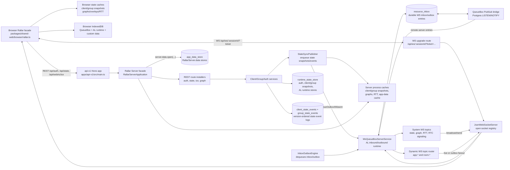

# Rallar Server Repositories And Data Flow

This document maps the current Rallar Server data model, persistence repositories, runtime caches, and transport flows. It covers the reusable server package in `packages/shared-server`, the current API application wiring in `apps/api-v1`, and the browser facade path in `packages/shared-web`.

## Executive Summary

Rallar Server is both REST HTTP and WebSocket based.

- REST HTTP owns auth, initial state reads, client state mutations, group/room mutations, ICE config, graph reads, and Swagger docs.
- WebSocket owns live AL messages, RTC signaling, system state snapshot broadcasts, state event broadcasts, dynamic application topics, and server-to-client message fanout.
- Persistent server state currently uses Postgres through nine physical tables: `runtime_state_store`, `client_state_events`, `group_state_events`, `resource_inbox`, `resource_inbox_results`, `app_data_store`, `crdt_documents`, `crdt_updates`, and `crdt_snapshots`.
- Process-local caches exist for client snapshots, group snapshots, graphs, RTT, Rallar app-data store instances, WebSocket connections, rate limiters, and repository-manager registrations.
- Browser Rallar gets initial client/group state over REST, then receives live state snapshot messages over WS. The high-level `rallar.rooms.onChange(...)` and `rallar.people.onChange(...)` APIs are driven by the browser state caches. Live state events can be observed through `rallar.rooms.onEvent(...)` and `rallar.people.onEvent(...)`; lower-level WS messages can still be observed with `rallar.messages.ws.onMessage(...)`.

## Architecture Diagram

## Main Runtime Entry Points

The current API runtime is composed in `apps/api-v1/src/main.ts`.

- `createRallarServer()` builds the shared server facade and injects API-v1 dependencies.
- `rallar.system.useDefaultMiddlewareTopics()` installs built-in WS topics, then installs the dynamic WS router.
- `rallar.system.useWebSocketLifecycle()` installs close handling for client/group presence cleanup.
- `rallar.ws.mount(app)` mounts the WS route and installs the server WS facade.
- `rallar.rest.mount(app)` mounts auth, state, ICE, graph, and docs routes.
- `rallar.start()` starts the `InboxOutboxEngine`.

The reusable facade is `packages/shared-server/rallar-facade/RallarServer.ts`.

- `RallarServer.ws` wraps topic definition, handlers, proxies, publish, and WS status.
- `RallarServer.system` wraps default middleware topics and WS lifecycle installation.
- `RallarServer.data` wraps generic repository registration and persistent server app-data stores.

## Data Types, Repositories, Persistence, And Cache

| Data | Repository/API | Physical persistence | Cache | Notes |
| --- | --- | --- | --- | --- |
| Auth users | `AuthUserRepository` | `runtime_state_store` namespaces `auth-users:by-username` and `auth-users:by-client-id` | No dedicated repository cache | Stores password hash/salt/algorithm, roles, status, display name, client id, username. Rows normally do not expire. |
| Auth sessions | `AuthSessionRepository` | `runtime_state_store` namespaces `auth-sessions:by-token` and `auth-sessions:by-session` | No dedicated repository cache | Session rows expire at `expiresAtEpochMs`. Logout deletes token and session index rows. |
| WebSocket tickets | `AuthSessionRepository` | `runtime_state_store` namespace `auth-sessions:ws-tickets` | No dedicated repository cache | Short-lived ticket rows. Consumption uses advisory locking when transactional runtime state is available. |
| Client principals | `ClientStateRepository` | `runtime_state_store` namespace `client-state:principals` | Client snapshot cache after publish/receive | Durable profile/presence identity for a principal inside app/workspace scope. |
| Client instances | `ClientStateRepository` | `runtime_state_store` namespace `client-state:instances` | Client snapshot cache after publish/receive | Durable instance records under a principal. |
| Client sessions | `ClientStateRepository` | `runtime_state_store` namespace `client-state:sessions` | Client snapshot cache after publish/receive | Active sessions expire by `expiresAtEpochMs`; lazy deletion also happens on reads. |
| Client events | `ClientStateRepository` through `ClientStateEventStore` | `client_state_events` | Live event callbacks, no durable browser event cache | Appended on mutations. Paged by `(snapshot_version, occurred_at_epoch_ms, event_id)`. Broadcast over WS as `client-state.event`; `rallar.people.onEvent(...)` can observe live events, while `data-caches.ts` does not apply event payloads to snapshot caches. |
| Groups/rooms | `GroupStateRepository` | `runtime_state_store` namespace `group-state:groups` | Group snapshot cache after publish/receive | Group rows can use `purgeAfterEpochMs`; active/deleted/archived status is in the JSON value. |
| Group members | `GroupStateRepository` | `runtime_state_store` namespace `group-state:members` | Group snapshot cache after publish/receive | Member status and role are durable. |
| Group presence sessions | `GroupStateRepository` | `runtime_state_store` namespace `group-state:sessions` | Group snapshot cache after publish/receive | Presence rows expire by `expiresAtEpochMs`. Active means `disconnectedAtEpochMs` is absent. |
| Group events | `GroupStateRepository` through `GroupStateEventStore` | `group_state_events` | Live event callbacks, no durable browser event cache | Appended on mutations. Paged by `(snapshot_version, occurred_at_epoch_ms, event_id)`. Broadcast over WS as `group-state.event`; `rallar.rooms.onEvent(...)` can observe live events, while `data-caches.ts` does not apply event payloads to snapshot caches. |
| WS inbox/outbox entries | `PSqlQueueBox` over `ResourceInboxRepository` | `resource_inbox` | No logical cache; queue engine locks rows | Same table is used for both inbound and outbound queue entries. `ri_type_id` separates `WS_INBOX` and `WS_OUTBOX`. |
| App inbox results | `ResourceInboxResultsRepository` | `resource_inbox_results` | No logical cache | Stores completed or failed app-inbox results keyed like the originating queue entry so REST callers can wait for durable mutation results. |
| AL runtime bookkeeping | `createPSqlALRuntimeStores` | `runtime_state_store` under server WS runtime namespaces | Runtime-store objects in process | Used for admission, dedup, ordering, supersedence, sent tracking, pending acks, repair attempts. |
| Server app data | `RallarServer.data.open(...)` / `RallarServerAppDataStore` | `app_data_store` | Per-process `Map` inside each opened store | Supports namespace, store name, key prefix, schema version, migration callback, TTL, `expireAtFor`, fresh/cache-first reads, and conditional mutation retries when the repository supports them. |
| CRDT documents | CRDT log repositories | `crdt_documents` | Repository/runtime dependent | Stores CRDT document metadata, lifecycle, scope, retention/quota metadata, and append/snapshot counters. |
| CRDT updates | CRDT log repositories | `crdt_updates` | Repository/runtime dependent | Stores accepted update envelopes per document and append sequence, with idempotency by update id. |
| CRDT snapshots | CRDT log repositories | `crdt_snapshots` | Repository/runtime dependent | Stores compacted snapshot envelopes per document and append sequence. |
| Generic facade repositories | `RallarServerDataFacade.register/set/lookup/...` | In-memory only unless the registered object persists itself | `RepositoryManager` | This is process-local registry state, not durable data by itself. |
| Graph snapshots | shared graph repositories and graph services | Process-local cache | Graph cache | Graph HTTP routes read computed graph data; RTT updates can recompute and cache graphs. |
| RTT measurements | `rtt-repository` | Process-local cache | RTT cache | Updated from WS `rtt` messages; used by Vivaldi/graph services. |
| ICE config | `readMeteredIceConfig` via route service | External Metered response, not persisted | `LoanedValue` cache | API-v1 caches ICE config for a short period in memory. |
| Browser custom data | `rallar.data.open(...)` in shared-web | Browser IndexedDB | Observable latest repository cache | Separate from Rallar Server data. BroadcastChannel can sync same-origin tabs when configured. |
| Browser QueueBox and AL runtime | browser queuebox and AL runtime stores | Browser IndexedDB when supported, else memory | Runtime object caches | Used for WS/RTC client queues and AL dedup/ordering/supersedence state. Expiry eviction exists in browser middleware. |

## Physical Storage Model

### `runtime_state_store`

This is the shared server infrastructure key-value table. The Postgres adapter is `PSqlRuntimeStateRepository`.

Columns used by the adapter:

- `store_namespace`
- `store_key`
- `store_value`
- `expire_at_ts`
- `updated_ts`
- `revision`

It is used by auth, client state, group state, and AL runtime stores. `RuntimeStateJsonStore` stores JSON strings and applies lazy expiry on reads. The API app also starts `initRuntimeStateExpiryEviction(...)`, which periodically deletes expired rows across namespaces.

The key space is namespace plus encoded keys such as:

- `app=<applicationId>:ws=<workspaceId>:principal=<principalId>`
- `app=<applicationId>:ws=<workspaceId>:group=<groupId>:session=<sessionId>`
- `token=<accessToken>`
- `ticket=<ticket>`

### `client_state_events` and `group_state_events`

These tables store durable state-event logs separately from the JSON runtime
state table. The Postgres adapters are `PSqlClientStateEventRepository` and
`PSqlGroupStateEventRepository`.

Important mapped fields:

- `application_id`, `workspace_key`, and `principal_id` or `group_id` scope the
  event stream. `workspace_key` stores `_` when the event has no workspace id.
  If `_` needs to be a valid workspace id, a future migration should split this
  into nullable workspace identity plus an index-safe generated key.
- `event_id`, `event_type`, `snapshot_version`, and `occurred_at_epoch_ms`
  mirror the public event payload.
- `event_json` stores the full event response body returned by REST and replay
  APIs.
- Page indexes order by `snapshot_version`, `occurred_at_epoch_ms`, and
  `event_id`, matching `StateEventCursor` and avoiding full-history scans for
  `/events/page`.

### `resource_inbox`

Despite the table name, API-v1 uses this as the durable QueueBox table for both WS inbox and WS outbox. The Postgres adapter is `ResourceInboxRepository`, wrapped by `PSqlQueueBox`.

Important mapped fields:

- `ri_topic_id` maps to `ResourceEntry.key.topicId`.
- `ri_resource_id` maps to `ResourceEntry.key.resourceId`.
- `fk_ext_bank_id` maps to `ResourceEntry.key.contextId`.
- `ri_type_id` maps to the queue type, for example `WS_INBOX` or `WS_OUTBOX`.
- `ri_resource` stores the serialized AL message or payload.
- `ri_status`, `start_ts`, `end_ts`, `next_ts`, and `ri_attempts` drive QueueBox processing and retries.
- `expire_ts` drives queue row expiry.

The engine reserves work with `SELECT ... FOR UPDATE SKIP LOCKED`, marks rows reserved, dispatches them through AL runtime, and releases them to done/failed/retry states.

### `resource_inbox_results`

This table stores durable app-inbox completion results. The Postgres adapter is
`ResourceInboxResultsRepository`.

Important mapped fields:

- `ris_topic_id` maps to `ResourceEntry.key.topicId`.
- `ris_resource_id` maps to `ResourceEntry.key.resourceId`.
- `fk_ext_bank_id` maps to `ResourceEntry.key.contextId`.
- `ris_type_id` maps to the queue type.
- `ris_resource` stores the serialized mutation result or failure payload.
- `ris_status` records completed or failed result state.
- `expire_ts` drives result row expiry.

### `app_data_store`

This table is for application data explicitly stored through the server app-data facade, not Rallar middleware state. The Postgres adapter is `PSqlAppDataRepository`.

Columns used by the adapter:

- `app_namespace`
- `store_name`
- `data_key`
- `data_value`
- `schema_version`
- `expire_at_ts`
- `updated_ts`
- `revision`

`RallarServerAppDataStore` keeps a per-process memory cache. `read(...)` and `keys()` are memory-only. `get(...)`
defaults to fresh repository read-through, with `readConsistency: 'cache-first'` available for callers that explicitly
prefer the local cache. Writes persist first, then update the cache. `PSqlAppDataRepository` uses the `revision` column
for conditional insert/update/delete operations, so read-modify-write helpers can retry conflicts without overwriting a
newer row. There is no automatic WS synchronization or app-data pubsub invalidation.

### CRDT tables

`crdt_documents`, `crdt_updates`, and `crdt_snapshots` are the durable CRDT log
tables used by the server CRDT repositories. The API-v1 migration and in-memory
schema both define these tables, and the Prisma schema mirrors them as the
physical storage source of truth.

- `crdt_documents` stores document identity, application/workspace scope,
  lifecycle, retention/quota metadata, projection ids, and append/snapshot
  counters, including the rolling stored update-byte total used by document-byte
  quota checks.
- `crdt_updates` stores accepted update envelopes by document and append
  sequence, with a unique update-id index per document.
- `crdt_snapshots` stores compacted snapshot envelopes by document and snapshot
  id, ordered by append sequence for lookup.

## REST HTTP Data Flow

### Auth

The auth route installer is `apps/api-v1/src/routes/config-route.ts`.

- `GET /api/config` returns API base URL, WS base URL, and the WS endpoint template.
- `POST /api/auth/register` creates an auth user in `AuthUserRepository`.
- `POST /api/auth/login` validates credentials and creates an auth session in `AuthSessionRepository`.
- `POST /api/auth/logout` deletes the current auth session.
- `POST /api/auth/ws-ticket` issues a short-lived WS ticket for the current auth session.

The state routes under `/api/state/*` are protected by `requireApiAuthSession` in `main.ts`.

### Client State

Client state routes live in `apps/api-v1/src/routes/client-state-routes.ts`.

- List/read snapshots and presence.
- List events.
- Upsert principal.
- Upsert instance.
- Connect session.
- Heartbeat session.
- Disconnect session.

HTTP and lifecycle mutations enter through `AppClientInboxService`, which calls
`ClientStateService`. The state service writes through `ClientStateRepository`
inside `runtimeRepository.begin(...)`, appends a durable client event, reads a
fresh snapshot, and returns a written result. `AppClientInboxService` owns
publishing that result through `StateSyncPublisher`.

### Group/Room State

Group state routes live in `apps/api-v1/src/routes/group-state-routes.ts`.

- List/read group snapshots.
- List group events.
- Create/update group.
- Upsert member.
- Connect group presence session.
- Heartbeat group presence session.
- Disconnect group presence session.

HTTP and lifecycle mutations enter through `AppGroupInboxService`, which calls
`GroupStateService`. The state service writes through `GroupStateRepository`
inside `runtimeRepository.begin(...)`, appends a durable group event, reads a
fresh snapshot, and returns a written result. `AppGroupInboxService` owns
publishing that result through `StateSyncPublisher`.

### ICE And Graph

- `GET /api/webrtc/ice` reads Metered ICE config and caches it in memory.
- Scoped graph diagnostics live under
  `/api/state/apps/:applicationId/workspaces/:workspaceId/graphs/global` and
  `/api/state/apps/:applicationId/workspaces/:workspaceId/groups/:groupId/graphs/latest`.

## WebSocket Data Flow

### Connection Setup

1. Browser Rallar logs in or restores an auth session.
2. `initialiseMiddleware(...)` reads `/api/config`.
3. It calls `/api/auth/ws-ticket`.
4. It opens `/api/ws/:sessionId?ticket=<ticket>`.
5. `ws-routes.ts` consumes the WS ticket, upgrades the socket, adds a `ConnectionContext` to `JsonWebSocketServer`, and registers an authorised client session through `ClientStateService`.
6. The server close lifecycle later disconnects client and group presence for the socket session id.

### Incoming Browser WS Message

1. Browser `rallar.messages.ws.send(...)` builds an AL broadcast message and enqueues it in `WsQueueBoxClientService`.
2. The browser QueueBox engine sends it over the WebSocket.
3. `JsonWebSocketServer` parses the JSON message and hands it to `WsQueueBoxServerService`.
4. `ALInboundMessageRuntime` applies QoS policy: admission, dedup, ordering, supersedence, forwarding, and control message handling.
5. The server QueueBox stores or dispatches the message through inbox callbacks.
6. System topics are handled by `ws-system-topics.ts`; user topics are handled by the dynamic WS topic router.

### Outgoing Server WS Message

There are two common paths.

State sync path:

1. A REST state mutation commits client/group state.
2. `StateSyncPublisher` updates the server process snapshot cache.
3. It enqueues a broadcast AL message with topic `client-state.snapshot`, `client-state.event`, `group-state.snapshot`, or `group-state.event`.
4. `InboxOutboxEngine` dequeues the outbox entry.
5. `ws-system-topics.ts` accepts the outbox message and calls `server.broadcast(data)`.
6. Browser `WsQueueBoxClientService` receives the AL message.
7. `packages/shared-web/browser/data-caches.ts` stores snapshot messages in browser state caches.
8. `BrowserRallarFacade` observes cache changes and emits `rooms.onChange(...)` and `people.onChange(...)`.
9. Live state-event subscribers registered through `rooms.onEvent(...)` and `people.onEvent(...)` observe matching
   state event messages without mutating the snapshot caches.

Dynamic user-topic path:

1. Server code defines topics with `rallar.ws.defineTopic(...)`, adds handlers with `rallar.ws.on(...)`, adds proxies with `rallar.ws.proxy(...)`, or publishes with `rallar.ws.publish(...)`.
2. The dynamic router accepts only user topics starting with `app.` or `room.` unless implicit topics are disabled.
3. Reserved built-in topics and `rallar.*` topics are rejected from the dynamic path.
4. Room-scoped messages call `authorizeRoomMessage`, which API-v1 implements with the group snapshot cache.
5. Fanout is `live-only`, `outbox`, or `none`.

### RTC Signaling

RTC signaling is carried over WS topic `rtc-signaling`. The server system topic parses the `QRtcSignalingMessage` and calls `server.send(msg.toId, data)`. That makes WS the signaling channel for peer-to-peer RTC setup.

## Browser Rallar Subscription Model

Yes, browser Rallar can subscribe to server changes over WS, but there are two levels.

High-level state subscriptions:

- `rallar.rooms.onChange(listener, options?)`
- `rallar.people.onChange(listener, options?)`

These are not direct REST polling subscriptions. They are backed by browser state caches. Initial cache hydration comes from REST (`refreshStateSnapshots`). Subsequent live updates come from WS state snapshot messages handled in `data-caches.ts`.

Live state-event subscriptions:

- `rallar.rooms.onEvent(listener, options?)`
- `rallar.people.onEvent(listener, options?)`

These observe matching `group-state.event` and `client-state.event` messages
when they arrive over WS. They are live callbacks, not durable event caches or a
replay protocol for late subscribers.

Lower-level WS message subscriptions:

- `rallar.messages.ws.onMessage(selector, handler)`

This registers a browser inbox callback through the Rallar facade. It can observe WS AL messages that arrive at the client and match the selector. This is the path for custom app messages and can also observe built-in state event messages if the selector matches and the message is delivered.

Lifecycle/status subscriptions:

- `rallar.ws.onStatus(...)`
- `rallar.ws.onLifecycle(...)`
- `rallar.rtc.onStatus(...)`
- `rallar.rtc.onLifecycle(...)`

These observe transport lifecycle and readiness, not domain state changes.

Important distinction: the browser high-level state cache applies snapshot
messages. It does not apply `client-state.event` and `group-state.event`
payloads in `data-caches.ts`; those event messages are exposed through live
event callbacks or lower-level WS subscriptions instead.

## Server-Side Subscription And Publishing Model

Server code can interact with WS through the Rallar Server facade:

- `rallar.ws.defineTopic(...)` registers a user topic definition.
- `rallar.ws.on(selector, handler)` observes dynamic WS messages.
- `rallar.ws.proxy(rule)` can authorize, transform, retarget, and fan out messages.
- `rallar.ws.publish(message, fanout?)` sends an AL message through `live-only`, `outbox`, or `none`.
- `rallar.ws.status()` reports current server WS connections.

System topics are installed separately and are not user-defined dynamic topics.

## Caching Summary

Server caches:

- `JsonWebSocketServer.connections` is the live socket registry.
- Shared client/group snapshot repositories are process-local observable latest repositories. They are updated when state sync publishes local mutations and when system topics accept state snapshot messages.
- The group snapshot cache is used for room authorization and room-target recipient resolution.
- Graph, overlay, Vivaldi, and RTT repositories are process-local.
- Server app-data stores have per-process `Map` caches, but default `get(...)` reads through durable storage and
  conditional mutation helpers use repository revisions when available.
- HTTP rate limiters are process-local.

Browser caches:

- Client/group snapshots are process-local browser observable latest repositories with TTL.
- Graph, overlay, and RTT repositories are process-local browser caches with TTL.
- Browser QueueBox and AL runtime stores use IndexedDB when available, otherwise memory.
- Browser custom data through `rallar.data` uses IndexedDB and observable repositories.

## Key Operational Semantics

- REST state writes are durable before WS state notifications are enqueued.
- QueueBox entries are durable in Postgres and processed asynchronously by `InboxOutboxEngine`.
- State snapshots are cached in process memory and then broadcast over WS.
- Room-scoped WS fanout depends on an in-memory group snapshot cache to know which active sessions are in the room.
- Browser Rallar should call `connect()` or any facade method that implicitly connects before expecting WS subscriptions to receive messages.
- Browser Rallar state subscriptions see snapshots, not a guaranteed replay of every event.
