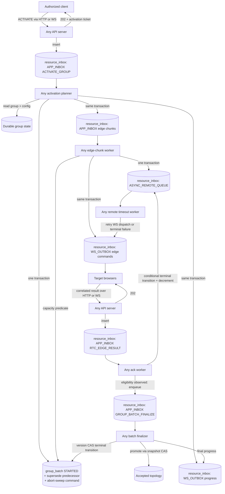

# Distributed Group RTC Activation Design

Status: approved design direction; implementation not started. Revised
2026-08-07 after a full design review (activation-flow correctness,
distributed-systems behavior, scalability at hundreds of sessions, security,
and operational complexity). All review decisions are folded into this
document.

Governance note: before implementation starts, this design must be reconciled
with `plans/rallar-architecture-quality-and-rtc-program-roadmap.md`, which
holds RTC Phase 1 reservations approved-inactive and requires an explicit
gate before Phase 1 implementation. This document is design authority only.

## Executive Summary

Rallar should not appoint a server to own or direct a group. An authorized
browser client may request group activation through any API server, and any
server sharing the PostgreSQL database may later claim and process each piece
of activation work.

The existing `resource_inbox` table remains the physical work table. It hosts
the logical `APP_INBOX`, `APP_OUTBOX`, and `WS_OUTBOX` queues and will also
host remote browser work awaiting confirmation through a new logical
`ASYNC_REMOTE_QUEUE` lane. Edge chunks remain `APP_INBOX` rows. Remote work
adds one queue status, `AWAITING_REMOTE`, but otherwise reuses the existing
payload, attempts, expiry, reservation, retry scheduling, and terminal-state
machinery.

One new `group_batch` row coordinates each activation attempt. It records the
original activation input, the planned topology, the source causal group
revision (as a tuple), a deterministic topology-input fingerprint, expected
and terminal work counters, capacity allocated to in-flight remote work, the
aggregate outcome, and an optimistic version. There is one batch row per
activation attempt, not one row per edge or chunk.

Server-directed activation coexists with the existing browser-owned overlay
reconciliation: activation drives commanded edge establishment and
confirmation; browser reconciliation continues to own healing, drift repair,
and steady-state connection lifecycle. The coexistence contract in this
document (commanded-edge retention and command-origin validation) is a
mandatory part of the design, not an optimization.

All domain services follow the repository's convergent service doctrine
unchanged:

```text
read -> compute -> validate -> write(transaction, computed)
```

Computation is side-effect-free and happens outside a database transaction.
AppInbox owns the transaction and the retry boundary. The write phase
receives the transaction and uses expected-state or expected-version
conditions; it never opens, commits, replaces, or retries a transaction. A
conflict rolls back the entire write and restarts the whole cycle from a
fresh read, including authorization, policy, capacity, lifecycle, and
invariant validation.

## Goals

- Remove any need for a designated server to handle a group.
- Accept activation through HTTP or WebSocket on any server.
- Return a durable activation ticket without holding the request open.
- Let any server process the activation command, edge chunks, remote
  confirmations, and timeouts.
- Reuse `resource_inbox` for all durable work, including work performed by a
  browser and awaiting confirmation.
- Keep one durable coordination row per group activation attempt.
- Bound RTC connection-establishment concurrency per batch without relying on
  a racy pre-dequeue count.
- Make duplicate commands, queue delivery, WebSocket delivery, browser
  acknowledgements, timeouts, and server restarts safe.
- Preserve the existing full `GroupRef` scope and causal group revisions.
- Keep group business lifecycle separate from RTC activation lifecycle.
- Keep commanded edges alive against the browser overlay reconciler until
  the batch promotes or aborts.
- Bound replan churn so activation converges under realistic membership
  change rates.

## Non-Goals

- Do not designate a server process as group leader or owner.
- Do not make the browser group director responsible for durable processing.
  A director may be an authorized activation requester, but it owns no server
  work.
- Do not replace PostgreSQL with a separate broker in the first iteration.
- Do not create a dedicated table for edge chunks or remote work in the first
  iteration. A partitioning or dedicated-table follow-up is a committed,
  scheduled successor, not an open-ended possibility; see Scale Posture.
- Do not treat Rallar Data, CRDT state, browser memory, or PostgreSQL
  notifications as authoritative activation state.
- Do not require synchronous HTTP requests to wait for RTC establishment.
- Do not overwrite the last accepted active topology with an unconfirmed
  plan.
- Do not add or remove edges from a running batch when membership changes;
  supersede and replan instead. Incremental per-delta batches are deferred
  behind a measured trigger (see Scale Posture).
- Do not plan across a browser's other groups. The browser-local peer
  connection cap is a documented v1 limitation; a cap-blocked result is a
  definitive terminal rejection.

## Existing Repository Fit

The current repository already provides most of the required primitives:

- `resource_inbox` stores a typed JSON resource, logical queue type, status,
  attempts, creation and processing timestamps, next-attempt timestamp, and
  expiry timestamp.
- `APP_INBOX`, `APP_OUTBOX`, `WS_OUTBOX`, `WS_INBOX`, `RTC_INBOX`, and
  `RTC_OUTBOX` are the existing `EnqueuedType` values; the RTC pair is
  browser-side only. This design adds `ASYNC_REMOTE_QUEUE` as a seventh lane.
- `ResourceInboxRepository` and `PSqlQueueBox` provide durable insert,
  reservation (`SELECT ... FOR UPDATE SKIP LOCKED`), retry, reserved-timeout
  recovery, and expiry behavior. `FAILED` rows are terminal for ordinary
  queue machinery; no failed-entry retry loop exists.
- The shared PostgreSQL unit of work already exists:
  `AppInboxTransactionWriter` opens one transaction and passes one
  `PSqlTransactionSql` to transaction-bound repositories
  (`app-inbox-transaction-writer.ts`, `run-in-transaction.ts`,
  `createTransactionBoundGroupStateRepository`). The activation write
  boundary reuses it; `group_batch` and the topology-plan reads/writes get
  transaction-bound constructors in the same pattern.
- `resource_inbox_results` provides durable results for current synchronous
  app-inbox operations. Activation ticket polling instead reads the
  activation command and `group_batch`, because RTC completion is
  intentionally asynchronous and longer-lived.
- The authoritative group revision is the causal tuple
  `GroupStateCausalRevision { groupRevision, presenceRevision }` with a
  partial order (`compareGroupCausalRevision`: equal, dominates, dominated,
  incomparable). `GroupSnapshot.stateRevision` is a lossy compatibility sum
  and must not be used for activation decisions.
- The accepted RTC topology already has a durable owner:
  `RtcTopologySnapshotRepository` stores one `RallarOverlayTopologySnapshot`
  per `GroupRef` with monotonic compare-and-set ordering on
  `(sourceGroupStateCausalRevision, version)`
  (`compareOverlayTopologyCausalTuple`). Promotion in this design writes
  through that repository and its ordering; it does not add a second
  accepted-topology store.
- Current topology work uses immutable group-revision inputs, deterministic
  work identities, durable publications, and multi-server WebSocket fanout.

Two identifier constraints bind harder than the column widths:

- Every queue write routes through `toAppQueueKey` (`AppQueueIdentity.ts`),
  which clamps `topicId` and `resourceId` to 36 characters, `contextId` to
  35 characters, and `createdBy` to 16 characters, silently rewriting longer
  values to a `prefix-fnv1a64` hash. Identifiers that must be queryable by
  equality (for example `contextId = batchId`) must fit their budget by
  construction; relying on the silent rewrite is forbidden.
- The queue uniqueness constraint is `(contextId, resourceId, topicId)` and
  does not include `ri_type_id`. Queue keys must be lane-qualified or
  otherwise distinct across lanes.

The current generic repository has a 50-row limit on `findByTopicId` and
`findByTypeId` and no batch-specific aggregate query. Batch finalization must
therefore add focused, indexed aggregate queries; it must not use
`findByTypeId()` or parse every JSON payload in the queue.

## Core Decisions

### No server owns a group

The database owns durable coordination. A server is only the temporary worker
that successfully claims a queue row or wins an optimistic write. It may
crash after any commit without transferring an in-memory lease or
group-director role to another server.

PostgreSQL notifications may wake workers, but notifications are not work or
state. A missed notification is recovered by polling durable rows.

### Coexistence with browser-owned reconciliation

Browsers keep owning steady-state connection lifecycle: the server broadcasts
the accepted overlay snapshot and `WebRtcGroupManager` reconciles toward it,
including disconnecting peers that are not in the desired set. Because this
design deliberately keeps the planned topology out of the accepted store
until promotion, commanded edges are not yet part of any browser's desired
set. Two browser-side rules are therefore mandatory:

- **Commanded-edge retention.** From acceptance of an edge command until the
  browser observes promotion, abort, or a bounded retention deadline, both
  the initiator and the responder register the commanded peer connection as
  retained so the overlay reconciler does not tear it down. The existing
  retained-peer exclusion in `WebRtcGroupManager` is the extension point.
- **Command-origin validation.** A browser accepts activation edge commands
  only from the authenticated server origin (the `rallar-server` sender
  identity), never from peers. See Authorization And Trust.

Without these rules the reconciler closes commanded connections on the next
presence-triggered reconcile and activation cannot complete.

### One physical work table, five logical lanes

`resource_inbox.ri_type_id` identifies the lane:

| Logical lane         | Purpose                                                        |
| -------------------- | -------------------------------------------------------------- |
| `APP_INBOX`          | Incoming commands and internal edge-chunk work                 |
| `APP_OUTBOX`         | Outbound application work, including existing topology work    |
| `WS_OUTBOX`          | Durable messages to WebSocket-connected browser sessions       |
| `WS_INBOX`           | Existing inbound WS lane (unchanged)                           |
| `ASYNC_REMOTE_QUEUE` | Work assigned to a remote browser awaiting a correlated result |

The lane is not the operation. The AL message type or resource payload kind
distinguishes `ACTIVATE_GROUP`, `ACTIVATE_EDGE_CHUNK`, `ESTABLISH_RTC_EDGE`,
`RTC_EDGE_RESULT`, `GROUP_BATCH_ABORT_SWEEP`, and `GROUP_BATCH_FINALIZE`.

### One batch row per activation attempt

A `group_batch` row represents the complete activation attempt for one scoped
group and one causal input revision. It is not a queue row, and there are no
child batch rows.

Repeated activation attempts create new batch rows. Reusing one permanent row
per group would break old tickets, erase audit history, and make late browser
acknowledgements ambiguous. A group may have many historical batches but at
most one `STARTED` batch, enforced by a partial unique index.

### Supersession is planner-atomic

Only the planner of a replacement batch supersedes a running batch. In one
transaction the replacement planner compare-and-sets the old batch
`STARTED -> SUPERSEDED`, inserts the new `STARTED` batch, and enqueues the
durable abort-sweep command for the old batch's outstanding chunk and remote
rows. Membership and presence mutations never touch `group_batch`; they only
enqueue a deterministic activation command for the newer causal input.

The finalizer also emits `SUPERSEDED` in exactly one case: the batch is still
the current generation, all of its work is terminal, and the current durable
topology input no longer matches the batch fingerprint (drift detected with
no replacement request). In that case the finalizer both records
`SUPERSEDED` and enqueues a deterministic activation command for the current
input, so a client-requested activation always converges on a batch for the
current state or a typed failure.

### Same-fingerprint requests attach

Activation requests are idempotent at two levels. The same scoped
`activationRequestId` returns the same ticket and batch. A different
`activationRequestId` whose canonical topology input produces the same
`topologyInputHash` as the current `STARTED` batch attaches to that batch:
no new batch is created, and the request's ticket resolves to the existing
batch. Supersession requires a changed fingerprint. This prevents concurrent
activation requests from superseding each other's identical work.

### Replan churn is bounded

Whole-topology replanning per membership change is the v1 policy, so churn
must be coalesced:

- Activation commands triggered by group changes are debounced per group
  (`activationDebounceMs`, default 2000 ms) using pending-command
  replacement, so a burst of joins and leaves collapses into one successor
  command carrying the newest causal input.
- A `STARTED` batch younger than `minimumBatchAgeMs` (default 5000 ms) is not
  superseded; the successor command defers until the age threshold passes and
  then replans from the then-current input.

Both constants are policy configuration with server-clamped bounds. This is
also the primary defense against forced-replan abuse; see Authorization And
Trust.

### The planned topology is not yet active topology

The activation planner persists its proposed topology with the batch. The
existing accepted topology remains authoritative for live routing until the
batch reaches an acceptable terminal result. This prevents an unconfirmed
edge plan from being advertised as active.

After finalization:

- `COMPLETED` promotes the planned topology as accepted.
- `PARTIAL` promotes it only if topology validation proves that the confirmed
  edges still satisfy the configured minimum connectivity and degree
  invariants.
- `FAILED` does not replace a previously accepted topology.

Promotion writes through `RtcTopologySnapshotRepository` using the batch's
source causal revision tuple and the repository's monotonic ordering; see
Flow 7 for the stale-promotion outcome.

### Capacity is a predicate-bounded counter, not a version race

`group_batch.in_flight_remote_count` bounds concurrent in-flight remote
confirmation units per batch. Increments and decrements are commutative
conditional updates whose predicate carries the bound and the batch status:

```sql
UPDATE group_batch
SET in_flight_remote_count = in_flight_remote_count + :k,
    updated_ts = now()
WHERE batch_id = :batch_id
  AND status = 'STARTED'
  AND in_flight_remote_count + :k <= :capacity_ceiling
RETURNING in_flight_remote_count;
```

Counter updates do not check or bump the optimistic `version`; the `version`
compare-and-set is reserved for batch status transitions. This keeps chunk
expansion and remote terminal transitions from conflicting with each other on
the hot batch row while preserving the capacity bound.

The capacity ceiling is the configured maximum number of concurrently
outstanding remote confirmation units for one batch. It is a policy value
with a server default and clamp; it is distinct from the structural
`degreeLimit` (edges per session) and from the browser-local peer-connection
cap.

The bound is per batch. During supersession, stragglers of the old batch may
briefly overlap the new batch's work; the overlap is bounded by abort-sweep
latency and is accepted.

## Architecture



## Identity And Scope

Every authoritative contract carries the complete group scope:

```ts
type GroupRef = Readonly<{
  applicationId: string;
  workspaceId: string;
  groupId: string;
}>;
```

`workspaceId` is required, matching the repository's `GroupRef`. The domain
canonical for an unscoped workspace is the `'default'` sentinel
(`DEFAULT_STATE_WORKSPACE_ID`); `group_batch.workspace_id` stores that
canonical and never `NULL` or the empty string.

The following identities are stable, with explicit queue-key budgets
(`resourceId` <= 36 characters, `contextId` <= 35 characters):

- `activationRequestId`: idempotency identity of the client request and the
  ticket returned by the API. Client-supplied or derived; validated to at
  most 36 characters.
- `batchId`: a ULID (26 characters, lexicographically sortable, unique).
  A ULID fits the 35-character `contextId` budget, so batch-scoped queue rows
  are queryable by `contextId = batchId` without hash rewriting.
- `batchGeneration`: assigned by a global PostgreSQL `bigint` sequence
  (`DEFAULT nextval(...)`). It is monotonically increasing within every
  `GroupRef` (with gaps, which are acceptable); no read-max-plus-one
  assignment exists.
- `topologyInputHash`: deterministic digest of topology-relevant membership,
  active-session identities, effective topology configuration, and capacity
  policy. It excludes unrelated metadata and heartbeat timestamps.
- `chunkId`: deterministic from `batchId` and chunk ordinal
  (`ck-<ordinal>`).
- `remoteWorkId`: deterministic namespaced hash (<= 32 characters) of
  `(batchId, chunkId, edgeId, confirmationRole)`. The composite natural key
  exceeds the column budget, so the hash form is the identity; the full
  components remain inside the payload.
- `dispatchId`: `remoteWorkId` plus `:a<attempt>`; fits the 36-character
  budget.
- Ack command identity: deterministic from `remoteWorkId`, dispatch attempt,
  and normalized outcome kind, so a late success after an earlier failure
  report is a distinct durable command rather than a key collision.

Deterministic identities are not capabilities. Any holder of a ticket can
derive every `remoteWorkId` in a batch; authorization comes exclusively from
the authenticated sender binding described in Authorization And Trust.

Because the queue uniqueness constraint ignores `ri_type_id`, a remote
tracking row and its WS dispatch never share the same
`(contextId, resourceId, topicId)` triple: topics are lane-qualified
operation topics, and `resourceId` differs (`remoteWorkId` versus
`dispatchId`).

For batch-scoped `APP_INBOX` edge chunks and `ASYNC_REMOTE_QUEUE` rows,
`fk_ext_bank_id`/`contextId` contains `batchId`. This makes the batch
queryable without parsing `ri_resource`. The full `GroupRef` remains
mandatory inside the authoritative payload and is validated against the batch
row.

## Data Model

### `resource_inbox`

No second remote-work table is added in v1. Existing columns keep their
current meaning, with these activation-specific conventions:

| Column           | Activation use                                                             |
| ---------------- | -------------------------------------------------------------------------- |
| `ri_resource_id` | Stable activation, chunk, remote-work, dispatch, ack, or finalize identity |
| `ri_topic_id`    | Operation topic such as group activation, edge chunk, or RTC edge          |
| `ri_resource`    | Versioned authoritative JSON/AL message                                    |
| `ri_type_id`     | Logical lane, including the new `ASYNC_REMOTE_QUEUE`                       |
| `ri_status`      | Queue/remote lifecycle status                                              |
| `fk_ext_bank_id` | Existing context; `batchId` (ULID) for batch-scoped chunk and remote rows  |
| `start_ts`       | Time the current server processing attempt was reserved                    |
| `end_ts`         | Terminal processing time when applicable                                   |
| `next_ts`        | Retry eligibility or remote-response deadline                              |
| `ri_attempts`    | Server processing or remote dispatch attempt number                        |
| `expire_ts`      | Retention deadline; never earlier than the batch result and ticket window  |

Add a focused batch index if query plans show that the existing indexes are
not sufficient:

```sql
CREATE INDEX resource_inbox_batch_lane_status_ix
ON resource_inbox
  (fk_ext_bank_id, ri_type_id, ri_status, next_ts, ri_row_id);
```

This is an additive index, not a redesign of the resource table. Every schema
change in this design lands in both the Prisma migration and
`apps/api-v1/src/db/in-memory-schema.sql`; parity between the two is a
review-blocking requirement because the in-memory schema backs the fast test
path.

### Remote work payload

Each `ASYNC_REMOTE_QUEUE` row is one confirmation unit. Both endpoints of an
edge confirm it: the initiator and the responder each get one remote row. Do
not store an array whose members have independent completion states inside
one row.

```ts
type AsyncRemoteRtcEdgeWorkV1 = Readonly<{
  version: 1;
  kind: 'establish-rtc-edge';
  remoteWorkId: string;
  batchId: string;
  chunkId: string;
  groupRef: GroupRef;
  sourceGroupStateCausalRevision: Readonly<{
    groupRevision: number;
    presenceRevision: number;
  }>;
  topologyInputHash: string;
  edgeId: string;
  confirmationRole: 'initiator' | 'responder';
  targetPrincipalId: string;
  targetSessionId: string;
  peerSessionId: string;
  batchGeneration: number;
  maximumAttempts: number;
  responseTimeoutMs: number;
  createdAtEpochMs: number;
}>;
```

All fields are mandatory because the row is persisted authoritative work. A
sparse HTTP request uses a separate input type. `maximumAttempts` and
`responseTimeoutMs` are server policy values clamped at the boundary; they
are never accepted verbatim from client input.

Role semantics:

- The **initiator** opens the RTC connection to `peerSessionId` and reports
  success when the data channel is open.
- The **responder** passively awaits the inbound connection from
  `peerSessionId`, bounded by the same `responseTimeoutMs`, and reports
  success when the data channel is open. A responder that observes nothing by
  the deadline simply lets the server-side timeout path fire; it may also
  report a definitive rejection early.

An edge is confirmed only when both roles' confirmation units succeed.

### New remote status

Add `AWAITING_REMOTE` to `EntityStatus`.

`AWAITING_REMOTE` means the durable browser command has been enqueued to
`WS_OUTBOX`, and the server is waiting for a correlated response. The
response deadline is `next_ts`.

The status must be added deliberately to status handling:

- include it in nonterminal status reporting;
- do not include it in ordinary `NEW`/`RETRY` app queue reservation;
- include it only in the remote timeout scanner when `next_ts <= now()`;
- treat `COMPLETED`, `FAILED`, and `ABORTED` as terminal remote outcomes.

Statuses do not carry the same meaning in every lane. Introduce lane-aware
predicates such as `isAsyncRemoteTerminalStatus()` beside the activation
owner rather than widening the shared generic status sets. The blast radius
of the new status spans the exported status sets in `ResourceEntry.ts`, the
row-lifecycle invariant switch in `ResourceInboxRepository`, the lane-aware
release logic in `QueueBoxTypes.ts`, and the in-memory queue mirror; the
validation strategy therefore requires invariance tests proving that every
existing lane's selector behavior is unchanged by the addition.

Remote work transitions are:

```text
                 browser result (success, or transient
                 failure with no attempts remaining)
AWAITING_REMOTE ----------------------------> COMPLETED | FAILED
       |
       | deadline reached, or transient failure reported,
       | and conditionally claimed
       v
   RESERVED ---- attempts remain ----> AWAITING_REMOTE
       |                                  + WS_OUTBOX retry dispatch
       |
       +---- attempts exhausted --------> FAILED

AWAITING_REMOTE or RESERVED -- batch superseded --> ABORTED
RESERVED (worker crash) -- reserved-timeout recovery --> re-evaluated
```

Failure taxonomy: a **transient** browser failure report (connection attempt
failed, ICE failure, peer temporarily unreachable) follows the retry path
while attempts remain, exactly like a timeout. Only **definitive** rejections
are immediately terminal: wrong target session, unauthorized, browser
capacity cap blocked, malformed command. This keeps a promptly-reporting
browser from being punished relative to a silent one.

`ASYNC_REMOTE_QUEUE` rows in `RESERVED` are registered with the existing
reserved-timeout recovery scan. A recovered row is re-evaluated against the
current batch: retried if the batch is `STARTED` and attempts remain, aborted
if the batch is no longer current, failed if attempts are exhausted.

`AWAITING_REMOTE` begins when the remote row and its first `WS_OUTBOX` row
are committed, not when the socket physically sends. In cluster mode a
dispatch with no locally connected recipient completes without delivery on
the assumption another server delivers; when no server holds the socket, the
remote deadline is the recovery net. This is safe under at-least-once
semantics but means each missed dispatch costs up to one `responseTimeoutMs`
before redispatch; the timeout must include a realistic delivery allowance.
Browsers must deduplicate by `remoteWorkId`. If measurement later shows false
timeouts, add a delivery acknowledgement phase instead of guessing now.

### Conditional remote transitions

A new status alone does not make remote work safe. A browser acknowledgement
can race a timeout worker.

Acknowledgement processing uses an expected-state transition and never
rewrites a terminal row:

```sql
UPDATE resource_inbox
SET ri_status = 'COMPLETED',
    end_ts = now(),
    next_ts = NULL
WHERE ri_resource_id = :remote_work_id
  AND fk_ext_bank_id = :batch_id
  AND ri_type_id = 'ASYNC_REMOTE_QUEUE'
  AND ri_status IN ('AWAITING_REMOTE', 'RESERVED')
RETURNING *;
```

A timeout retry conditions on the status and observed attempt number. Its
transaction updates the remote row and inserts the attempt-specific
`WS_OUTBOX` dispatch. If the conditional update affects no row, the
transaction must not commit another dispatch.

No `ri_revision` column is required for the first iteration because
`(expected status, expected attempts)` is the remote row's fencing condition.
If future transitions mutate payload state without changing status or
attempts, add an explicit revision rather than weakening the condition.

### `group_batch`

The conceptual schema is:

```sql
CREATE SEQUENCE group_batch_generation_seq;

CREATE TABLE group_batch (
  batch_id                    varchar(32) PRIMARY KEY,
  activation_request_id       varchar(36) NOT NULL,
  application_id              varchar(128) NOT NULL,
  workspace_id                varchar(128) NOT NULL,
  group_id                    varchar(128) NOT NULL,
  batch_generation            bigint NOT NULL
                                DEFAULT nextval('group_batch_generation_seq'),
  source_group_revision       bigint NOT NULL,
  source_presence_revision    bigint NOT NULL,
  topology_input_hash         varchar(128) NOT NULL,
  status                      varchar(36) NOT NULL,
  input_json                  jsonb NOT NULL,
  planned_topology_json       jsonb NOT NULL,
  expected_chunk_count        integer NOT NULL,
  planned_edge_count          integer NOT NULL,
  terminal_chunk_count        integer NOT NULL DEFAULT 0,
  terminal_remote_count       integer NOT NULL DEFAULT 0,
  failed_remote_count         integer NOT NULL DEFAULT 0,
  in_flight_remote_count      integer NOT NULL DEFAULT 0,
  version                     bigint NOT NULL DEFAULT 1,
  created_ts                  timestamptz NOT NULL,
  updated_ts                  timestamptz NOT NULL,
  completed_ts                timestamptz,
  outcome_json                jsonb,
  expire_ts                   timestamptz NOT NULL,

  UNIQUE (application_id, workspace_id, group_id, batch_generation),
  UNIQUE (application_id, workspace_id, group_id, activation_request_id),
  CHECK (expected_chunk_count >= 0),
  CHECK (planned_edge_count >= 0),
  CHECK (terminal_chunk_count >= 0),
  CHECK (terminal_remote_count >= 0),
  CHECK (failed_remote_count >= 0),
  CHECK (in_flight_remote_count >= 0)
);

CREATE UNIQUE INDEX group_batch_one_started_per_group_ix
ON group_batch (application_id, workspace_id, group_id)
WHERE status = 'STARTED';
```

`batch_id` is a ULID. `workspace_id` stores the `'default'` canonical when
the scope has no explicit workspace; `NULL` and the empty string are
forbidden. The partial unique index has no precedent in the current schema
and requires a raw SQL migration plus the in-memory schema mirror.

The source revision is the causal tuple, stored as its two components. The
scalar `stateRevision` sum is not stored: it cannot express the partial
order, and promotion must construct the accepted snapshot from the tuple.

The terminal counters are maintained by the same transactions that already
touch the batch row (chunk expansion, remote terminal transitions, abort
sweep) as commutative increments. They exist so finalization eligibility is
an O(1) read of the batch row rather than a per-wake aggregate scan; the
full aggregate query remains the final verification before a terminal
transition. Counters and the large JSON columns are deliberately not
indexed so counter updates stay HOT-updatable and the TOASTed plan JSON is
not rewritten.

The authoritative batch statuses are:

| Status       | Meaning                                                                      |
| ------------ | ---------------------------------------------------------------------------- |
| `STARTED`    | Plan and edge chunks are sealed; work is incomplete                          |
| `COMPLETED`  | Every required remote confirmation succeeded                                 |
| `PARTIAL`    | Work is terminal and some edges failed, but the confirmed topology validates |
| `FAILED`     | Retry budget or validation failed; no acceptable new topology promoted       |
| `SUPERSEDED` | A newer causal group input replaced this batch before completion             |

`SUPERSEDED` is necessary for joins, leaves, and other topology-relevant
group changes during activation. Reporting such a batch as a generic failure
would mislead callers and operators. A batch superseded by a replacement
planner is terminal at supersession time; its `outcome_json` records
best-effort counts (its remote rows may still be draining through the abort
sweep).

`(source_group_revision, source_presence_revision)` remains mandatory causal
evidence, but revision movement alone does not supersede a batch: the causal
order is partial, and a heartbeat may advance durable state without changing
the planned peers. Supersession requires a changed `topology_input_hash` or a
business lifecycle transition that makes activation invalid.

The `version` is the compare-and-set token for status transitions:

```sql
UPDATE group_batch
SET status = :next_status,
    ...,
    version = version + 1,
    updated_ts = now()
WHERE batch_id = :batch_id
  AND version = :expected_version
RETURNING *;
```

A zero-row result is a conflict, not success. The caller's cycle restarts
from a fresh read under AppInbox retry ownership. Counter updates use the
capacity/status predicate form and do not touch `version` (see Core
Decisions).

## Group RTC Activation Status

The existing `Group.status` remains the business lifecycle:

```text
active | archived | deleted
```

RTC activation is a separate projection:

```text
INACTIVE | INITIALISING | ACTIVE | RECONFIGURING | DEGRADED | FAILED
```

`RECONFIGURING` is needed because an already active group may retain its last
accepted topology while a newer batch runs. Calling that group `INITIALISING`
would incorrectly imply that it has no usable RTC topology.

The projection is derived from the current batch plus the accepted topology
snapshot:

| Current condition                                                             | RTC activation status |
| ----------------------------------------------------------------------------- | --------------------- |
| No accepted topology and no current batch                                     | `INACTIVE`            |
| `STARTED` batch and no accepted topology                                      | `INITIALISING`        |
| `STARTED` batch with an accepted predecessor                                  | `RECONFIGURING`       |
| Current batch `COMPLETED` and promoted                                        | `ACTIVE`              |
| Current batch `PARTIAL`, or reconfiguration failed with older usable topology | `DEGRADED`            |
| Current batch `FAILED` and there is no usable topology                        | `FAILED`              |

The projection is served by group/topology read APIs and the activation
ticket endpoint. All activation read surfaces require group read
authorization unconditionally; they are not gated on the legacy
`RALLAR_STATE_STRICT_READ_AUTH` flag, because batch state and the planned
topology expose the group's session graph.

## Service Contract

Transport adapters convert HTTP, WebSocket, or database queue inputs into the
same typed domain input. Domain services follow the convergent service
doctrine exactly as written in
`.agents/skills/rallar-code-writing/references/convergent-service-writing.md`;
this section repeats only the binding consequences:

- Services expose direct, named `read`, `compute`, `validate`, and
  `write(transaction, computed)` members, in the same shape as
  `GroupStateMutationService`. Computed persistence data is called
  `computed`, never `plan` (the domain artifact `planned_topology_json`
  keeps its name because it is a topology proposal, not the service's
  computed persistence value).
- AppInbox owns the transaction and the retry boundary. There is no
  activation-specific in-process retry runner: a conflict is a classified
  retryable error, the queue row releases to `RETRY` under the standard
  20-attempt jittered schedule, and the next dequeue reruns the whole cycle
  from `read`, including authorization, policy, capacity, lifecycle, and
  invariant validation.
- `write` receives the transaction from `AppInboxTransactionWriter` and never
  opens, commits, replaces, or retries one. Its operation-specific
  conditional guard is the first write.
- Transaction, retry, lifecycle, and after-commit dependencies use named
  ports declared beside the canonical owner. No generic
  `ReadComputeValidateWriteService<I, R, P, O>` abstraction is introduced.
- `read` obtains all state required for decisions from repositories, not
  process caches. The cached group-state read-through paths are for serving
  reads; activation decisions read authoritative state.
- Malformed scope, authorization denial, invariant violation, resource-cap
  violation, and exhausted retry budgets are typed terminal outcomes, not
  exceptions.

Placement: the canonical implementation lives in a new owned feature
directory, `packages/shared-server/rallar-system/group-activation/**`, with a
durable repository navigation README (the module count and control-flow
family count exceed the thresholds in the realtime skill). Nothing new is
added under `rallar-system/services/**`, which is compatibility-only for
these capabilities. Shared contracts live with the existing API contracts in
`packages/shared`; both runtimes (Node workspaces and Deno apps) consume them
through the existing aliases.

Network calls and RTC work never occur inside a database transaction.

## End-To-End Flows

### 1. Accept an activation request

An authorized group director or any other client allowed by group policy may
request activation through HTTP or WebSocket.

1. Authenticate the caller and normalize the complete `GroupRef`.
2. Derive or accept an idempotency key as `activationRequestId` (<= 36
   characters, validated).
3. Clamp all requested topology options to server policy.
4. Insert one `APP_INBOX` `ACTIVATE_GROUP` row with a deterministic key.
5. Return HTTP `202 Accepted` (or the WebSocket equivalent) with the
   activation ticket.
6. Wake queue readers as an optimization.

The durable payload includes the actor, requested group scope, requested
topology options, idempotency identity, and causal request metadata. The
worker reruns authorization from durable current state; acceptance by the
transport does not authorize a later stale decision.

**Ticket read surface.** A new read endpoint resolves a ticket by scoped
`activationRequestId`, under mandatory group read authorization:

- If no batch references the request yet, the endpoint reads the activation
  command row and reports `QUEUED`; if the command has terminally failed
  before ever creating a batch (retry exhaustion, typed rejection), it
  reports `QUEUED_FAILED` with the typed reason.
- Once a batch exists (created by or attached to this request), the endpoint
  reports the batch status, the derived RTC activation status, and the
  outcome summary when terminal.

The ticket state machine is
`QUEUED -> (QUEUED_FAILED | STARTED -> COMPLETED | PARTIAL | FAILED | SUPERSEDED)`.
Because the command's completion and the batch insert commit in the same
AppInbox transaction, polling never observes a gap between them.

### 2. Plan group activation

Any server may claim the single activation command.

Read:

- Read the complete scoped group snapshot and causal revision tuple from
  authoritative repositories.
- Read the effective topology configuration and relevant RTT/capacity
  inputs.
- Read an existing batch for the same activation request.
- Read any current `STARTED` batch, its fingerprint and age, and the accepted
  topology snapshot.
- Rerun authorization and group lifecycle policy.

Compute:

- Compute the topology in memory with the existing graph/topology packages.
- Compute `topologyInputHash` from the canonical topology-relevant input.
- Validate and deterministically order edges.
- Divide edges into fixed-size chunks sized within the capacity ceiling.
- Assign the ULID `batchId` and deterministic chunk and edge identities.
- Create the immutable batch content and queue envelopes in memory.

Validate:

- The group remains eligible for RTC activation.
- The source causal revision tuple is still current for the computed input; a
  revision-only change with an identical fingerprint is rebased after
  authorization is rerun.
- Idempotency: a batch for this `activationRequestId` already exists ->
  return it. The current `STARTED` batch has the same fingerprint -> attach
  (no new batch). The current `STARTED` batch is younger than
  `minimumBatchAgeMs` -> defer this command.
- Topology connectivity, degree, self-edge, duplicate-edge, and scope
  invariants hold.
- Every chunk's confirmation-unit count fits the capacity ceiling. A chunk
  larger than the whole ceiling would otherwise block forever.
- The batch and payload sizes stay within configured limits.

Write in one transaction (received from AppInbox):

- If a different-fingerprint `STARTED` predecessor exists and is old enough,
  compare-and-set it `STARTED -> SUPERSEDED` on its expected version and
  enqueue the deterministic `GROUP_BATCH_ABORT_SWEEP` command for it.
- Conditionally insert the one `group_batch` row as `STARTED` (unique
  constraints and the partial index are the guards).
- Persist the planned topology in `planned_topology_json`.
- Insert exactly `expected_chunk_count` deterministic `APP_INBOX`
  `ACTIVATE_EDGE_CHUNK` rows.
- Insert the coalesced `WS_OUTBOX` activation-progress message for connected
  group clients.
- Record the accepted source revision tuple, generation, and fingerprint.

If any insert or expected-state condition fails, the transaction commits
nothing and the cycle restarts from `read`. A duplicate activation request
loads and returns the existing batch.

The batch is sealed by the atomic write of its expected count and all chunk
rows. There is no end-of-batch sentinel.

### 3. Claim and expand an edge chunk

A simple query of outstanding remote rows before dequeue is not a concurrency
control. Two servers can both observe spare capacity and oversubscribe it.

Chunks are ordinary `APP_INBOX` rows and use the standard reservation
machinery: a worker claims the chunk with the existing
`SELECT ... FOR UPDATE SKIP LOCKED` dequeue (row becomes `RESERVED`, attempts
increment), computes outside any transaction, and then commits one atomic
finish transaction conditioned on `(RESERVED, expected attempts)`. A worker
crash before the finish commit leaves a `RESERVED` row for the existing
reserved-timeout recovery; a crash after commit leaves the complete
expansion. Capacity is written only in the finish transaction, so no crash
point leaks capacity.

Read:

- Read the exact batch, planned topology, scoped group snapshot, target
  sessions, and current connection/capacity observations.

Compute:

- Create one remote confirmation work item per required browser result (two
  per edge: initiator and responder).
- Create the corresponding first-attempt `WS_OUTBOX` dispatch messages.

Validate:

- The batch is still `STARTED` with the expected generation and fingerprint;
  newer causal state with the same fingerprint is reauthorized and may
  continue.
- Each target session is still authorized and active enough to receive work.
- Every remote identity belongs to exactly one planned edge and confirmation
  role.

Write in one transaction:

- Conditionally advance the chunk from `RESERVED` to `COMPLETED`, using its
  expected status and attempt number.
- Conditionally increment `group_batch.in_flight_remote_count` by the number
  of new remote confirmation units and `terminal_chunk_count` by one, using
  the capacity-predicate counter update (batch `STARTED`, ceiling in the
  predicate; no version check).
- Insert each deterministic `ASYNC_REMOTE_QUEUE` row as `AWAITING_REMOTE`.
- Set each remote deadline in `next_ts` and initial attempts consistently.
- Insert each deterministic first-attempt `WS_OUTBOX` row.
- Record the chunk expansion outcome in its durable result payload.

If capacity is unavailable, the worker releases the chunk to a short
fixed-delay defer that does not consume the failure budget: the release rolls
the reservation attempt back (or schedules through a defer-specific path)
with a small constant `next_ts` delay, because waiting for capacity is not a
failure and must not exhaust the 20-attempt budget on large batches. The
chunk is never held `RESERVED` while waiting for capacity. Remote terminal
transitions wake the queue engine so freed capacity is discovered promptly
rather than at the next poll.

### 4. Perform RTC work in the browser

The target browser receives a versioned edge command containing
`remoteWorkId`, batch and generation, group scope, peer session, role, and
deadline.

The browser:

- validates that the message originates from the authenticated server sender
  (`rallar-server`); commands from peers are rejected and counted;
- validates that the message targets its current session and exact
  `GroupRef`;
- deduplicates by `remoteWorkId`;
- registers the commanded peer connection as retained so the overlay
  reconciler does not tear it down before promotion, abort, or the retention
  deadline (both roles);
- performs assigned RTC connections in parallel within the server-provided
  batch and the browser-local safety limit (initiator connects; responder
  awaits, bounded by the same deadline);
- reports a correlated success, transient failure, or definitive rejection
  through HTTP or WebSocket; and
- treats repeat dispatch of the same `remoteWorkId` as a request to return
  the same known result or continue the same idempotent operation.

Browser output is proposal data. The server validates the authenticated
sender, target identity, batch, edge, role, generation, and result shape
before accepting it.

### 5. Accept a remote result

Any server may receive the browser response. Result ingestion follows the
mutation doctrine: the transport adapter authenticates, normalizes, clamps
the payload size, and enqueues one deterministic `APP_INBOX`
`RTC_EDGE_RESULT` command (identity from `remoteWorkId`, dispatch attempt,
and outcome kind), then returns `202` without waiting for a durable result
row. Duplicate submissions deduplicate at enqueue.

The ack worker then runs the doctrinal cycle:

Read:

- Read the remote row, its batch, current group/session identity, and the
  authenticated sender facts captured at the boundary.

Compute:

- Normalize the reported result.
- Determine the legal remote transition (terminal success, terminal
  definitive failure, or transient-failure retry) and the corresponding
  counter updates.
- Determine coalesced progress and possible finalization eligibility.

Validate:

- The authenticated sender session equals the row's `targetSessionId`, and
  that session's principal equals `targetPrincipalId`.
- The full group scope, batch, edge, confirmation role, and generation
  match.
- The result is valid for the current row state.
- A stale or superseded result cannot reactivate an obsolete batch.

Write in one transaction:

- For terminal outcomes: conditionally transition the remote row to
  `COMPLETED` or `FAILED`, decrement `in_flight_remote_count` and increment
  `terminal_remote_count` (and `failed_remote_count` on failure) exactly
  once via the counter predicate.
- For transient failures with attempts remaining: conditionally transition
  the row back through the retry path (equivalent to a deadline expiry) with
  the attempt-specific next `WS_OUTBOX` dispatch.
- Insert the coalesced `WS_OUTBOX` progress message when a progress
  threshold is crossed.
- When this write observes potential finalization eligibility (for example
  the decrement that reaches zero in-flight with all chunks terminal),
  enqueue the deterministic `GROUP_BATCH_FINALIZE` command.

A duplicate acknowledgement observes the terminal row and succeeds as a
no-op. A late successful result from an earlier dispatch attempt may complete
the same `remoteWorkId` if the batch is still current; attempts identify
delivery retries, not different domain work.

### 6. Retry timed-out remote work

Any server may scan `ASYNC_REMOTE_QUEUE` rows where:

```text
status = AWAITING_REMOTE and next_ts <= now()
```

For each due row:

1. Conditionally reserve it using the queue reservation behavior extended to
   the remote lane.
2. Reread the remote row, batch, group/session state, and attempt policy.
3. Recompute and revalidate whether retry is still legal (batch still
   `STARTED`, target session still live).
4. If attempts remain, transactionally transition it back to
   `AWAITING_REMOTE`, advance `next_ts`, increment/fence the attempt, and
   insert the deterministic attempt-specific `WS_OUTBOX` row.
5. If attempts are exhausted, transactionally mark it `FAILED`, update the
   batch counters exactly once, and enqueue finalization eligibility work as
   in Flow 5.

If an acknowledgement wins while the timeout worker computes, the timeout
worker's conditional write fails and its transaction emits no new dispatch.
A timeout worker that crashes while holding `RESERVED` is recovered by the
reserved-timeout scan and re-evaluated against the current batch status.

Session death is handled proactively rather than deadline-paced: the
presence-expiry and session-cleanup paths enqueue abort work for remote rows
targeting the dead session, so a departed browser does not force every one of
its confirmation units to wait out `responseTimeoutMs`.

### 7. Finalize a batch

Finalization is a doctrinal `APP_INBOX` command. Any transaction that
observes potential eligibility (Flows 5 and 6) enqueues
`GROUP_BATCH_FINALIZE` with the deterministic identity
`finalize:<batchId>:v<observed batch version>`; the version suffix makes
re-triggering after a no-op run a distinct durable command instead of a key
collision with the previous terminal row. A periodic reconciliation scanner
enqueues the same command for any `STARTED` batch whose counters look
eligible or whose age exceeds a policy bound, so a lost wake never strands a
batch. Triggers remain wakeups; the database decides readiness.

Eligibility precheck is O(1) on the batch row:

1. The batch is `STARTED`.
2. `terminal_chunk_count = expected_chunk_count`.
3. `in_flight_remote_count = 0`.

Only when the precheck passes does the finalizer run the batch-scoped
aggregate verification using `contextId = batchId`:

- exactly `expected_chunk_count` edge chunks exist and every one is
  terminal;
- no remote row is `AWAITING_REMOTE` or `RESERVED`;
- per-edge confirmation results for the confirmed-edge graph.

Compute and validate the confirmed-edge graph (an edge counts as confirmed
only when both of its confirmation units succeeded):

- `COMPLETED` when every required confirmation succeeded.
- `PARTIAL` when failures exist but the confirmed graph remains an
  acceptable connected topology under the configured policy.
- `FAILED` when no acceptable topology can be promoted.
- `SUPERSEDED` when the batch is still the current generation but durable
  state now has a different topology-input fingerprint or an incompatible
  business lifecycle; in this case also enqueue the deterministic activation
  command for the current input so replanning has an owner.

Write in one transaction:

- Conditionally update the batch from `STARTED` using its expected version.
- For `COMPLETED` or validated `PARTIAL`, promote the confirmed topology
  through `RtcTopologySnapshotRepository`: construct the snapshot from the
  batch's source causal revision tuple and the next overlay version, and
  commit through the repository's monotonic compare-and-set guard.
- Record the promotion outcome inside `outcome_json` as
  `promoted | stale | not-attempted`. A `stale` promotion (a newer accepted
  snapshot already dominates) is not an error: the batch result stands, the
  newer topology won, and the projection derives from the actual accepted
  store.
- Persist the mandatory outcome summary with total, completed, failed, and
  aborted confirmation counts.
- Insert the deterministic final `WS_OUTBOX` notification.

`group_batch` is the completion barrier. A fake end-of-batch remote item is
unnecessary and would be vulnerable to arriving before slow chunk workers had
created all their rows.

### Abort sweep

`GROUP_BATCH_ABORT_SWEEP`, enqueued by the superseding planner's transaction,
is a doctrinal command that conditionally and idempotently:

- transitions the superseded batch's `AWAITING_REMOTE` and recoverable
  `RESERVED` remote rows to `ABORTED`, updating the old batch's counters;
- transitions its unexpanded `NEW`/`RETRY` edge chunks to `ABORTED` so no
  worker expands a dead batch;
- leaves terminal rows untouched.

The sweep is resumable after any crash because every transition is
conditional. Late acknowledgements for aborted work observe the terminal row
and are recorded as stale no-ops; they cannot promote the old topology.

## Join, Leave, And Disconnect Behavior

### Join while `INACTIVE`

The client joins immediately under normal group policy. No RTC work exists.
An authorized client may request activation afterward.

### Join while `INITIALISING` or `RECONFIGURING`

The membership/presence mutation completes immediately and enqueues the
deterministic, debounced activation command for the newer causal revision. It
never touches `group_batch`. The replacement planner supersedes the running
batch atomically once the debounce and minimum-batch-age policies allow.

The first implementation replans the whole topology. Appending edges to an
already sealed batch complicates expected counts, capacity, authorization,
and optimal placement and makes completion ambiguous.

### Join while `ACTIVE`

Two policies are possible:

- Recommended initial policy: retain the accepted topology temporarily, use
  WS fallback where required, and enqueue a debounced reconfiguration batch.
- Later optimization: attach the new session as a leaf to an endpoint with
  spare capacity, then schedule a background topology optimization.

The leaf optimization reduces join latency but risks poor RTT placement and a
long-lived suboptimal topology. It should follow measurement, not be the
first correctness path.

### Leave or disconnect

Existing presence expiry and RTC fault-tolerance mechanisms continue to
remove or heal live connections. Topology-relevant departure enqueues the
debounced activation command; a browser reconnect mints a new session
identity and is a topology-relevant change like any other. The
presence-cleanup path additionally enqueues proactive abort work for remote
rows targeting the departed session (Flow 6).

## Transactions And Optimistic Concurrency

Optimistic versioning and transactions solve different problems and both are
required:

- Expected versions/states prevent a stale decision from overwriting newer
  state.
- The transaction prevents a winning multi-row decision from being only
  partially persisted.

The activation write boundary reuses the existing shared unit of work:
`AppInboxTransactionWriter` opens one transaction and passes the same
`PSqlTransactionSql` to the transaction-bound `group_batch` repository, the
group/runtime state repositories, the topology snapshot repository, and
`ResourceInboxRepository`, exactly as existing group-state writes already do.
Calling several repositories that each open their own transaction does not
satisfy the atomic write requirement.

AppInbox owns retries. There is no in-process optimistic retry loop; a
conflict is a classified retryable error, the row releases to `RETRY`, and
every subsequent attempt reruns authorization and policy from current state
under the standard 20-attempt jittered schedule.

No transaction includes topology computation, network I/O, WebSocket
sending, browser waiting, retry sleeping, or unbounded row scans.

## Idempotency And Delivery Semantics

- Activation request: first-writer-wins by scoped `activationRequestId`;
  same-fingerprint requests attach to the current `STARTED` batch.
- Batch creation: one row per request and one `STARTED` batch per group
  (partial unique index); supersession is planner-atomic.
- Edge chunks: deterministic by `(batchId, chunkOrdinal)`.
- Remote work: deterministic hash identity of
  `(batchId, chunkId, edgeId, confirmationRole)`.
- WebSocket dispatch: deterministic by `(remoteWorkId, attempt)`.
- Browser result command: deterministic by
  `(remoteWorkId, attempt, outcome kind)`; duplicates dedupe at enqueue; the
  row transition itself is a terminal conditional no-op on replay.
- Abort sweep: deterministic per superseded `batchId`; every transition
  conditional and idempotent.
- Finalization: deterministic per `(batchId, observed batch version)`;
  terminal transition conditional from `STARTED`; deterministic final
  publication identity.

Queue and WebSocket delivery are at least once. Exactly-once effects come
from idempotent identities and conditional durable state transitions, not
from an exactly-once transport claim.

## Failure Handling

| Failure                                   | Recovery                                                                        |
| ----------------------------------------- | ------------------------------------------------------------------------------- |
| Server crashes before a write             | No durable effect; another worker retries                                       |
| Server crashes after enqueue commit       | Durable queue row remains; any server can process it                            |
| Server crashes holding a `RESERVED` chunk | Reserved-timeout recovery releases it; expansion is atomic so no capacity leaks |
| Server crashes during chunk expansion     | The finish transaction leaves either no effect or the complete expansion        |
| Duplicate activation                      | Existing command/batch returned; same fingerprint attaches                      |
| Duplicate edge chunk delivery             | Deterministic remote and WS identities prevent duplicate domain work            |
| Duplicate WebSocket delivery              | Browser deduplicates by `remoteWorkId`                                          |
| Browser response races timeout            | Conditional row transition selects the winner; loser emits nothing              |
| Browser reports transient failure         | Retry path while attempts remain; definitive rejects are terminal               |
| Browser never responds                    | Bounded retries, then terminal `FAILED`                                         |
| Target session dies mid-batch             | Presence cleanup proactively aborts its remote rows                             |
| Group changes during activation           | Debounced command; replacement planner supersedes atomically; sweep aborts      |
| Fingerprint drift with no new request     | Finalizer records `SUPERSEDED` and enqueues the replacement command             |
| Promotion loses to a newer snapshot       | Outcome records `stale`; the newer accepted topology stands                     |
| Worker repeatedly loses optimistic writes | Standard queue retry schedule; typed retry-exhausted outcome                    |
| PostgreSQL notification is missed         | Periodic durable queue scan and finalization reconciler find the work           |
| Partial edge failure                      | Promote only if the confirmed topology still satisfies minimum invariants       |

## Authorization And Trust

- The activation request requires group policy authorization, and the worker
  reruns authorization when it processes the durable request and on every
  retry.
- Full `GroupRef` equality is mandatory at every queue, batch, WebSocket, and
  acknowledgement boundary.
- **Result authorization chain.** Deterministic work identities are not
  capabilities. A result is accepted only when the transport-authenticated
  session (WS: the envelope sender bound to the authenticated connection;
  HTTP: the bearer session) equals the remote row's `targetSessionId`, and
  that session's principal, resolved server-side, equals
  `targetPrincipalId`. Payload-claimed identities are cross-checked against
  the authenticated facts and never trusted. A client cannot acknowledge
  work assigned to another session.
- Unauthorized, stale, and mismatched results are typed rejections with
  counters, never silent drops; the observability section's stale and
  unauthorized acknowledgement metrics depend on this.
- **Command origin.** Browsers accept `ESTABLISH_RTC_EDGE` only from the
  authenticated server sender identity, in addition to target-session and
  `GroupRef` validation. Without the origin check, a group peer could
  command a victim browser to initiate RTC toward an attacker, exposing
  addresses through ICE.
- Browser results are untrusted proposal data until validated; result
  payloads are size-capped at the boundary before enqueue.
- `responseTimeoutMs`, `maximumAttempts`, capacity ceilings, debounce and
  batch-age policies, and topology options are server policy values, clamped
  at every boundary; client input never sets them directly.
- A stale batch cannot publish or promote topology after a newer generation
  wins; promotion goes through the monotonic snapshot compare-and-set.
- Resource caps are checked on every retry attempt.
- Abuse economics: fingerprint-attach makes identical-input request spam
  free; debounce and minimum batch age bound forced-replan loops from
  join/leave toggling; ordinary per-principal transport rate limits apply to
  the activation endpoints.
- The existing `TOPOLOGY_RECONFIGURE` path remains a second writer of the
  accepted topology in v1. Both writers commit through the same monotonic
  snapshot compare-and-set, so they cannot corrupt each other; operators
  should prefer activation for RTC bring-up, and unifying reconfigure onto
  activation batches is a scheduled follow-up decision.
- The pre-existing RTC signaling relay gap (the inner `fromId` is not
  asserted against the authenticated envelope sender) is tracked as a
  separate hardening task outside this design; commanded edges raise its
  priority because spoofed signaling can fail targeted edges.

## Retention And Cleanup

- Activation commands, batch rows, edge chunks, remote work, result
  commands, and final publications share an explicit ticket-retention
  policy.
- `expire_ts` must not remove a remote row before its response/retry window
  or remove a completed row before duplicate acknowledgements are expected
  to stop.
- `group_batch.expire_ts` outlives all child queue rows and the public
  polling window.
- Cleanup is conditional on expiry and terminal state. A `STARTED` batch is
  reconciled or failed; it is not silently deleted. This conditional
  expected-state cleanup is new machinery: the existing unconditional
  `deleteExpired` sweep is not sufficient for authoritative activation
  state.
- Cross-row retention ordering (batch outlives children) is a service-level
  invariant validated in tests; JSON payloads provide no foreign keys.

## Observability And Operations

Record at least:

- activation commands queued, deduplicated, attached, started, completed,
  partial, failed, superseded, deferred by batch age, and retry-exhausted;
- queue age by logical lane and operation;
- batch duration, time waiting for capacity, and debounce coalescing counts;
- edge chunks runnable, reserved, completed, deferred for capacity, retried,
  aborted, and failed;
- remote work awaiting, completed, failed, aborted, timed out, retried, and
  proactively aborted on session death;
- remote acknowledgement latency by attempt and browser/session class;
- WebSocket dispatch retry count and no-local-recipient count;
- optimistic conflicts by service and table, and capacity-predicate
  rejections;
- topology planned edges versus confirmed edges; promotion outcomes
  (promoted, stale, not-attempted);
- stale, unauthorized, and origin-rejected command/acknowledgement counts;
- ticket polling age and terminal result retention.

Cardinality policy: per-batch rollups are the default granularity;
per-remote-unit structured logs are sampled, not universal, because a single
large batch emits thousands of units. Progress `WS_OUTBOX` messages are
coalesced to a bounded count per batch (chunk completions and percentage
thresholds, on the order of twenty messages), never per acknowledgement.
Cluster wake notifications are coalesced per lane rather than emitted per
row; the polling floor remains the correctness backstop.

Structured logs always include `activationRequestId`, `batchId`, full
`GroupRef`, chunk or remote work identity, attempt, server/service id, and
the causal revision tuple.

## Scale Posture

The review's working model for a large group (mesh, degree limit 5):
`E ≈ 2.5 × N` edges and `R = 2E` confirmation units. At `N = 400`: roughly
1,000 edges, 2,000 remote rows, 40 chunks, and at least 2,000 dispatches;
with result commands, a full generation writes on the order of 7,000-11,000
`resource_inbox` rows, each transitioning status two to three times.

Consequences this design accepts and plans for:

- **Committed storage follow-up.** Activation traffic shares
  `resource_inbox` with all product traffic. At hundreds of sessions the
  original "reconsider a dedicated table upon measurement" triggers are met
  immediately, so the follow-up is committed now: partition `resource_inbox`
  by `ri_type_id` or move the remote/dispatch lanes to a dedicated table in
  a scheduled successor change. The v1 schema, identities, and indexes are
  designed to make that migration mechanical (lane-qualified keys,
  batch-scoped context ids, additive index).
- **Topology compute ceiling.** Planning cost grows quadratically in memory
  and up to cubically in selection work (per the repository's RTC
  performance baseline). Compute runs outside transactions, is debounced,
  and is memoized by `topologyInputHash` across retries of the same input.
  Groups beyond roughly 400 sessions are unvalidated until measured; do not
  promise them.
- **Counter-based finalization.** Eligibility prechecks are O(1) batch-row
  reads; the full aggregate runs once per terminal decision.
- **Capacity pacing.** Deferred chunks use short fixed delays and are woken
  by remote terminal transitions, so drain speed tracks real capacity, not
  the retry backoff curve.
- **Browser cap.** Per-group planning does not see a browser's other
  groups; the browser-local peer-connection cap can force cap-blocked
  definitive rejections for multi-group browsers. This is a documented v1
  limitation; a cross-group session budget is a possible successor.

## Critical Assessment

### Advantages

- No designated server, leader election, or group ownership lease is needed.
- Existing queue reservation, retry, expiry, and operational knowledge are
  reused, including dashboards and operator intuition.
- Edge chunks and remote results share one idempotent work model.
- Cross-lane writes use the existing single-transaction unit of work.
- `group_batch` provides one understandable completion barrier and public
  ticket target, with O(1) eligibility via counters.
- Doctrinal AppInbox ownership means one retry model, one transaction owner,
  and one verification style across every activation flow.
- Deterministic identities make crash recovery and at-least-once delivery
  practical.
- Separating business and RTC activation status avoids corrupting group
  lifecycle semantics.
- The coexistence contract keeps browser-owned healing while adding
  server-confirmed establishment.

### Costs And Risks

- `resource_inbox` becomes heterogeneous. Every generic status switch,
  statistic, cleanup path, and dequeue selector must understand that
  `AWAITING_REMOTE` is nonterminal but not ordinary runnable work; the
  invariance tests in the validation strategy are the guard.
- The browser-side retention and origin rules are mandatory coupled changes
  in `shared-web`/shared services; server work alone cannot ship safely.
- The single `group_batch` row remains a write hot spot, mitigated by
  commutative counters; it must be measured under the target scale.
- Batch-scoped aggregate queries need the indexed context convention and new
  repository methods; generic 50-row list methods are insufficient.
- Starting the remote deadline at commit can cause duplicate dispatch under
  a slow WS queue; browsers deduplicate, and false-timeout measurement may
  later justify a delivery acknowledgement phase.
- One physical table mixes short-lived dispatch work with longer-lived
  remote confirmations until the committed partition/table follow-up lands.
- JSON payloads provide no relational foreign keys; scope and batch identity
  are validated in repository/service code and tests.
- A `PARTIAL` outcome is domain-sensitive. It must be decided by graph
  invariants, not merely by counting at least one successful edge.
- Whole-topology replan per change is a small/medium-group policy. Debounce
  bounds churn, but convergence at hundreds of sessions under heavy
  membership change ultimately needs incremental or leaf-attach batches.

### Why not a separate `async_remote_work` table now?

A separate table would give clearer constraints, status types, foreign keys,
and retention indexes. It would also duplicate reservation, timeout, attempt,
expiry, and idempotency machinery that `resource_inbox` already has. V1
therefore reuses the shared table — but the successor is committed, not
hypothetical (see Scale Posture), because at the target scale remote and
dispatch rows dominate table churn immediately. The v1 design keeps the
migration mechanical.

### Why not an end-of-batch work item?

An end marker can be processed before a slow edge worker has inserted its
remote rows unless another authoritative seal proves that all producers are
finished. The batch already records `expected_chunk_count`, and chunk child
writes are deterministic. Using the batch as the seal is simpler and removes
the marker race.

### Why not query outstanding work before dequeue?

The query is a useful observation but not a reservation. Concurrent servers
can read the same available capacity and all proceed. The predicate-bounded
`group_batch.in_flight_remote_count` update turns capacity into an atomic,
bounded claim without serializing unrelated batch writes through one version
counter.

## Validation Strategy

### Focused unit tests

- Deterministic activation, batch, chunk, remote, dispatch, ack, and
  finalize identities, each within its queue-key budget (no silent hash
  rewriting).
- Topology chunking is deterministic and respects capacity-sized chunks.
- `AWAITING_REMOTE` is nonterminal and excluded from ordinary runnable
  selectors; lane-aware predicates behave per lane.
- **Existing-lane invariance:** adding the status changes no selector,
  release, statistic, or cleanup behavior for `APP_INBOX`, `APP_OUTBOX`,
  `WS_INBOX`, or `WS_OUTBOX` rows.
- Due remote rows are selected only after `next_ts`.
- Browser acknowledgement and timeout races have one monotonic terminal
  outcome; transient-failure reports retry, definitive rejects terminate.
- Duplicate acknowledgements are no-ops; late success from a prior dispatch
  attempt completes current work safely.
- Fingerprint-attach, debounce, and minimum-batch-age decisions.
- Batch status and RTC activation status projection for every state,
  including `QUEUED_FAILED` tickets and stale promotions.
- Partial topology passes only when connectivity and degree policy remain
  valid, computed from both-role edge confirmation.

### PostgreSQL repository tests

- Two servers race to insert the same activation and converge on one ticket.
- Two servers race to create a batch and only one `STARTED` row wins; the
  superseding planner's transaction atomically supersedes, inserts, and
  enqueues the abort sweep.
- Concurrent chunk expansions cannot exceed the capacity ceiling; counter
  updates from expansions and decrements do not conflict with each other.
- Batch status compare-and-set conflicts return a conflict without partial
  writes.
- Remote acknowledgement versus timeout retry never regresses a terminal
  row; a losing timeout transaction inserts no `WS_OUTBOX` dispatch.
- Remote terminal transition updates batch counters exactly once, including
  the abort path.
- Capacity deferral does not consume the chunk failure budget.
- Finalize command identity re-arms across batch versions; the periodic
  reconciler enqueues for eligible or over-age batches.
- Promotion commits through the snapshot repository's monotonic guard;
  stale promotion records the outcome without failing the batch.
- Batch aggregate queries handle more than 50 chunks/remote rows.
- Expiry cannot delete refreshed or nonterminal work; conditional cleanup
  respects expected state.
- Equal-tuple-different-content snapshot collisions surface as invariant
  corruption; conflicting idempotency-key reuse is a typed rejection.

### Service tests

- HTTP and WebSocket activation inputs produce the same normalized command.
- Every retry reruns authorization, capacity, lifecycle, and topology
  validation.
- Planner transaction writes supersession, batch, all chunks, abort-sweep
  command, and progress outbox atomically.
- Edge expansion writes the chunk terminal state, capacity, remote rows, and
  WS rows atomically across simulated pre-commit and post-commit crashes.
- Result ingestion enforces the full authorization chain (session binding,
  principal binding, scope, role, generation) with typed, counted
  rejections.
- Finalization waits for the counter precheck and aggregate verification.
- Group join/leave supersedes stale activation and cannot promote its
  topology; drift-detected supersession enqueues the replacement command.
- Existing active topology survives a failed reconfiguration.
- Per the convergent-service doctrine, every new AppInbox family
  (activation, chunk, result, abort sweep, finalize) documents its
  construction-and-registration timeline and runtime invocation timeline.

### Browser tests

- Command origin, target-session, and `GroupRef` validation, including
  rejection counters.
- Commanded-edge retention against reconciler teardown until promotion,
  abort, or retention deadline, for both roles.
- Dedup by `remoteWorkId` including repeat dispatch returning the same known
  result.
- Signaling readiness distinguished from data-channel readiness; at least
  one reconnect scenario.

### Multi-server black-box tests

- Client requests activation through server A; server B creates the batch;
  servers C and A process chunks; browser results arrive through a different
  server; all converge on one batch outcome.
- Kill a worker immediately before and after the atomic chunk-expansion
  commit; another server observes either runnable work or the complete
  terminal expansion, never a capacity leak or partial child set.
- Drop queue wake notifications and prove periodic polling and the
  finalization reconciler still complete.
- Delay and duplicate WebSocket commands and browser acknowledgements.
- Run overlapping activation and membership-change traffic and prove stale
  topology is never promoted and debounce bounds batch generations.
- Exhaust a browser retry budget and verify `PARTIAL` versus `FAILED` using
  the topology invariants.

For REST behavior, add or update Rallar black-box recipes in
`packages/shared-test/black-box-runner` as part of implementation. API-v1
mutation-path changes run the medium-scale convergence gate
(`test:api-v1:black-box:postgres:medium-scale`) unweakened.

## Recommended Implementation Sequence

1. Add shared activation, batch, remote-work, ticket, and status contracts in
   `packages/shared`, consumable from both runtimes.
2. Add the `group_batch` migration (sequence, partial unique index via raw
   SQL) with the in-memory schema mirror, the transaction-bound repository,
   status transitions, counter updates, and batch-scoped resource-inbox
   aggregate queries/index.
3. Add `ASYNC_REMOTE_QUEUE` and `AWAITING_REMOTE` with lane-aware predicates
   and the existing-lane invariance tests.
4. Add activation acceptance (202 + ticket), the ticket read endpoint with
   mandatory group-read authorization, and batch planning with atomic
   supersession/chunk/progress writes under `rallar-system/group-activation/**`.
5. Add capacity-aware edge-chunk claiming (SKIP LOCKED plus atomic finish,
   non-budget-consuming defer) and deterministic remote/WS child writes.
6. Add browser command handling: origin validation, commanded-edge
   retention, role semantics, dedup, and result reporting.
7. Add result ingestion as doctrinal `APP_INBOX` commands with the full
   authorization chain and failure taxonomy.
8. Add remote timeout scanning, reserved-recovery registration, proactive
   session-death aborts, the abort sweep, finalization with counter
   prechecks, and promotion through the snapshot repository.
9. Add join/leave supersession, debounce and minimum-batch-age policies, and
   reconfiguration behavior.
10. Add focused, PostgreSQL, browser, and multi-server black-box validation
    plus operational metrics with the cardinality policy.

Follow-ups tracked outside this sequence: the committed
partition/dedicated-table successor (Scale Posture), unifying
`TOPOLOGY_RECONFIGURE` onto activation batches, the signaling-relay
hardening task, incremental/leaf-attach batches behind a measured trigger,
and a cross-group browser session budget.

This sequence is architectural guidance, not yet a file-by-file
implementation plan.

## Final Recommendation

Proceed with `resource_inbox` as the one physical work table for v1,
including `ASYNC_REMOTE_QUEUE`, and add only `group_batch` as a new
coordination table — with the partition/dedicated-table successor committed
for the target scale. Add `AWAITING_REMOTE` with lane-aware predicates,
batch-scoped indexed queries, conditional remote transitions, commutative
capacity counters, and one optimistic batch version for status transitions.
Keep the batch as the producer seal and completion barrier, keep supersession
planner-atomic and debounced, keep the planned topology separate from the
accepted topology until confirmations reach a validated terminal outcome,
and treat the browser coexistence contract (retention plus origin
validation) and the result authorization chain as mandatory parts of the
design.

This is the smallest design that preserves multi-server safety, durable
polling, bounded establishment concurrency, correct completion, and safe
coexistence with browser-owned reconciliation, without appointing a server to
own the group.
