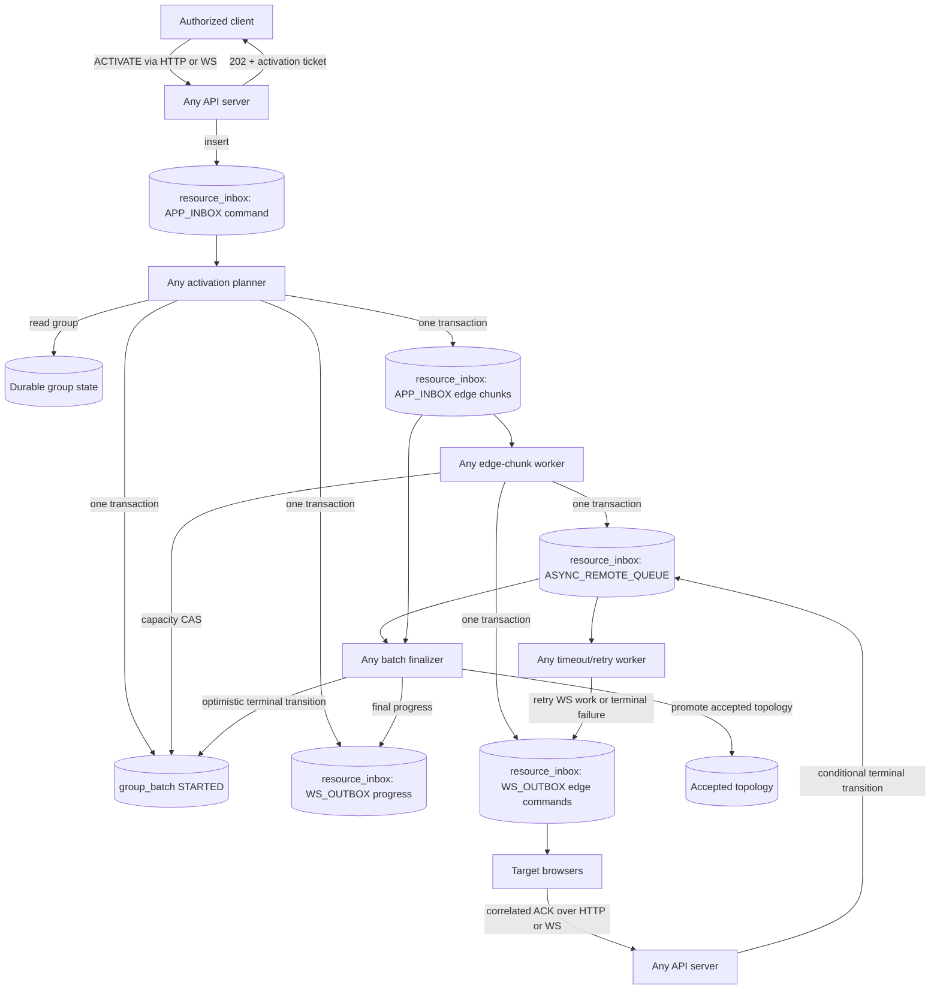

# Distributed Group RTC Activation Design

Status: approved design direction; implementation not started.

## Executive Summary

Rallar should not appoint a server to own or direct a group. An authorized
browser client may request group activation through any API server, and any
server sharing the PostgreSQL database may later claim and process each piece
of activation work.

The existing `resource_inbox` table remains the physical work table. It hosts
the logical `APP_INBOX`, `APP_OUTBOX`, and `WS_OUTBOX` queues and will also host
remote browser work awaiting confirmation through a new logical
`ASYNC_REMOTE_QUEUE` lane. Edge chunks remain `APP_INBOX` rows. Remote work
adds one queue status, `AWAITING_REMOTE`, but otherwise reuses the existing
payload, attempts, expiry, reservation, retry scheduling, and terminal-state
machinery.

One new `group_batch` row coordinates each activation attempt. It records the
original activation input, the planned topology, the source group revision, a
deterministic topology-input fingerprint, the expected edge-chunk count,
capacity already allocated to remote work, the aggregate outcome, and an
optimistic version. There is one batch row per activation attempt, not one row
per edge or chunk.

All domain services follow the same cycle:

```text
read -> compute -> validate -> write
```

Computation is side-effect-free and happens outside a database transaction.
The write phase uses a short transaction with expected-state or
expected-version conditions. A conflict rolls back the entire write and
restarts the whole cycle from a fresh read, including authorization, policy,
capacity, lifecycle, and invariant validation.

## Goals

- Remove any need for a designated server to handle a group.
- Accept activation through HTTP or WebSocket on any server.
- Return a durable activation ticket without holding the request open.
- Let any server process the activation command, edge chunks, remote
  confirmations, and timeouts.
- Reuse `resource_inbox` for all durable work, including work performed by a
  browser and awaiting confirmation.
- Keep one durable coordination row per group activation attempt.
- Bound RTC connection concurrency per group without relying on a racy
  pre-dequeue count.
- Make duplicate commands, queue delivery, WebSocket delivery, browser
  acknowledgements, timeouts, and server restarts safe.
- Preserve the existing full `GroupRef` scope and causal group revisions.
- Keep group business lifecycle separate from RTC activation lifecycle.

## Non-Goals

- Do not designate a server process as group leader or owner.
- Do not make the browser group director responsible for durable processing.
  A director may be an authorized activation requester, but it owns no server
  work.
- Do not replace PostgreSQL with a separate broker in the first iteration.
- Do not create a dedicated table for edge chunks or remote work.
- Do not treat Rallar Data, CRDT state, browser memory, or PostgreSQL
  notifications as authoritative activation state.
- Do not require synchronous HTTP requests to wait for RTC establishment.
- Do not overwrite the last accepted active topology with an unconfirmed plan.
- Do not add or remove edges from a running batch when membership changes;
  supersede and replan instead.

## Existing Repository Fit

The current repository already provides most of the required primitives:

- `resource_inbox` stores a typed JSON resource, logical queue type, status,
  attempts, creation and processing timestamps, next-attempt timestamp, and
  expiry timestamp.
- `APP_INBOX`, `APP_OUTBOX`, and `WS_OUTBOX` are existing `EnqueuedType`
  values.
- `ResourceInboxRepository` and `PSqlQueueBox` provide durable insert,
  reservation, retry, timeout, and expiry behavior.
- `resource_inbox_results` provides durable results for current synchronous
  app-inbox operations. Activation polling should instead read the activation
  command and `group_batch`, because RTC completion is intentionally
  asynchronous and longer-lived.
- Current group snapshots carry a full `GroupRef` and `stateRevision`.
- Current topology work uses immutable group-revision inputs, deterministic
  work identities, durable publications, and multi-server WebSocket fanout.
- Current queue claiming uses a short `SELECT ... FOR UPDATE SKIP LOCKED`
  reservation transaction. The new design does not introduce long-running
  locks around computation or remote work.

The current generic repository has a 50-row limit on some list methods and no
batch-specific aggregate query. Batch finalization must therefore add focused,
indexed aggregate queries; it must not use `findByTypeId()` or parse every JSON
payload in the queue.

## Core Decisions

### No server owns a group

The database owns durable coordination. A server is only the temporary worker
that successfully claims a queue row or wins an optimistic write. It may crash
after any commit without transferring an in-memory lease or group-director
role to another server.

PostgreSQL notifications may wake workers, but notifications are not work or
state. A missed notification is recovered by polling durable rows.

### One physical work table, four logical lanes

`resource_inbox.ri_type_id` identifies the lane:

| Logical lane | Purpose |
| --- | --- |
| `APP_INBOX` | Incoming commands and internal edge-chunk work |
| `APP_OUTBOX` | Outbound application work, including existing topology/publication work where applicable |
| `WS_OUTBOX` | Durable messages to WebSocket-connected browser sessions |
| `ASYNC_REMOTE_QUEUE` | Work assigned to a remote browser and awaiting a correlated result |

The lane is not the operation. The AL message type or resource payload kind
distinguishes `ACTIVATE_GROUP`, `ACTIVATE_EDGE_CHUNK`, and
`ESTABLISH_RTC_EDGE`.

### One batch row per activation attempt

A `group_batch` row represents the complete activation attempt for one scoped
group and one causal input revision. It is not a queue row, and there are no
child batch rows.

Repeated activation attempts create new batch rows. Reusing one permanent row
per group would break old tickets, erase audit history, and make late browser
acknowledgements ambiguous. A group may have many historical batches but at
most one `STARTED` batch.

### The planned topology is not yet active topology

The activation planner persists its proposed topology with the batch. The
existing accepted topology remains authoritative for live routing until the
batch reaches an acceptable terminal result. This prevents an unconfirmed
edge plan from being advertised as active.

After finalization:

- `COMPLETED` promotes the planned topology as active.
- `PARTIAL` promotes it only if topology validation proves that the confirmed
  edges still satisfy the configured minimum connectivity and degree
  invariants.
- `FAILED` does not replace a previously accepted topology.

## Architecture



## Identity And Scope

Every authoritative contract carries the complete group scope:

```ts
type GroupRef = Readonly<{
  applicationId: string;
  workspaceId?: string;
  groupId: string;
}>;
```

The following identities are stable:

- `activationRequestId`: idempotency identity of the client request and the
  ticket returned by the API.
- `batchId`: deterministic from the activation request identity, or a UUID
  claimed by a first-writer-wins insert.
- `batchGeneration`: monotonically increasing within a `GroupRef`.
- `topologyInputHash`: deterministic digest of topology-relevant membership,
  active-session identities, effective topology configuration, and capacity
  policy. It excludes unrelated metadata and heartbeat timestamps.
- `chunkId`: deterministic from `batchId` and chunk ordinal.
- `remoteWorkId`: deterministic from `batchId`, `chunkId`, edge identity, and
  confirmation role.
- `dispatchId`: deterministic from `remoteWorkId` and attempt number.

Identifiers stored in `resource_inbox` must fit the current column lengths.
When a composite natural key would exceed the limit, use a stable namespaced
hash or UUID rather than truncating it.

The current queue uniqueness constraint does not include `ri_type_id`; it is
`(contextId, resourceId, topicId)`. Queue keys must therefore be lane-qualified
or otherwise distinct. A remote tracking row and its WS dispatch must never
reuse the same three-part key merely because their `ri_type_id` differs.

For batch-scoped `APP_INBOX` edge chunks and `ASYNC_REMOTE_QUEUE` rows,
`fk_ext_bank_id`/`contextId` should contain `batchId`. This makes the batch
queryable without parsing `ri_resource`. The full `GroupRef` remains mandatory
inside the authoritative payload and is validated against the batch row.

## Data Model

### `resource_inbox`

No second remote-work table is added. Existing columns keep their current
meaning, with these activation-specific conventions:

| Column | Activation use |
| --- | --- |
| `ri_resource_id` | Stable activation, chunk, remote-work, or dispatch identity |
| `ri_topic_id` | Operation topic such as group activation, edge chunk, or RTC edge |
| `ri_resource` | Versioned authoritative JSON/AL message |
| `ri_type_id` | Logical lane: `APP_INBOX`, `APP_OUTBOX`, `WS_OUTBOX`, or `ASYNC_REMOTE_QUEUE` |
| `ri_status` | Queue/remote lifecycle status |
| `fk_ext_bank_id` | Existing context; `batchId` for batch-scoped chunk and remote rows |
| `start_ts` | Time the current server processing attempt was reserved |
| `end_ts` | Terminal processing time when applicable |
| `next_ts` | Retry eligibility or remote-response deadline |
| `ri_attempts` | Server processing or remote dispatch attempt number |
| `expire_ts` | Retention deadline; never earlier than the batch result and ticket retention window |

Add a focused batch index if query plans show that the existing unique index is
not sufficient:

```sql
CREATE INDEX resource_inbox_batch_lane_status_ix
ON resource_inbox
  (fk_ext_bank_id, ri_type_id, ri_status, next_ts, ri_row_id);
```

This is an additive index, not a redesign of the resource table.

### Remote work payload

Each `ASYNC_REMOTE_QUEUE` row is one confirmation unit. If both endpoints must
confirm an edge, create two remote rows. Do not store an array whose members
have independent completion states inside one row.

```ts
type AsyncRemoteRtcEdgeWorkV1 = Readonly<{
  version: 1;
  kind: 'establish-rtc-edge';
  remoteWorkId: string;
  batchId: string;
  chunkId: string;
  groupRef: GroupRef;
  sourceGroupStateRevision: number;
  topologyInputHash: string;
  edgeId: string;
  confirmationRole: 'initiator' | 'responder';
  targetPrincipalId: string;
  targetSessionId: string;
  peerSessionId: string;
  topologyGeneration: number;
  maximumAttempts: number;
  responseTimeoutMs: number;
  createdAtEpochMs: number;
}>;
```

All fields are mandatory because the row is persisted authoritative work. A
sparse HTTP request uses a separate input type.

### New remote status

Add `AWAITING_REMOTE` to `EntityStatus`.

`AWAITING_REMOTE` means the durable browser command has been enqueued to
`WS_OUTBOX`, and the server is waiting for a correlated response. The response
deadline is `next_ts`.

The status must be added deliberately to status sets:

- include it in nonterminal status reporting;
- do not include it in ordinary `NEW`/`RETRY` app queue reservation;
- include it only in the remote timeout scanner when `next_ts <= now()`;
- treat `COMPLETED`, `FAILED`, and `ABORTED` as terminal remote outcomes.

Existing generic helpers do not give every status the same meaning in every
lane; for example, ordinary queue machinery may reconsider `FAILED` work.
Introduce lane-aware helpers such as `isAsyncRemoteTerminalStatus()` and do
not register `ASYNC_REMOTE_QUEUE` with the ordinary failed-entry retry loop.

Remote work transitions are:

```text
                 browser acknowledgement
AWAITING_REMOTE ----------------------------> COMPLETED
       |
       | deadline reached and conditionally claimed
       v
   RESERVED ---- attempts remain ----> AWAITING_REMOTE
       |                                  + WS_OUTBOX retry
       |
       +---- attempts exhausted --------> FAILED

AWAITING_REMOTE or RESERVED -- obsolete plan --> ABORTED
```

`AWAITING_REMOTE` begins when the remote row and its first `WS_OUTBOX` row are
committed, not when the socket physically sends. This keeps the first version
simple and durable. A delayed WebSocket delivery may therefore cause a harmless
duplicate dispatch. Browsers must deduplicate by `remoteWorkId`, and the timeout
must include a reasonable queue-delivery allowance. If measurement later shows
false timeouts, add a delivery acknowledgement phase instead of guessing now.

### Conditional remote transitions

A new status alone does not make remote work safe. A browser acknowledgement
can race a timeout worker.

Acknowledgement uses an expected-state transition and never rewrites a
terminal row:

```sql
UPDATE resource_inbox
SET ri_status = 'COMPLETED',
    end_ts = now(),
    next_ts = NULL
WHERE ri_resource_id = :remote_work_id
  AND fk_ext_bank_id = :batch_id
  AND ri_type_id = 'ASYNC_REMOTE_QUEUE'
  AND ri_status IN ('AWAITING_REMOTE', 'RESERVED')
RETURNING *;
```

A timeout retry conditions on the status and observed attempt number. Its
transaction updates the remote row and inserts the attempt-specific
`WS_OUTBOX` dispatch. If the conditional update affects no row, the transaction
must not commit another dispatch.

No `ri_revision` column is required for the first iteration because
`(expected status, expected attempts)` is the remote row's fencing condition.
If future transitions mutate payload state without changing status or
attempts, add an explicit revision rather than weakening the condition.

### `group_batch`

The conceptual schema is:

```sql
CREATE TABLE group_batch (
  batch_id                    varchar(128) PRIMARY KEY,
  activation_request_id       varchar(128) NOT NULL,
  application_id              varchar(128) NOT NULL,
  workspace_id                varchar(128) NOT NULL,
  group_id                    varchar(128) NOT NULL,
  batch_generation            bigint NOT NULL,
  source_group_state_revision bigint NOT NULL,
  topology_input_hash         varchar(128) NOT NULL,
  status                      varchar(36) NOT NULL,
  input_json                  jsonb NOT NULL,
  planned_topology_json       jsonb NOT NULL,
  expected_chunk_count        integer NOT NULL,
  planned_edge_count          integer NOT NULL,
  in_flight_remote_count      integer NOT NULL DEFAULT 0,
  version                     bigint NOT NULL DEFAULT 1,
  created_ts                  timestamptz NOT NULL,
  updated_ts                  timestamptz NOT NULL,
  completed_ts                timestamptz,
  outcome_json                jsonb,
  expire_ts                   timestamptz NOT NULL,

  UNIQUE (application_id, workspace_id, group_id, batch_generation),
  UNIQUE (application_id, workspace_id, group_id, activation_request_id),
  CHECK (expected_chunk_count >= 0),
  CHECK (planned_edge_count >= 0),
  CHECK (in_flight_remote_count >= 0)
);

CREATE UNIQUE INDEX group_batch_one_started_per_group_ix
ON group_batch (application_id, workspace_id, group_id)
WHERE status = 'STARTED';
```

Use the repository's canonical representation for absent `workspaceId`; do
not alternate between `NULL` and an empty string for the same scope.

The authoritative batch statuses are:

| Status | Meaning |
| --- | --- |
| `STARTED` | Plan and edge chunks are sealed; work is incomplete |
| `COMPLETED` | Every required remote confirmation succeeded and the topology was promoted |
| `PARTIAL` | Work is terminal and some edges failed, but the confirmed topology still passes minimum invariants |
| `FAILED` | Retry budget or validation failed and no acceptable new topology can be promoted |
| `SUPERSEDED` | A newer causal group input replaced this batch before completion |

`SUPERSEDED` is necessary for joins, leaves, and other topology-relevant group
changes during activation. Reporting such a batch as a generic failure would
mislead callers and operators.

`source_group_state_revision` remains mandatory causal evidence and an
expected-read check, but a greater revision alone does not supersede a batch.
For example, a heartbeat may advance durable group state without changing the
planned peers. Supersession requires a changed `topology_input_hash` or a
business lifecycle transition that makes activation invalid.

The `version` is the compare-and-set token. Every update uses:

```sql
UPDATE group_batch
SET ...,
    version = version + 1,
    updated_ts = now()
WHERE batch_id = :batch_id
  AND version = :expected_version
RETURNING *;
```

A zero-row result is a conflict, not success. The caller rolls back and repeats
the complete service cycle from a fresh read.

## Group RTC Activation Status

The existing `Group.status` remains the business lifecycle:

```text
active | archived | deleted
```

RTC activation is a separate projection:

```text
INACTIVE | INITIALISING | ACTIVE | RECONFIGURING | DEGRADED | FAILED
```

`RECONFIGURING` is needed because an already active group may retain its last
accepted topology while a newer batch runs. Calling that group `INITIALISING`
would incorrectly imply that it has no usable RTC topology.

The projection is derived from the current batch plus the last accepted
topology:

| Current condition | RTC activation status |
| --- | --- |
| No accepted topology and no current batch | `INACTIVE` |
| `STARTED` batch and no accepted topology | `INITIALISING` |
| `STARTED` batch with an accepted predecessor | `RECONFIGURING` |
| Current batch `COMPLETED` and promoted | `ACTIVE` |
| Current batch `PARTIAL`, or reconfiguration failed while an older topology remains usable | `DEGRADED` |
| Current batch `FAILED` and there is no usable topology | `FAILED` |

This projection should be returned by group/topology read APIs but should not
replace `Group.status` or cause ordinary business-lifecycle mutations.

## Service Contract

Transport adapters convert HTTP, WebSocket, or database queue inputs into the
same typed domain input. Domain services expose the four phases; a small
application runner invokes them and owns bounded optimistic retries.

```ts
interface ReadComputeValidateWriteService<I, R, P, O> {
  read(input: I): Promise<R>;
  compute(input: I, read: R): P;
  validate(input: I, read: R, plan: P): void;
  write(input: I, read: R, plan: P): Promise<O>;
}
```

Rules for every service:

- `read` obtains all state required for authorization, policy, capacity,
  lifecycle, and invariant decisions.
- `compute` is deterministic and side-effect-free for the same input and read
  model.
- `validate` checks both read data and the computed plan. It performs no
  writes.
- `write` opens the shortest practical transaction and uses expected versions
  or expected row states.
- An optimistic conflict restarts at `read`; it never retries only a stale
  final write.
- Malformed scope, authorization denial, invariant violation, resource-cap
  violation, and exhausted retry budgets are typed terminal outcomes.
- Retry budgets are bounded and observable.

Network calls and RTC work never occur inside a database transaction.

## End-To-End Flows

### 1. Accept an activation request

An authorized group director or any other client allowed by group policy may
request activation through HTTP or WebSocket.

1. Authenticate the caller and normalize the complete `GroupRef`.
2. Derive or accept an idempotency key as `activationRequestId`.
3. Insert one `APP_INBOX` `ACTIVATE_GROUP` row with a deterministic key.
4. Return HTTP `202 Accepted` or the WebSocket equivalent with the activation
   ticket.
5. Wake queue readers as an optimization.

The durable payload includes the actor, requested group scope, requested
topology options, idempotency identity, and causal request metadata. The worker
reruns authorization from durable current state; acceptance by the transport
does not authorize a later stale decision.

Before a `group_batch` row exists, ticket polling reports `QUEUED` from the
activation command row. Once a batch exists, polling reports the batch and its
derived RTC activation status.

### 2. Plan group activation

Any server may claim the single activation command.

Read:

- Read the complete scoped group snapshot and causal revision.
- Read the effective topology configuration and relevant RTT/capacity inputs.
- Read an existing batch for the same activation request.
- Read any current `STARTED` batch and last accepted topology.
- Rerun authorization and group lifecycle policy.

Compute:

- Compute the topology in memory with the existing graph/topology packages.
- Compute `topologyInputHash` from the canonical topology-relevant input.
- Validate and deterministically order edges.
- Divide edges into fixed-size chunks.
- Assign deterministic batch, chunk, and edge identities.
- Create the immutable batch plan and queue envelopes in memory.

Validate:

- The group remains eligible for RTC activation.
- The source revision is still the one used by the plan.
- The canonical topology input still produces the planned
  `topologyInputHash`; a revision-only change with the same fingerprint can be
  rebased without discarding the plan after authorization is rerun.
- Topology connectivity, degree, self-edge, duplicate-edge, and scope
  invariants hold.
- Every chunk fits the configured group connection-capacity budget. A chunk
  larger than the whole budget would otherwise block forever.
- The batch and payload sizes stay within configured limits.

Write in one transaction:

- Conditionally insert the one `group_batch` row as `STARTED`.
- Persist the planned topology in `planned_topology_json`.
- Insert exactly `expected_chunk_count` deterministic `APP_INBOX`
  `ACTIVATE_EDGE_CHUNK` rows.
- Insert `WS_OUTBOX` activation-progress messages for connected group clients.
- Record the accepted source revision and generation.
- Record the accepted topology-input fingerprint.

If any insert or expected-state condition fails, the transaction commits
nothing. A duplicate activation request loads and returns the existing batch.

The batch is sealed by the atomic write of its expected count and all chunk
rows. There is no end-of-batch sentinel.

### 3. Claim and expand an edge chunk

A simple query of outstanding remote rows before dequeue is not a concurrency
control. Two servers can both observe spare capacity and oversubscribe it.

Eligible processing therefore uses a purpose-specific optimistic
claim-and-expand write. The edge chunks remain ordinary `resource_inbox`
`APP_INBOX` rows, but the worker does not use a generic claim followed by an
independent capacity update. Splitting those writes could leak capacity if the
worker crashed between them.

Read:

- Read the exact batch, planned topology, scoped group snapshot, target
  sessions, and current connection/capacity observations.

Compute:

- Create one remote confirmation work item for each required browser result.
- Create the corresponding first-attempt `WS_OUTBOX` dispatch messages.

Validate:

- The batch is still `STARTED` and has the expected version/generation.
- The group scope and topology-input fingerprint still match; newer causal
  state with the same fingerprint is reauthorized and may continue.
- Each target session is still authorized and active enough to receive work.
- Every remote identity belongs to exactly one planned edge and confirmation
  role.

Write in one transaction:

- Conditionally advance the chunk from `NEW` or `RETRY` to `COMPLETED`, using
  its expected status and attempt number.
- Conditionally increment `group_batch.in_flight_remote_count` by the number
  of new remote confirmation units, using the expected batch version and the
  configured capacity ceiling in the update predicate.
- Insert each deterministic `ASYNC_REMOTE_QUEUE` row as `AWAITING_REMOTE`.
- Set each remote deadline in `next_ts` and initial attempts consistently.
- Insert each deterministic first-attempt `WS_OUTBOX` row.
- Record the chunk expansion outcome in its durable result payload.

If capacity is unavailable, a conditional defer changes only the chunk to
`RETRY` with a future `next_ts`; it does not reserve capacity or create child
work. The chunk is never held as `RESERVED` while waiting for remote capacity.
If the expansion worker crashes before commit, none of the chunk, capacity,
remote, or WebSocket changes exist. If it crashes after commit, all of them
exist and the chunk is already terminal.

This purpose-specific write still reuses the existing physical table and
queue contracts. It adds contention to the single batch row, but it provides a
correct bound without a new capacity-token table. Chunk size and retry jitter
limit the hot row in the first iteration.

### 4. Perform RTC work in the browser

The target browser receives a versioned edge command containing
`remoteWorkId`, batch and topology generation, group scope, peer session, role,
and deadline.

The browser:

- validates that the message targets its current session and exact
  `GroupRef`;
- deduplicates by `remoteWorkId`;
- performs assigned RTC connections in parallel within the server-provided
  batch and browser-local safety limit;
- reports a correlated success or failure through HTTP or WebSocket; and
- treats repeat dispatch of the same `remoteWorkId` as a request to return the
  same known result or continue the same idempotent operation.

Browser output is proposal data. The server validates target identity, batch,
edge, role, topology generation, and result shape before accepting it.

### 5. Accept a remote result

Any server may receive the browser response.

Read:

- Read the remote row, its batch, current group/session identity, and terminal
  state.

Compute:

- Normalize the reported result.
- Determine the legal remote transition and the corresponding decrement of
  batch capacity.
- Determine progress/finalization work to enqueue.

Validate:

- The authenticated sender matches the expected principal and session.
- The full group scope, batch, edge, confirmation role, and topology
  generation match.
- The result is valid for the current row state.
- A stale or superseded result cannot reactivate an obsolete batch.

Write in one transaction:

- Conditionally transition the remote row to `COMPLETED` or terminal `FAILED`.
- Optimistically decrement `group_batch.in_flight_remote_count` exactly once.
- Insert any deterministic `WS_OUTBOX` progress message.

A duplicate acknowledgement observes the terminal row and succeeds as a
no-op. A late successful result from an earlier dispatch attempt may complete
the same `remoteWorkId` if the batch is still current; attempts identify
delivery retries, not different domain work.

### 6. Retry timed-out remote work

Any server may scan `ASYNC_REMOTE_QUEUE` rows where:

```text
status = AWAITING_REMOTE and next_ts <= now()
```

For each due row:

1. Conditionally reserve it using existing queue reservation behavior.
2. Reread the remote row, batch, group/session state, and attempt policy.
3. Recompute and revalidate whether retry is still legal.
4. If attempts remain, transactionally transition it back to
   `AWAITING_REMOTE`, advance `next_ts`, increment/fence the attempt, and insert
   the deterministic attempt-specific `WS_OUTBOX` row.
5. If attempts are exhausted, transactionally mark it `FAILED`, decrement
   batch in-flight capacity exactly once, and enqueue finalization/progress
   work.

If an acknowledgement wins while the timeout worker computes, the timeout
worker's conditional write fails and its transaction emits no new dispatch.

### 7. Finalize a batch

Finalization may be triggered after chunk completion, remote terminal
transition, timeout exhaustion, or periodic reconciliation. Triggers are only
wakeups; the database decides readiness.

Read batch-scoped aggregates using `contextId = batchId`:

- number of expected edge chunks present;
- edge chunks by status;
- remote rows by terminal/success/failure status;
- `group_batch` version and source group revision;
- current group and accepted topology state.

The batch is eligible for finalization only when:

1. Exactly `expected_chunk_count` edge chunks exist.
2. Every edge chunk is terminal.
3. No remote row is `AWAITING_REMOTE`, `RESERVED`, `NEW`, or `RETRY`.
4. `in_flight_remote_count` is zero.
5. The batch is still the current activation generation.

Compute and validate the confirmed-edge graph:

- `COMPLETED` when every required confirmation succeeded.
- `PARTIAL` when failures exist but the confirmed graph remains an acceptable
  connected topology under the configured policy.
- `FAILED` when no acceptable topology can be promoted.
- `SUPERSEDED` when current durable state has a different topology-input
  fingerprint or an incompatible business lifecycle.

Write in one transaction:

- Conditionally update the batch from `STARTED` using its expected version.
- Promote the accepted topology only for `COMPLETED` or validated `PARTIAL`.
- Persist a mandatory outcome summary with total, completed, failed, and
  aborted confirmation counts.
- Insert the deterministic final `WS_OUTBOX` notification.

`GROUP_BATCH` is the completion barrier. A fake end-of-batch remote item is
unnecessary and would be vulnerable to arriving before slow chunk workers had
created all their rows.

## Join, Leave, And Disconnect Behavior

### Join while `INACTIVE`

The client joins immediately under normal group policy. No RTC work exists.
An authorized client may request activation afterward.

### Join while `INITIALISING` or `RECONFIGURING`

The membership/presence mutation may complete immediately, but it changes the
topology input. The current batch becomes `SUPERSEDED`, and a deterministic
activation command for the newer causal revision is enqueued.

The first implementation should replan the whole topology. Appending edges to
an already sealed batch complicates expected counts, capacity, authorization,
and optimal placement and makes completion ambiguous.

### Join while `ACTIVE`

Two policies are possible:

- Recommended initial policy: retain the accepted topology temporarily, use
  WS fallback where required, and enqueue a new reconfiguration batch.
- Later optimization: attach the new session as a leaf to an endpoint with
  spare capacity, then schedule a background topology optimization.

The leaf optimization reduces join latency but risks poor RTT placement and a
long-lived suboptimal topology. It should follow measurement, not be the first
correctness path.

### Leave or disconnect

Existing presence expiry and RTC fault-tolerance mechanisms continue to remove
or heal live connections. Topology-relevant departure supersedes a running
batch and enqueues a new causal activation/reconfiguration command.

Remote rows for a superseded batch become `ABORTED` through conditional,
idempotent transitions. Late acknowledgements are recorded as stale no-ops and
cannot promote the old topology.

## Transactions And Optimistic Concurrency

Optimistic versioning and transactions solve different problems and both are
required:

- Expected versions/states prevent a stale decision from overwriting newer
  state.
- The transaction prevents a winning multi-row decision from being only
  partially persisted.

The activation write boundary needs a shared PostgreSQL unit of work capable
of passing one transaction-scoped repository to `group_batch`, runtime/group
state, topology-plan, and resource-inbox operations. Calling several
repositories that each open their own transaction does not satisfy the atomic
write requirement.

No transaction includes topology computation, network I/O, WebSocket sending,
browser waiting, retry sleeping, or unbounded row scans.

The bounded retry loop is conceptually:

```ts
for (let attempt = 1; attempt <= maximumAttempts; attempt += 1) {
  const read = await service.read(input);
  const plan = service.compute(input, read);
  service.validate(input, read, plan);
  const result = await service.write(input, read, plan);

  if (result.kind !== 'conflict') return result;
}

return { kind: 'retry-exhausted' };
```

Every retry reruns authorization and policy from current state.

## Idempotency And Delivery Semantics

- Activation request: first-writer-wins by scoped `activationRequestId`.
- Batch creation: one row per request and one `STARTED` batch per group.
- Edge chunks: deterministic by `(batchId, chunkOrdinal)`.
- Remote work: deterministic by `(batchId, chunkId, edgeId,
  confirmationRole)`.
- WebSocket dispatch: deterministic by `(remoteWorkId, attempt)`.
- Browser acknowledgement: terminal conditional transition; duplicates are
  no-ops.
- Finalization: conditional transition from batch `STARTED` and deterministic
  final publication identity.

Queue and WebSocket delivery are at least once. Exactly-once effects come from
idempotent identities and conditional durable state transitions, not from an
exactly-once transport claim.

## Failure Handling

| Failure | Recovery |
| --- | --- |
| Server crashes before a write | No durable effect; another worker retries |
| Server crashes after enqueue commit | Durable queue row remains; any server can process it |
| Server crashes during chunk expansion | Atomic chunk/capacity/remote/WS transaction leaves either no effect or the complete expansion |
| Duplicate activation | Existing activation command/batch is returned |
| Duplicate edge chunk delivery | Deterministic remote and WS identities prevent duplicate domain work |
| Duplicate WebSocket delivery | Browser deduplicates by `remoteWorkId` |
| Browser response races timeout | Conditional row transition selects the winner; losing transaction emits no new state-dependent work |
| Browser never responds | Bounded retries, then terminal `FAILED` |
| Group changes during activation | Old batch becomes `SUPERSEDED`; newer causal batch replans |
| Worker repeatedly loses optimistic writes | Bounded retry-exhausted outcome; work remains retryable with backoff |
| PostgreSQL notification is missed | Periodic durable queue scan finds the work |
| Partial edge failure | Promote only if the confirmed topology still satisfies minimum invariants |

## Authorization And Trust

- The activation request requires group policy authorization.
- The worker reruns authorization when it processes the durable request.
- Full `GroupRef` equality is mandatory at every queue, batch, WebSocket, and
  acknowledgement boundary.
- Browser results are untrusted proposal data until the server validates the
  authenticated principal/session, assigned role, edge, batch, and topology
  generation.
- A client cannot acknowledge work assigned to another session.
- A stale batch cannot publish or promote topology after a newer generation
  wins.
- Resource caps are checked on every optimistic retry.

## Retention And Cleanup

- Activation commands, batch rows, edge chunks, remote work, durable results,
  and final publications must share an explicit ticket-retention policy.
- `expire_ts` must not remove a remote row before its response/retry window or
  remove a completed row before duplicate acknowledgements are expected to
  stop.
- `group_batch.expire_ts` must outlive all child queue rows and the public
  polling window.
- Cleanup is conditional on expiry and terminal state. A `STARTED` batch is
  reconciled or failed; it is not silently deleted.
- Expiry of authoritative state uses expected-state or expected-version
  conditions so cleanup cannot delete a refreshed replacement.

## Observability And Operations

Record at least:

- activation commands queued, deduplicated, started, completed, partial,
  failed, superseded, and retry-exhausted;
- queue age by logical lane and operation;
- batch duration and time spent waiting for capacity;
- edge chunks runnable, reserved, completed, retried, and failed;
- remote work awaiting, completed, failed, aborted, timed out, and retried;
- remote acknowledgement latency by attempt and browser/session class;
- WebSocket dispatch retry count and no-local-recipient count;
- optimistic conflicts by service and table;
- batch capacity conflicts and `in_flight_remote_count`;
- topology planned edges versus confirmed edges;
- stale and unauthorized acknowledgement counts;
- ticket polling age and terminal result retention.

Structured logs should always include `activationRequestId`, `batchId`, full
`GroupRef`, chunk or remote work identity, attempt, server/service id, and
causal group revision.

## Critical Assessment

### Advantages

- No designated server, leader election, or group ownership lease is needed.
- Existing queue reservation, retry, expiry, and operational knowledge are
  reused.
- Edge chunks and remote results share one idempotent work model.
- Cross-lane writes can use one PostgreSQL transaction because the rows share
  the same database.
- `group_batch` provides one understandable completion barrier and public
  ticket target.
- Optimistic retries support multi-server progress without holding a lock
  during topology calculation or browser work.
- Deterministic identities make crash recovery and at-least-once delivery
  practical.
- Separating business and RTC activation status avoids corrupting group
  lifecycle semantics.

### Costs And Risks

- `resource_inbox` becomes heterogeneous. Every generic status switch,
  statistic, cleanup path, and dequeue selector must understand that
  `AWAITING_REMOTE` is nonterminal but not ordinary runnable work.
- The single `group_batch` row is a contention point for capacity allocation
  and remote terminal decrements. This is acceptable for a bounded first
  version but must be measured.
- Batch-scoped aggregate queries need an indexed context convention and new
  repository methods; generic 50-row list methods are insufficient.
- Starting the remote deadline when WS work is committed can cause duplicate
  dispatch under a slow WS queue. This is safe but may be noisy.
- One physical table mixes short-lived dispatch work with longer-lived remote
  confirmations, increasing table and index churn.
- JSON payloads do not provide relational foreign keys to batch rows. Scope and
  batch identity must be validated in repository/service code.
- Optimistic retry loops can amplify load under extreme contention. They need
  bounded attempts, jitter, and conflict metrics.
- A `PARTIAL` outcome is domain-sensitive. It must be decided by graph
  invariants, not merely by counting at least one successful edge.

### Why not a separate `async_remote_work` table now?

A separate table would give clearer constraints, status types, foreign keys,
and retention indexes. It would also duplicate reservation, timeout, attempt,
expiry, and idempotency machinery that `resource_inbox` already has. The
current design defers that duplication until measurement proves the shared
table is a bottleneck or correctness burden.

Reconsider a dedicated table when one or more of these conditions are observed:

- remote rows dominate `resource_inbox` size or vacuum/index cost;
- remote retention differs materially from every other queue lane;
- batch-scoped queries remain slow with the focused index;
- shared status handling causes recurring defects;
- remote work needs relational child results, quorum acknowledgements, or
  payload updates that require an independent revision model;
- operational ownership or access control differs from ordinary queue work.

### Why not an end-of-batch work item?

An end marker can be processed before a slow edge worker has inserted its
remote rows unless another authoritative seal proves that all producers are
finished. The batch already records `expected_chunk_count`, and chunk child
writes are deterministic. Using the batch as the seal is simpler and removes
the marker race.

### Why not query outstanding work before dequeue?

The query is a useful observation but not a reservation. Concurrent servers
can read the same available capacity and all proceed. The optimistic
`group_batch.in_flight_remote_count` update turns capacity into an atomic,
bounded claim.

## Validation Strategy

### Focused unit tests

- Deterministic activation, batch, chunk, remote, and dispatch identities.
- Topology chunking is deterministic and respects capacity-sized chunks.
- `AWAITING_REMOTE` is nonterminal and excluded from ordinary runnable
  selectors.
- Due remote rows are selected only after `next_ts`.
- Browser acknowledgement and timeout races have one monotonic terminal
  outcome.
- Duplicate acknowledgements are no-ops.
- Late success from a prior dispatch attempt completes current work safely.
- Batch status and RTC activation status projection for every state.
- Partial topology passes only when connectivity and degree policy remain
  valid.

### PostgreSQL repository tests

- Two servers race to insert the same activation and converge on one ticket.
- Two servers race to create a batch and only one `STARTED` row wins.
- Concurrent chunk claims cannot exceed group remote capacity.
- Batch compare-and-set conflicts return a conflict without partial writes.
- Remote acknowledgement versus timeout retry never regresses a terminal row.
- A losing timeout transaction inserts no `WS_OUTBOX` dispatch.
- Remote terminal transition decrements batch capacity exactly once.
- Batch aggregate queries handle more than 50 chunks/remote rows.
- Expiry cannot delete refreshed or nonterminal work.

### Service tests

- HTTP and WebSocket activation inputs produce the same normalized service
  plan.
- Every optimistic retry reruns authorization, capacity, lifecycle, and
  topology validation.
- Planner transaction writes batch, all chunks, and progress outbox atomically.
- Edge expansion writes the chunk terminal state, capacity allocation, remote
  rows, and WS rows atomically across simulated pre-commit and post-commit
  crashes.
- Finalization waits for the expected chunk count and all remote terminal
  states.
- Group join/leave supersedes stale activation and cannot promote its topology.
- Existing active topology survives a failed reconfiguration.

### Multi-server black-box tests

- Client requests activation through server A; server B creates the batch;
  servers C and A process chunks; browser acknowledgements arrive through a
  different server; all converge on one batch outcome.
- Kill a worker immediately before and after the atomic chunk-expansion commit;
  another server observes either runnable work or the complete terminal
  expansion, never a capacity leak or partial child set.
- Drop queue wake notifications and prove periodic polling still completes.
- Delay and duplicate WebSocket commands and browser acknowledgements.
- Run overlapping activation and membership-change traffic and prove stale
  topology is never promoted.
- Exhaust a browser retry budget and verify `PARTIAL` versus `FAILED` using the
  topology invariants.

For REST behavior, add or update Rallar black-box recipes in
`packages/shared-test/black-box-runner` as part of implementation.

## Recommended Implementation Sequence

1. Add shared activation, batch, remote-work, ticket, and status contracts.
2. Add the `group_batch` migration, repository, optimistic transitions, and
   batch-scoped resource-inbox aggregate queries/index.
3. Add `ASYNC_REMOTE_QUEUE` and `AWAITING_REMOTE` semantics to queue contracts
   and selectors.
4. Add the common read/compute/validate/write optimistic runner.
5. Add activation acceptance and batch planning with atomic chunk/progress
   writes.
6. Add capacity-aware edge-chunk claiming and deterministic remote/WS child
   writes.
7. Add browser command handling and HTTP/WS acknowledgement ingestion.
8. Add timeout, retry, batch finalization, and topology promotion.
9. Add join/leave supersession and reconfiguration behavior.
10. Add focused, PostgreSQL, and multi-server black-box validation plus
    operational metrics.

This sequence is architectural guidance, not yet a file-by-file implementation
plan.

## Final Recommendation

Proceed with `resource_inbox` as the one physical work table, including
`ASYNC_REMOTE_QUEUE`, and add only `group_batch` as a new coordination table.
Add `AWAITING_REMOTE`, batch-scoped indexed queries, conditional remote
transitions, and one optimistic batch version. Keep the batch as the producer
seal and capacity coordinator, and keep planned topology separate from the
last accepted active topology until confirmations reach a validated terminal
outcome.

This is the smallest design that preserves multi-server safety, durable
polling, bounded group concurrency, and correct completion without appointing
a server to own the group.
